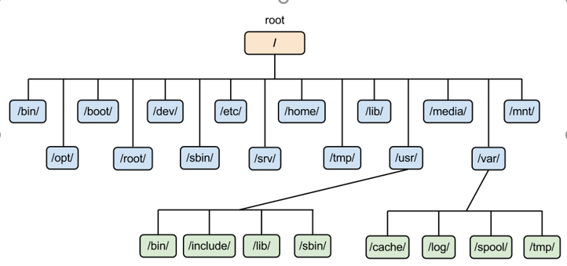

# Mục Lục 
- [1. Các thư mục trong linux](#1)

- [2. Mount](#2)

- [3. Quản lý tệp](#3)

- [4. Sử dụng liên kết](#4)

  - [1. Inode](#Inode)
  
  - [2. Hard links](#hard)
  
  - [3. Symbolic links](#sys) 
  
  - [4. Archives and compressed file](#arc)
  
[Tham khảo](#tm)

#  1.Các thư mục trong linux
 
**Sơ đồ thư mục hệ thống linux**

- /  

  - Thư mục gốc, chưa tất cả file và thư mục hệ thống

  - Chỉ người dùng root mới có quyền ghi cho thư mục này

- /boot 

  - Chứa linux kernel, file ảnh hỗ trợ load hệ thống
 
 

- /bin

  - Chứa các tin nhị phân hỗ trợ việc boot và thi hành lệnh  
  
  
 
- /dev 

  - Chứa các tập tin thiết bị phần cứng, bao gồm các thiết bị đầu cuối, thiết bị được gắn vào hệ thống. Vd: cdrom, cpu, core… 
 
 

- /etc 

  - Chứa các file cấu hình yêu cầu bởi tất cả các chương trình

  - /etc kiểu soát cách hệ điều hành và hệ thống hoạt động
 

- /home 
  - Thư mục chính của người dùng, mỗi người dùng sẽ được tạo thư mục riêng và sử dụng
 

- /lib, /lib64 

  - Thứa các file thư viện chia sẻ cho các tệp tin nhị phân nằm dưới /bin và /sbin

  - Chứa thư viện dùng chung để khởi động hệ thống và chạy các lệnh trong hệ thống tệp gốc

 
- /media

  - Thư mục chứa các mount tạm thời cho các thiết bị tháo lắp

	Vd: /media/cdrom cho CD-ROM; /media/floppy cho ổ đĩa mềm; /media/cdrecorder cho ổ đĩa ghi CD

- /mnt

  - Thư mục mount tạm thời nơi mà người quản trị hệ thống có thể mount các tập tin hệ thống.

- /opt

  - Chứa các ứng dụng thêm không đi kèm theo hệ điều hành, các thư mục ứng dụng sẽ được lưu tại /otp.

Vd: viz, java 

- /proc 

  - Chứa các thông tin về tiến trình hệ thống

  - Các tiến trình đang chạy sẽ được lưu thông tin tại đây. 

  - Đây là các tập tin hệ thống ảo với nội đung tài nguyên hệ thống
 

- /root

  - Là thư mục của người dùng root

  - Chỉ người dùng root mới được sử dụng thư mục này 

- /run

  - Chứa dữ liệu của tiến trình chạy từ khi bắt đầu đến khi kết thúc

  - /run bao gồm tệp id và tệp khóa và một số thứ khác  

- /sbin

  - Giống như /bin, chứa các tập tin nhị phân và  thi hành lệnh

  - Được dùng cho quản trị viên và bảo trì hệ thống

- /srv

  - Srv là viết tắt của service

  - Sử dụng cho các dịch vụ như NTS, HTTP,…

- /sys

  - Chứa các file giao diện phần cứng khác nhau và các tiến trình liên quan được quản lý bởi linux kernel và các tiến trình liên quan.
 

- /usr

  - Chứa đựng các thư mục con có tệp chương trình , thư viện cho các file chương trình và tài liệu về chúng 
 
- /var

  - Chứa các file có thể thay đổi kích thước như log file, mail boxet, và spool files
 

- /tmp

  - Thư mục chứa các tập tin tạm được tạo bởi hệ thống và người dùng
 
  - Các tập tin trong thư mục này bị xóa khi hệ thống khởi động lại.

# 2. Mount
- mount, umount
  - Lệnh mount dùng để đính kèm tệp hệ thống được tìm thấy trên một số thiết bị vào ây tệp lớn
  - Lệnh umount dùng để tách nó ra một lần nữa
- Lệnh df -Th được đăng ký để hiển thị không gian nhớ khả dụng trong thiết bị được mount, nó bao gồm tất cả các mount hệ thống

  - Tùy chọn  -h để tóm tắt kết quả đầu ra để ta có thể đọc
  - Tùy chọn -T hiển thị loại tệp hệ thống 
    - *Filesystem*: tên file  của thiết bị được tương tác với thiết bị đĩa  
    - *Type*: loại tệp hệ thống được sử dụng 
    - *Size*: kích thước của thiết bị được mount
    - *Used*: không gian đĩa của thiết bị được sử dụng 
    - *Avail*: không gian đĩa khả dụng
    - *Mounted on*: thư mục lưu trữ hiện tại 
- findmnt
  - Lệnh findmnt hiển thị các mount và các quan hệ tồn tại giữa các mount khác nhau

# 3. Quản lý tệp
- Wildcard
 
|Wildcard	 |  Ý nghĩa|
|---- | ----|
|   *  |  match bất kỳ ký tự nào|
|?  |  match 1 ký tự bất kỳ|
|[characters]  |  match ký tự nào có trong set|
| [!characters]  |  không match ký tự nào có trong set|
|[[:class:]] |    match ký tự định nghĩa bởi class|

- Lệnh ls
   - Được sử dụng để hiển thị danh sách tệp tin 

Lệnh   |  miêu tả     
------ | ------
ls -l | hiển thị danh sách dài, chứa thông tin về thuộc tính tệp
ls -a | hiển thị tất cả file, kể cả file ẩn 
ls -R | hiển thị thư mục và cả các tệp con
ls -S | hiển thị danh sách theo kích thước 
ls -s | hiển thị tệp cùng với dung lượng của tệp 
ls -t | hiển thị danh sách sắp xếp theo thời gian tạo

**ls -l**

**ls -a**

 

**ls -R**

- Lệnh copy  

  - Cấu trúc lệnh `cp [options] sourcefiles destdir`
  - Được sử dụng để copy file

lệnh | miêu tả
---- | ----
cp -a | lưu trữ
cp -f | sao chép đè lên tệp đích nếu cần  
cp -i  | hỏi trước ghi đè khi thư mục đích đã tồn tại file
cp -l | liên kết tệp thay vì sao chép 
cp -n | không ghi đè tệp
cp -R |sao chép thư mục một cách đệ quy

Vd: 

  - Copy f2 vào thư mục tm1

`cp f2 tm1` 

  - Copy tệp f1 trong tm1 đến tm2

`cp tm1/f1 tm2`

  - Copy tất cả thư mục tm2 vào thư mục tm1 

`cp -R tm1 tm2`

  - Copy file2 vào tm1 và hỏi trước nếu file2 đã tồn tại trong tm1

`cp -i file2 tm1`

  - Buộc copy tệp file2 vào thư mục tm3

`cp -f file2 tm3`

  - Copy tất cả file bắt đầu bằng a vào thư mục  tm2

`cp *a tm2`

- Moving

Cấu trúc lệnh: 

`mv [options] sourcefiles destdir`

  - Dùng để di chuyển tệp, thư mục

  - Dùng để đổi tên tệp, thư muc

Lệnh | mô tả
----|----
mv -f | buộc di chuyển bằng cách ghi đè tệp đích mà không có lời nhắc
mv -i | lời nhắc tương tác trước khi ghi đè
mv -u | cập nhật - di chuyển khi nguồn mới hơn đích

  - Đổi tên thư mục tm1 thành tm6

`mv tm1 tm6`

  - Di chuyển thư mục tm3 vào thư mục tm2

`mv tm3 tm2`

- Delete

  - Cấu trúc lệnh: 

`rm [options] files destdir`

lệnh  | mô tả 
----|----
rmdir [tên thư mục]	|  Xóa thư mục rỗng
rm -rf [tên thư mục]	|  Xóa thư mục có dữ liệu

# 4. Sử dụng liên kết
 
**Giới thiệu**: 

- Một liên kết là một kết nối giữa file name và dữ liệu thực tế trên ổ đĩa  
- Có 2 loại liên kết: hard link và symbolic 

## 1. Inode

- Trong Linux, dữ liệu của các file được chia thành các block. Có nhiều cách tổ chức để liên kết các khối dữ liệu trong một file với nhau, một trong các cách đó là dùng chỉ mục (indexed allocation).

- Trong một inode cso các metadata sau:
  - Dung lượng file tính bằng byte.
  - Device ID: id của thiết bị lưu trữ file.
  - User ID: id của chủa chủ sở hữu file.
  - Group ID: id của nhóm sở hữu file.
  - File mode : gồm kiểu file và cách thức truy cập file.
  - Timestamps: các mốc thời gian khi: bản thân inode bị thay đổi (ctime, inode change time), nội dung file thay đổi (mtime, modification time) và lần truy cập mới nhất (atime, access time).
  - Link count : số lượng hard links trỏ đến inode. Các con trỏ chỉ đến các blocks trên ổ cứng dùng lưu nội dung file. Các con trỏ cho biết file nằm ở đâu để đọc nội dung.
- Inode xác định file và thuộc tính của nó. Mỗi inode được xác định bởi một con số duy nhất trong hệ thống tệp tin.
- Inote là một cấu trucs dữ liệu trong hệ thống tệp truyền thống của ho nhà unix như UFS hoặc EXT3. Inode lưu trữ thông tin về 1 tệp thông thường, thư mục hay những đói tượng khác của hệ thống tệp tin.
- Chú ý:
  - Inote ko chứa tên file, thư mục.
  - Các con trỏ là thành phần quan trọng nhất: nó cho biết địa chỉ các block lưu nội dung file và tìm đến các block đó có thể truy cập được nội dung file.

## 2. Hard links

- Hard links là các liên kết cấp thấp ( low-level links) mà hệ thống sử dụng để tạo các thành phần của chính hệ thống file, chẳng hạn như file và thư mục. Liên kết cứng sẽ tạo một liên kết trong cùng hệ thống tập tin với 2 inode entry tương ứng trỏ đến cùng một nội dung vật lý (cùng số inode vì chúng trỏ đến cùng dữ liệu).
- Tất cả các hệ thống tệp tin dựa trên thư mục phải có ít nhất một liên kết cứng (link counts từ 1 trở lên) cung cấp tên gốc cho mỗi tệp tin

- Lệnh tạo liên kết cứng như sau: `ln [file nguồn] [file đích]`

- 2 file viblo.txt và hardlink có cùng số inode là 136. Khi file gốc viblo.txt bị xóa thì nội dụng file hardlink.txt vẫn còn nguyên.

- Khi sử dụng lệnh rm để xóa file thì làm giảm đi một hard link. Khi số lượng hard link giảm còn 0 thì không thể truy cập tới nội dung của file được nữa

## 3. Symbolic links
- Symbolic links là một file đặc biệt trỏ đến một file hoặc thư mục khác - được gọi là target. Khi được tạo, một symbolic links có thể được sử dụng thay cho target file. Nó có thể có một tên độc nhất, và được đặt trong bất kỳ thư mục nào. Nhiều symbolic links thậm chí có thể được tạo cho cùng một target file, cho phép truy cập target bằng nhiều tên khác nhau.
 

- Symbolic link không chứa bản sao dữ liệu của target file. Nó tương tự như một shortcut trong Microsoft Windows: nếu bạn xóa một symbolic link, target sẽ không bị ảnh hưởng. Vì chỉ đơn thuần là một shortcut, symbolic link không dùng đến inode entry. Nó sẽ tạo ra một inode mới và nội dung của inode này trỏ đến tên tập tin gốc.

- Ngoài ra, nếu target của một symbolic link bị xóa, di chuyển hoặc đổi tên, symbolic link không được cập nhật. Khi điều này xảy ra, liên kết tượng trưng được gọi là "broken" hoặc "orphaned" và sẽ không còn hoạt động như một liên kết.

- Lệnh tạo liên kết tượng trưng như sau: `ln -s [file nguồn] [file đích]`

- 2 file viblo2.txt và sym-links.txt có số inode là khác nhau. Khi xóa file viblo2.txt thì nội dung của sum-links.txt sẽ bị mất

- Lệnh ls -l sẽ hiện thị tệp nào là symbolic link, nếu tệp tin là hard links thì sẽ hiển thị chỉ số inode giống nhau 

## 4. Archives and compressed file

- Cấu trúc lệnh: `tar -[option] file_archive files/directories`

option | mô tả
----|----
c| Tạo file lưu trữ.
x| Giải nén file lưu trữ.
z| Nén với gzip - Luôn có khi làm việc với tập tin gzip (.gz).
j| Nén với bunzip2 - Luôn có khi làm việc với tập tin bunzip2 (.bz2).
lzma| Nén với lzma - Luôn có khi làm việc với tập tin LZMA (.lzma).
f| Chỉ đến file lưu trữ sẽ tạo - Luôn có khi làm việc với file lưu trữ.
v| Hiển thị những tập tin đang làm việc lên màn hình.
r| Thêm tập tin vào file đã lưu trữ.
u| Cập nhật file đã có trong file lưu trữ.
t| Liệt kê những file đang có trong file lưu trữ.
delete| Xóa file đã có trong file lưu trữ.
totals| Hiện thỉ thông số file tar
exclude |loại bỏ file theo yêu cầu trong quá trình nén

Vd:
  - Tạo file nen1.tar lưu trữ các tập tin file1 file và các thư mục tm1 tm2

`tar -cvf nen1.tar tm1 file1 tm2 file2` 

  - Hiển liệt kê các file trong nen1.tar và các thông tin chi tiết

  - Để giảm dung lượng file, tạo file nén gzip nen1.tar.gz(nen1.tgz) lưu trữ các tập tin file1 file và các thư mục tm1 tm2

`tar -czvf nen1.tar tm1 file1 tm2 file2`

  - Xóa file1 và file2 trong nen1.tar 

`tar -f nen1.tar --delete file1 file2`

  - Giải nén nen1.tar (thêm -z nếu là file gz, -j nếu là file bunzip): `tar -xf nen1.tar`

  - Giải nèn nen1.tar vào thư mục tm3 ta dùng option -C  `tar -xf nen1.tar -C tm3`

Ngoài `tar` còn có lênh `zip`, `gzip` để nén dữ liệu 

# Tham khảo 

https://kb.hostvn.net/cau-truc-cay-thu-muc-trong-linux_61.html

https://www.rapidtables.org/vi/code/linux/cp.html

https://viblo.asia/p/hard-links-va-symbolic-links-tren-linux-07LKXJR2lV4

https://hocvps.com/nen-va-giai-nen-file-tar-gzip-va-zip/
