# Mục lục 
- [1. Giới thiệu](#1)
- [2. Managing Shell Jobs](#2)
  - [1. Running jobs in the Foreground and Background](#21)
  - [2. Managing Shell Jobs](#22)
  - [3. Managing Parent-Child Relations](#23)
- [3. Dùng Command-Line Tools cho Process Management](#3)
  - [1. Processes and thread](#31)
  - [2. Lấy thông tin Process](#32)
  - [3. Điều chỉnh quá trình ưu tiên với `nice`](#33)
  - [4. Gửi tín hiệu đến process với kll, killall và  pkill](#34)
- [4. Sử dụng `top` để quản lý process  ](#4)
- [5. Điều chình để tối ưu hóa hiệu suất](#5)
- [Tham khảo](#tm)

# 1. Giới thiệu 
- Có 3 loại process chính  
  - *Sbell jobs* là lệnh bắt đầu từ dòng lệnh
  - *Daemons* là quá trình cung cấp dịch vụ
  - *Kernel threads* là một phần của linux kernel
- Khi process bắt đầu, nó có thể sử dụng nhiều threads. *thread* là một nhiệm vụ bắt đầu bởi một process và một CPU chuyên dụng có thể phục vụ 
- Linux shell khong cung cấp tool để xử lý threads riêng biệt, do đó các lệnh được sử dụng

# 2. Managing Shell Jobs
- Khi người dụng nhập lệnh, một shell jobs được bắt đầu. Nếu không có tác động cụ thể nào được thự hiện nó sẽ bắt đầu như một tiến trình tiền cảnh, hoạt động cho đến khi kết thúc.

## 1. Running jobs in the Foreground and Background
- Bất kì một lệnh nào được bắt đầu như một foregroud job,hay không thể tác động vào terminal, nơi mà lệnh được bắt đầu cho đến khi hoàn thành
- Một quy trình yêu cầu sự tương tác của người dùng sẽ không thể tương tác khi chạy ở chế độ nền, do đó quá trình thường sẽ bị đình trệ khi chuyển sang chế độ nền.
- Có 2 cách tiếp cận một process trong background:
  - THêm `&` và cuối câu lệnh để bắt đầu lệnh trong nền 
  - Lệnh `fg` để di chuyển job đến từ background đến foreground, thêm ID job để di chuyển một job trong nhiều job đang được thực hiện
- `jobs` để hiển thị các job đang chạy 
- `Ctrl-Z` để tạm thời dừng job nếu nó thực hiện mất nhiều thời gian hơn dự đoán, dùng lenenhj `bg` để job tiếp tục thự hiện 
- `Ctrl C` để dừng job hiện tại và xóa khỏi bộ nhớ
- `Ctrl D`  gửi ký tự kết thúc tệp ở job hiện tại và kết thúc khi job hiên tại hoàn thành.

## 2. Managing Shell Jobs
 
 Command | Use 
 ---|---
 &(đặt ở cuối dòng lệnh)| bắt đầu lệnh trong nền 
 Ctrl - Z | tạm dừng job để quản lý  
 Ctrl - D|  gửi ký tự kết thúc  tệp (EOF) đến job hiện tại để nó ko nhận job tiếp theo 
 Ctrl - C| hủy bỏ job hiện tại
 bg | tiếp tục job trước đó khi sử dụng Crtl-Z
 fg| chuyển job từ background sang foreground
 jobs| hiển thị job hiện tại đang chạy trong shell

 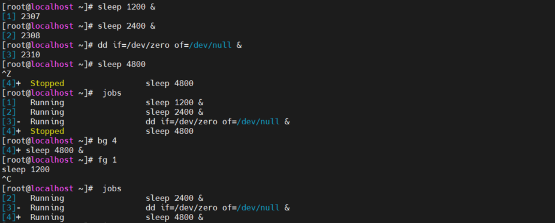

## 3. Managing Parent-Child Relations
- Khi một process bắt đầu trong shell, nó sẽ trở thành quá trình con của shell đó. 
- Trong process managerment, quan hệ Parent - Child giữa các propcesses rất quan trọng. Cần Parent để quản lý Child.
- Tất cả process trong một shell sẽ bị dừng nếu shell đó dừng
- Process bắt đầu trong backgroup sẽ khong bị dừng khi parent shell bị dừng. Lệnh `kill` để tắt một processses hoạt động trong background
- Trong các phiên bản trước của bash shell cần sử dụng lênh nohup để các process trong background không bị chấm dứng khi parent chắm dứt.
- Trong các phiên bản cũ của linux khi parent bị kill thì các tất cả các child process cũng sẽ bị kill. 
- Trong RHEL 8, nếu kill parent process thì tất cả các child process sẽ trở thành con của systemd process

# 3. Dùng Command-Line Tools cho Process Management

## 1. Processes and thread
- Các tác vụ trên linux thường bắt đầu dưới dạng process. Một process có thể bắt đầu với nhiều threads. Nếu các process rât bận, các threads có thể được cử lý bởi các CPU hoặc CPU core có sẵn trong máy.
- Không thể quản lý hết các threads một cách riêng lẻ, nên cần phải quản lý các process
- 2 loại background process
  - *Kernel threads*  là một phần của linux kernel, mõi trong số chúng được bắt đầu với số nhận dạng quy trình riêng (PID).
  - *Deamon processes* 
- Các process kernel nằm trong dấu ngoặc vuông 
- `ps aux` hiểu thị danh sách các process 
 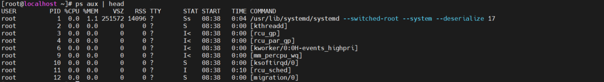
- Kernel threads không thể được quản lý, không thể điều chỉnh độ ưu tiên, không thể kill chúng ngoài trừ gỡ bỏ chúng hoàn toàn khỏi máy  

## 2. Lấy thông tin Process
- Sử dụng lệnh `ps`

Lệnh | Mô tả 
---|---
ps -e(ps -ef,  ps -eF, ps -ely)| xem tất cả process trên hệ thống 
ps aux | bản  tóm tắt các process hoạt động
ps -U root -u root u | xem các process chạy dưới dạng root ở định dạng user
ps -eLf | nhận thông tin về threads
ps fax | để hiện thị quan hệ Parent-Child giữa các process
ps -C syslogd -o pid= | chỉ in các process ID của syslogd
ps -q 42 -o comm= | chỉ in tên của PID 42 

  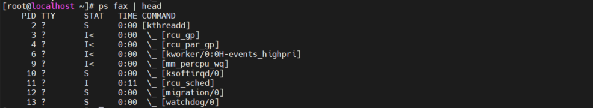

  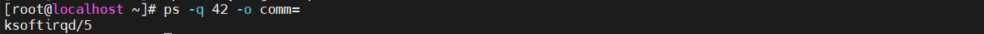
- Một phần thông tin quan trọng  trong lệnh ps là PID. Nhiều tác vụ yêu cầu PID hoạt động, và đó là lý do tại sao một lệnh như `ps aux | grep dd`, nó sẽ hiển thị chi tiết quá trình về dd, bao gồm cả PID của nó.
- Một cách khác để có kết quả tương tự là sử dụng lệnh `PGREP`. Sử dụng `pgrep dd` để có được một danh sách tất cả các PID có tên chứa chuỗi "DD".
- Ý nghĩa của một số trường thông tin trong `ps`

Trường | Ý nghĩa 
---|---
CMD| tên câu lệnh thực thi tiến trình
%CPU| lượng CPU sử dụng 
%MEM | lượng ram tiêu thụ 
PID | mã tiến trình 
PPID| mã của tiến trình cha
UID| mã người dùng
USER | tên người dùng
PRI| độ ưu tiên của tiến trình 
RSS| lượng bộ nhớ sử dụng thực 
VSZ or SZ | lượng bộ nhớ ảo sử dụng
S or STAT | chứa đoạn mã code mô tả trạng thái của tiến trình 
Start or STIME| thời gian mà câu lệnh đó khởi động, ,nhỏ hơn 24h là “HH:MM:SS”, lớn hơn là “Mmm dd”
TTY	|terminal liên quan tới tiến trình

- Khi sử dụng lệnh ps, ta có thể xem được trạng thái của tiến trình đó là gì, thông qua trường STAT theo kí hiệu như sau:

Kí hiệu	|Giải thích
---|---
D|	Tiến trình ngủ liên tục (Uninterruptible)
R|	Tiến trình đang sẵn sàng hoặc đang chạy
S|	Tiến trình ngủ ngắt quãng (Interruptible)
T|	Đã bị dừng bởi tín hiệu kiểm soát hoặc bị theo dõi
W|	Phân trang (không có sẵn sau bản kernel 2.6.xx))
X|	Dead (ít gặp)
Z|	Zombie process

Một số kí tự đi kèm:

Kí hiệu|	Giải thích
---|---
<|	Ưu tiên cao
N|	Ưu tiên thấp
L|	có trang bị khoá trong bộ nhớ (do thời gian thực hoặc IO)
s|	Session leader
\||	Tiến trình đa luồng (CLONE_THREAD)
+|	Tiến trình thuộc nhóm Foreground

 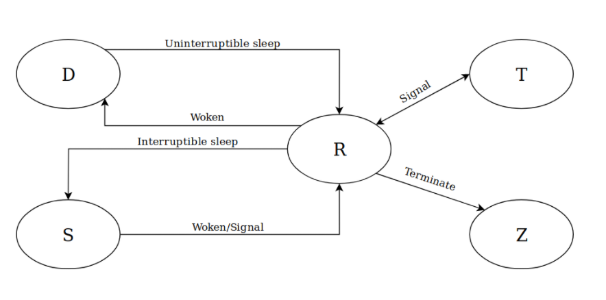

- Một tiến trình sẽ bắt đầu chu trình bằng trạng thái ‘R’ và sẽ bị kết thúc khi tiến trình cha đưa nó về trang thái ‘Z’

## 3. Điều chỉnh quá trình ưu tiên với `nice`
- Lệnh ` nice` thực hiện một chương trình với một ưu tiên lập lịch tùy chỉnh. Giá trị dao động từ -20 (mức ưu tiên cao nhất) đến 19 (mức thấp nhất).

  - Cấu trúc `nice [OPTION] [COMMAND [ARG]...]`

- Lệnh `renice` dùng thay đổi mức độ ưu tiên của một hoặc nhiều tiến trình đang chạy. Giá trị độ bền dao động từ -20 (thuận lợi nhất cho tiến trình) đến 19 (ít thuận lợi nhất cho tiến trình).

  - Cấu trúc  `renice [-n] priority [-g|-p|-u] identifier...`

- Có thể sử dụng lệnh `r`từ tiện ích `top` để thay đổi mức độ ưu tiên của một process hiện đang chạy
- Modern linux kernels phân biệt giữa các kernel threads thiết yếu được bắt đầu như các real-time process và normal user process. Tăng độ ưu tiên của một user process sẽ không bao giờ có thể chặn các kernel thread hoặc process khác được bắt đầu như real-time process.
- Một thread process chạy với độ ưu tiên cao không cho phép vượt qua ranh giớ của CPU mà nó đang chạy trên.

 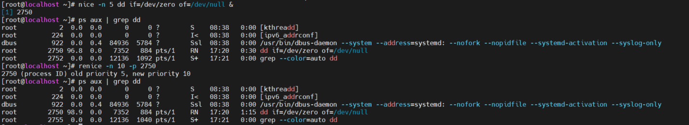

## 4. Gửi tín hiệu đến process với kll, killall và  pkill

**Lệnh `kill`**

- Lệnh `kill` được dùng để gửi tín hiệu để dừng một tiến trình thông qua số PID hoặc ID.
- 
- Cấu trúc `kill [option] [process-id]`

option | ý nghĩa
---|---
-1| Kết thúc process
-2 |Chấm dứt chương trình bằng tín hiệu SIGINT
-9 | gửi tín hiệu SIGKILL để buộc chấm dứt ngay một tiến trình
-15 | gửi  tín hiệu SIGTERM yêu cầu chấm dứt một process, đóng tất cả file đang mở 
-17 | Báo hiệu hệ điều hành để tạm dừng chương trình cho đến khi nhận được tín hiệu SIGCONT ("tiếp tục")

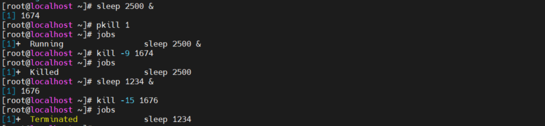

`kill -l` để xem danh sách signals sử dụng để dùng với `kill`

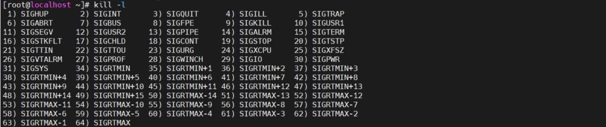

**Lệnh `killall`**

- Sử dụng `killall` để kill nhiều process sử dụng tên giống nhau cần kill đồng thời 
- Cấu trúc `killall [process name]` 
- `killall` thường được sử dụng trong multiprocessing environments hơn multithreading environments 

**Lệnh `pkill`

- Lệnh `pkill` dùng để quản lý process theo tên. Chủ yếu dùng để dừng process 

# 4. Sử dụng `top` để quản lý process  

- `top` là  công cụ thuận tiện để  quản lý các process, dễ dàng tìm kiếm process, hiển thị trạng  thái của các process, điều chỉnh đội ưu tiên hay kill process 

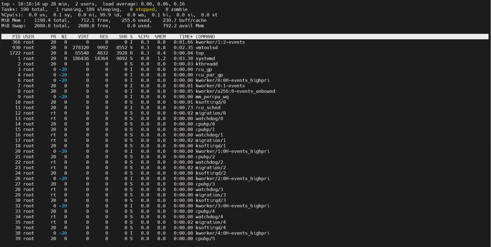

- Các option  của `top`

option | mô tả  
---|---
h| hiển thị phiên bản hiện tại
d| chỉ định thời gian trễ việc là mới màn hình  
o| sắp xếp theo trường đăt tên 
p| chỉ hiển thị các tiến trình với ID tiến trình được đặt
u| chỉ hiển thị các tiết trình của user được chỉ đinh
i| không hiển thị các tiến trình nhàn rỗi 

Dòng | ý nghĩa
---|---
Dòng 1 | liên quan tới thời gian của sever
Dòng 2 | liên quan tới thông tin tiến trình 
Dòng 3 | liên quan tới thông tin CPU
Dòng 4 | Liên quan tới thông tin ram 
Dòng 5 | liên quan tới thông tin Swap
Dòng 6 | các tham số của các tiến trình hoạt động

- Ý nghĩa của dòng 2 trong `top`

task | ý nghĩa  
--- | ---
Running (R) | process đang hoạt đông và thời gian sử dụng CPU 
Sleeping (S) | process đang chờ một sự kiện hoàn thành 
Uninterruptable sleep (D) | process đang trong chế độ ngủ và không thể dừng lại, nó thường xuyên xảy ra khi process đang ch ở  I/O
Stopped (T) | process đã bị dừng, các process trong shell khi sử dụng `crtl-Z`
Zombie (Z) | process bị dừng nhưng không thể xóa vì nó là parent, nó ở trạng thái không thể quản lý 

- Trong `top`, nhập k để kill một process, nhập r để thay đổi độ ưu tiên của process

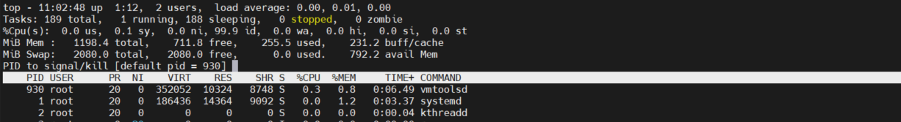

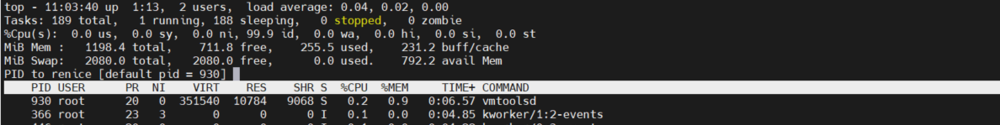

- Dùng `up time`  để biết thông tin về Load Average
- Load  Average không nên cao hơn số lượng core CPU. Lệnh `lscpu` để xem số lượng Core CPU trong hệ thống.

# 5. Điều chình để tối ưu hóa hiệu suất 

- Sử dụng `tuned` để điều chỉnh tối ưu hóa hệ thống. `tuned` cung cấp một hồ sơ để admin điều chỉnh các thuộc tính một cách tốt nhất  

Profile | Use 
---|---
balanced | sự hài hòa tốt nhất giữa năng lượng và hiệu suất
desktop | dựa vào balanced profile nhưng tuned cho phản ứng tốt hơn đến ứng dụng tương tác
latency-performance | tuned cho lưu lượng max
network-latency | dựa trên latency-performance nhưng thêm tùy chọn để giảm độ trễ của mạng 
network-throughput | dựa trên throughput-performance, tối ưu hóa CPU cho nội dung đường truyền 
powersave | điều chỉnh tiết kiệm năng lượng tối đa 
throughput-performance| điều chỉnh thông lượng tối đa
virtual-guest | tối ưu hóa linux chạy như một máy ảo
virtual-host | tói ưu hóa linux  cho sử dụng làm một máy chủ KVM

 - `tuned-amd`dùng để quản lý performance profile
 - Chạy `systemctl enable --now tuned` đển bắt đàu tuned profile trước khi sử dụng `tuned amd`
 - `tuned-adm list` hiển thị tổng quan cac profile có sẵn trên máy chủ 
- `tuned-adm profile profile-name` để chọn profile
-  `tuned-adm recommend` để xuất một tuned profile cho hệ thống

# Tham khảo

https://news.cloud365.vn/ps-command-tim-hieu-va-huong-dan-su-dung/#5.-Tr%E1%BA%A1ng-th%C3%A1i-c%E1%BB%A7a-m%E1%BB%99t-ti%E1%BA%BFn-tr%C3%ACnh

https://blogd.net/linux/quan-ly-tien-trinh-tren-linux/#15-1-l%E1%BB%87nh-nice

https://blogd.net/linux/vi-du-ve-su-dung-lenh-top/