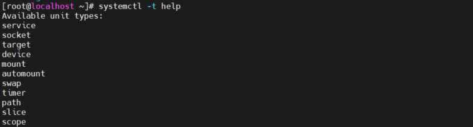
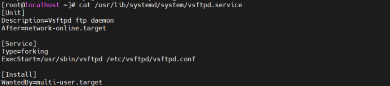
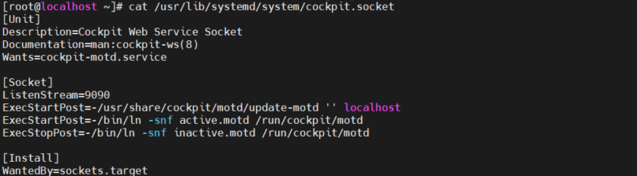
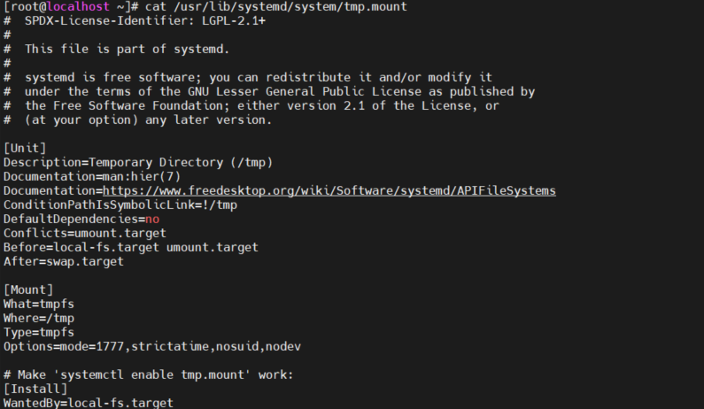
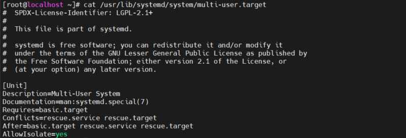
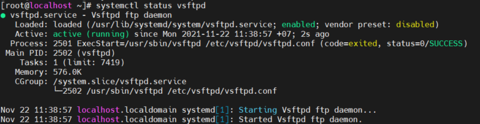
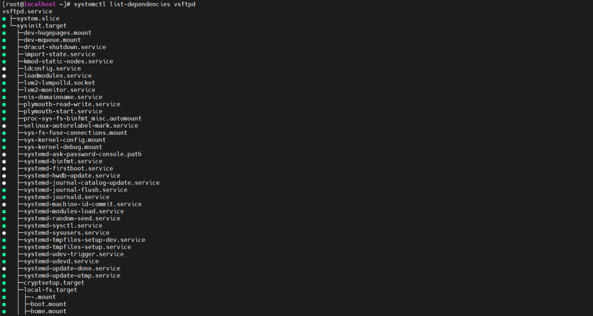
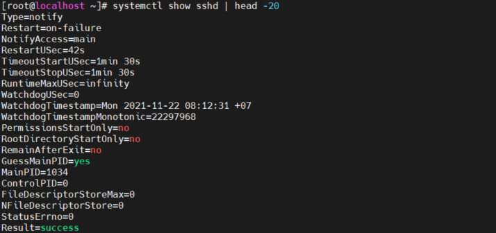

# Mục lục 
- [1. Understanding Systemd](#1)
  - [1.1 Understanding Systemd Unit Locations](#11)
  - [1.2 Understanding Systemd Service Units](#12)
  - [1.3 Understanding Systemd Mount Units](#13)
  - [1.4 Understanding Systemd Socket Units](#14)
  - [1.5 Understanding Systemd Target Units](#15)
- [2. Managing Units Through Systemd](#2)
  - [2.1 Managing Dependencies ](#21)
  - [2.2 Managing Unit Options](#22)
- [Tham khảo](#tm)

# 1.  Understanding Systemd

- Systemd quản lý hệ thống và service cho hệ thống vận hành linux
- Systemd quản lý các units
  - Có 12 loại units và loại sử dụng phổ biến nhất là service
  - Lệnh `systemctl -t help`để xem các units có sẵn 
  

Unit | file exténion | description
---|---|---
Service unit | .service | dịch vụ của hệ thống
Target unit | .target | một nhóm của systemd unit
Automount unit | .automount | hệ thống tập tin automount point
Device unit | .device| file thiết bị được nhận biết bởi kernel
Mount unit | .mount | hệ thống tập tin mount point
Path unit| .path | một tập tin hoặc thư mục trong hệ thống tập tin
Scope unit | .scope | một quá trình được tạo ra bên ngoài  
Slice unit | .slice | Một nhóm phân cấp được tổ chức unit quản lýcác quy trình hệ thống 
Snapshot unit | .snapshot | trạng thái được lưu của quản lý hệ thống
Socket unit | .socket | một inter-process giao tiếp với socket
Swap unit | .swap | một thiết bị swap hoặc một tệp swap
Timer unit | .timer | bộ đếm thời gian hệ thống  

## 1.1 Understanding Systemd Unit Locations
- Systemd cung cấp một giao diện thống nhất để bắt đầu các unit. Giao diện này được xác định trong unit file. Các unit file  có thể xảy ra trong ba địa điểm:

Directory | Description 
---|---
/usr/lib/systemd/system | file systemd unit được phân phối với các package RPM đã cài đặt
/etc/systemd/system/ |  hệ thống chứa các file unit tùy chỉnh. Nó cũng có thể chứa các tập tin được viết bởi một admin hoặc được tạo bởi lệnh Systemctl edit
/run/systemd/system | chứa file unit tự động được tạo tại thời điểm chạy 
- Độ ưu tiền khi một file unit tồn tại ở nhiều vị trí : /run > /etc > /usr
- /run có độ ưu tiên cao nhất, có quyền ghi đè lên bất kì cài đặt nào đưuọc xác định ở nơi khác. 

## 1.2 Understanding Systemd Service Units

- Service unit được sử dụng để bắt đầu các prcess.
- Có thể bắt đầu bất kì loại process nào bằng service bao gồm cả deamon process và lệnh

Vd File unit  vsftpd.service

  

  - [Unit] mô tả unit và xác định phụ thuộc.   `Before` chỉ ra unit nên được bắt đầu trước khi unit được xác định, `After` chỉ ra unit nên được bắt đầu sau khi unit được xác đinh.
  - [Service] mô tả cách bắt đầu và dự  dịch vụ và trạng  thái yêu cầu cài đặt, `type` dùng để chỉ định cách bắt đầu quá trình (forking, oneshot)
  - [Install] chỉ ra target mà unit được bắt đầu  

## 1.3 Understanding Systemd Socket Units
-  Socket tạo ra một phương pháp cho ứng dụng giao tiếp với nhau.
- Một socket có thể định nghĩa như một file, như port trong hệ thống sẽ lắng nghe đến kết nối.

  

  - `ListenStream` định nghĩa TCP port mà systemd lắng nghe cho kết nối 
  - `ListenDatagram` định nghĩa cho UDP port

## 1.4 Understanding Systemd Mount Units

- Một thiết bị gắn kết chỉ định cách gắn hệ thống tệp trên một thư mục cụ thể

 
  
  - [unit] Tuyên bố xung đột được sử dụng để liệt kê các unit không thể sử dụng
cùng với unit này. Sử dụng điều này cho các đơn vị loại trừ lẫn nhau
  - [Mount] Định nghĩa chính xác nơi mà mount phải thực hiện. Nhận biết các đối tượng sử dụng với lệnh mount 

## 1.5 Understanding Systemd Target Units

- File unit được sử dụng để xây dựng các chức năng cần thiết trên máy chủ. 
- Target unit khả thi cho việc tải các chức năng theo đúng thứ tự và đúng thời điểm
- Một vài target được sử dụng để định nhĩa trạng thái một server nên được khởi động.
- Các target khác là một nhóm các dịch vụ giúp dễ dàng quản lý. Tất cả các unit được yêu cầu để có chức năng cụ thể.

- VD multi-user.target định nghĩa cho trạng thái hoạt động thông thường của RHEL server.

 

- Target chỉ định nghĩa những gì nó yêu cầu,và server và target mà nó không thể cùng tồn tại với nhau 
- [After] định nghĩa cho load ordering
- Target file không chứa nôi thông tin về các unit mà nó bao gồm
- Lệnh `systemctl enable` để unit tự động bắt đầu khi khởi động, [install] để xác định target unit được thêm vào 
- Khi thêm unit đến target, một symbolic link được tạo ra ở /etc/systemd/system

# 2. Managing Units Through Systemd

- Lệnh `systemctl` được sử dụng để quản lý các unit

Command | Mô tả
---|---
 systemctl start | bắt đầu một unit
 systemctl stop | dừng một unit
 systemctl status | xem trạng thái của dịch vụ 
 systemctl enable | chop phép unit tự động hoạt động khi khởi động

 Hiển thị trạng thái hoặt động của vsftpd.service 

 

 Status | Description
 ---|--- 
 loaded | unit file được xử lý và unit hoạt động
 Active(running) | unit đang chạy với một hay nhiều process hoạt động
 Active(exited) | unit đã hoàn thành một lần chạy 
 Active(waiting) | unit đang chạy và đợi một sự kiện
 Inactive(dead) | unit không chạy 
 Enable | unit sẽ bắt đầu tại thời điểm khởi động
 Disable | unit sẽ không bất đầu tại thời điểm khởi động
 Static | unit không thể enable nhưng có thể tự động bắt đầu bằng một unit khác
 Main PID | PID của dịch vụ hệ thống tương ứng theo sau là tên của nó
 Process | thông tin bổ sung về các quy trình liên quan.
 Status | thông tin bổ sung về dịch vụ hệ thống tương ứng.
 CGroup | thông tin bổ sung về các nhóm kiểm soát liên quan (Cgroups)

- Lệnh tổng quát unit 

Command | Description
---|---
systemctl --type=service | chỉ hiển thị service unit
systemctl list-units --type=service | hiện thị tất cả hoạt động của service unit 
systemctl list-units --type=service --all | hiển thị các service unit hoạt động cũng như không hoạt động
systemctl --failed --type=service | hiển thị tất cả service lỗi
systemctl status -l your.service | hiển thị chi tiết thông tin trạng thái về service

 ## 2.1 Managing Dependencies

- Có 2 cách quản lý phụ thuộc
  - Các loại unit như socket và path liên quan trực tiếp đến một đơn vị dịch vụ, truy cập một trong 2 loại unit này sẽ tự động kích hoạt loại dịch vụ 
  - Phụ thuộc có thể định nghĩa trong unit, sử dụng từ khóa như `Requires`, `Requisite`, `After`, và `Before`. 

Keyword| Decscription
---|---
Requires| Nếu unit load, unit được liệt kê cũng sẽ load theo, nếu một trong các unit bị vô hiệu hóa thì các unit này sẽ bị vô hiệu hóa
Requisite | Nếu unit được liệt kê ở đây không load thì unit sẽ thất bại
Before|  unit sẽ bắt đầu trước khi unit được xác định 
After |  unit sẽ bắt đầu sau khi unit được xác đinh

- Nhập `systemctl list-dependencies` để xem những phụ thuộc mà nó có. Thêm --reverse để xem các unit nào phụ thuộc vào unit này

 

 ## 2.2 Managing Unit Options

- Unit file có thể được cấu hình với các option khác nhau
- Lệnh `systemctl show` để xem các option có sẵn của unit, bao gồm cả các giá trị mặc định.

 

- `systemctl edit` để thêm option vào unit file 
- `systemctl edit --full` sửa trực tiếp toàn bộ nội dung file
- `systemctl daemon-reload` reload systemd sau khi sửa 

- Khi unit file áp dụng optiion, những thay đỏi này sẽ được viết vào /etc/systemd/system

- Cách thay thế để thay đổi tệp đơn vị là sao chép unit file mặc định từ /usr/lib/systemd/system đến /etc/systemd/system, và tạo cài đặt của bạn trong unit file ở vị trí này. Cách tiếp cận này đảm bảo rằng các sửa đổi sẽ không bị mất sau khi unit file  mặc định được cập nhật.

# Tham khảo 

https://access.redhat.com/documentation/en-us/red_hat_enterprise_linux/7/html/system_administrators_guide/chap-managing_services_with_systemd#sect-Managing_Services_with_systemd-Services-List

