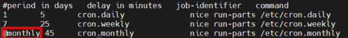

# Mục lục
- [1. Configuring Cron to Automate Recurring Tasks ](#1)
  - [1.1 Managing the crond Service](#11)
  - [1.2 Understanding Cron Timing](#12)
  - [1.3 Managing Cron Configuration Files](#13)
  - [1.4 Understanding the Purpose of anacron](#14)
  - [1.5 Managing Cron Security](#15)
- [2. Configuring at to Schedule Future Tasks](#2)
- [Tham khảo](#tm)

---

# 1. Configuring Cron to Automate Recurring Tasks
- Cron được sử dụng như một dịch vụ chung để chạy các process tự động tại thời gian cụ thể
- Cron service gồm 2 thành phần chính: 
  - Cron daemon crond,  Daemon này trông mỗi phút để xem liệu có việc phải làm. 
  - Công việc này cần làm được xác định trong cấu hình Cron, bao gồm nhiều tệp làm việc cùng nhau để cung cấp thông tin phù hợp với dịch vụ phù hợp ở bên phải thời gian.

## 1.1 Managing the crond Service
- Crond service được khởi động mặc định trong hệ thống RHEL, dịch vụ này cần thiết vì một số tác vụ hệ thống chạy thống qua cron.
- Crond không cần nhiều quản lý, crond không cần load lại hay khởi động lại khi thay đổi cấu hình, crond deamon sẽ cập nhập mỗi phút và kiểm tra cấu hình để xem thứ gì cần khởi động

- `systemctl status crond -l` giám sát trạng thái hiện tại của cron service

  

- Phần quan trọng nhất trong đầu ra là ở phần đầu, nó chỉ ra dịch vụ đang đang được load và bật, nó sẽ tự động bật bất cứ khi nòa dịch vụ này khởi động 

## 1.2 Understanding Cron Timing

- Khi schedule service thông qua Cron, cần chỉ định chính xác khi nào dịch vụ cần được bắt đầu.
- Trong cấu hình crondtab, sử dụng chuõi thời gian đểchỉ ra tác vụ nên được khởi động. 

Time and date | Values 
---|---
minute | 0-59
hour | 0-23 
date of month | 1-31
month | 1-12(name)
day of week | 0-7

- Sử dụng `*` để chỉ bất kì giá trị nào
  - Dùng dấu phẩy , để thiết lập nhiều số cho nhiều thời điểm. Ví dụ tôi muốn cứ vào phút thứ 20 và 40 lệnh sẽ được chạy:  `20,40 * * * * <run command here>`
  - Dùng dấu xuộc / để chia đều khoảng cách thời gian được chạy. Ví dụ cứ 5 phút quét hệ thống 1 lần để kiểm tra xem có sự bất thường nào không: `*/5 * * * * <scan system now>`
  - Dùng dấu gạch ngang - để chỉ khoảng thời gian.Ví dụ cứ vào 10h30 11h30 12h30 sáng sẽ chạy lệnh: `30 10-12 * * * <command>`

Ví dụ | Mô tả
---|---
\*11*** | mỗi phút giữa 11:00-11:59
0 7 -18 ** 1-5  | mỗi ngày 11h chỉ vào các ngày trong tuần 
0 7-18 * * 1-5 |Mỗi giờ ở đầu giờ từ 7 giờ sáng đến 6 giờ tối trong tuần 
0 */2 2 12 5| mỗi 2 giờ một lần trong ngày 2 tháng 12 và mỗi thứ 6 trong tháng 12 

## 1.3 Managing Cron Configuration Files

- File cấu hình đặt tại /etc/crontab. Nó cung cấp về cái nhìn tổng quan về về thông số thời gian được sử dụng  trong  cron
 
  

- Các tệp cấu hình khác được sử dụng thay vì chỉnh sửa file /etc/crontab
  - File Cron ở /etc/cron.d
  - Các tập lệnh tại  /etc/cron.hourly, cron.daily, cron.weekly, và cron.monthly
  - Các tập lệnh dành riêng cho người dùng bằng `crontab -e`
- Các lệnh crontab thường dùng
  - crontab -e: tạo hoặc chỉnh sửa file crontab 
  - crontab -l: hiển thị file crontab 
  - crontab -r: xóa file crontab
- Khi dùng `crontab -e`, trình soạn thảo `vi` sẽ tạo một file tạm thời để chỉnh sửa cấu hình, khi hoàn tất file tạm thời sẽ chuyển đến vị trí /var/spool/cron. Trong thư mục này mỗi file sẽ tạo cho mỗi người dùng.
- Không nên chỉnh sửa các file này trực tiếp. khi file được lưu bởi `crontab -e` nó sẽ được kích hoạt tự động

## 1.4 Understanding the Purpose of anacron
- Anacron service được sử dụng để đảm bảo công việc thực hiện thường xuyên
- Ngay sau khi máy tính được khởi động, anacron sẽ kiểm tra xem các job đã được cấu hình có bỏ lỡ lịch chạy nào không. Nếu có, các job này sẽ được chạy ngay lập tức. Nhưng các job sẽ chỉ chạy một lần, bất kể bao nhiều lần nó đã lỡ lịch,

- Dịch vụ này quan tâm các cron job bắt đầu từ hourly, daily, weekly, và  monthly, không có vấn đề vào thời điểm chính xác
- File /etc/anacrontab sử dụng để xác định mức độ làm việc

  

  - Trường đầu tiên chỉ định tần suất thực hiện việc làm 
  - Trường thứ 2 chỉ định thời gian anacron chờ đợi trước đó  
  - Trường thứ 3 chứa định danh công việc
  - trường thứ 4 chỉ định lệnh được thực thi
- Cách vận hành của anacron
  - 1. Dịch vụ crond chạy các cron job được chỉ định trong /etc/cron.d/0hourly.
    
  - 2. Cron job được chỉ định trong /etc/cron.d/0hourly chạy chương trình run-parts mỗi giờ một lần
  - 3. Chương trình run-parts sẽ chạy tất cả script có trong thư mục /etc/cron.hourly
  - 4. Thư mục /etc/cron.hourly chứa script 0anacron, script này sẽ chạy chương trình anacron bằng config file /etc/anacrontab

  - 5. Cuối cùng, chương tình anacron chạy các chương trình có trong /etc/cron.daily hàng ngày; chạy job trong /etc/cron.weekly hàng tuần, và job trong cron.monthly mỗi tháng. Lưu ý rằng thời gian delat trong mỗi dòng giúp ngăn các job này bị trùng nhau.
- Anacron không được thiết kế để chạy các chương trình theo các thời gian cụ thể. Mà nó sẽ chạy các chương trình tại những khoảng thời gian nhất định, với thời gian bắt đầu xác định.

- Shortcut trong crontab Linux
    
  - File /etc/anacrontab ở trên cho ta thấy cách các shortcut (phím tắt) có thể được sử dụng, chỉ định một số thời gian phổ biến.
  - Các shortcut thời gian này có thể thay thế đến 5 trường thường dùng để chỉ định thời gian. 
  - Kí tự @ dùng để xác định shortcut cho cron.
  - Một số shortcut và ý nghĩa của chúng 

    Shortcut | ý nghĩa
    ---|---
    @reboot | Chạy sau khi reboot.
    @yearly | Chạy hàng năm, ví dụ: 0 0 1 1 *
    @annually | Chạy hàng năm, ví dụ: 0 0 1 1 *
    @monthly | Chạy hàng tháng, ví dụ: 0 0 1 * *
    @weekly | Chạy hàng tuần, ví dụ: 0 0 * * 0
    @daily | Chạy hàng ngày, ví dụ: 0 0 * * *
    @hourly | Chạy mỗi giờ, ví dụ: 0 * * * *

## 1.5 Managing Cron Security

- Tất cả người dùng đều có thể nhập cron job, để giới hạn người dùng được phép lên lịch cron bằng cách sử dụng file cấu hình /etc/cron.allow và /etc/cron.deny
  - Nếu cron.allow tồn tại, phải liệt kê tất cả người dùng được phép sử dụng cron.
  - Không nên để 2 tệp tồn tại cùng lúc 
  - Chỉ root mới được sử dụng cron nếu không có 2 tệp tồn tại

# 2. Configuring at to Schedule Future Tasks

- Dịch vụ ATD cung cấp dịch vụ thực thi một lần, ATD cung cấp mặc định cho RHEL 8 
- Một số chương trình có thể phải chạy tự động theo định kỳ hoặc thực thi một hoặc nhiều lệnh tại một thời điểm nhất định trong tương lai. Hệ thống Linux  bao gồm các cơ sở để sắp xếp các công việc để chạy vào bất kỳ ngày hoặc thời gian nào mong muốn. Hoặc cũng có thể thiết lập hệ thống để thực hiện một nhiệm vụ định kỳ hoặc chỉ một lần. 
- Sử dụng lệnh `at` để để chạy ATD service, theo sau `at` là thời gian cụ thể hoặc cũng có thể là  mốc thời gian  như teatime và noon. 
- Sau khi sử dụng `at`, chạy shell và nhập các lệnh sẽ được thự thi tại thời điểm cụ thể đã được thiết lập. Ctrl-D  để thoát khỏi shell khi đã nhập xong 
- Lênh `atq` để sắp xếp các job sau khi lên lịch
- Lệnh `atrm` để loại bỏ công việc hiện tại
- Ngoài ra lệnh `batch` có chức năng tương tự như `at` nhưng phức tạp hơn
 
   

# Tham Khảo

https://vietnix.vn/crontab/

https://www.dummies.com/computers/operating-systems/linux/how-to-schedule-jobs-in-linux-at-and-crontab-commands/