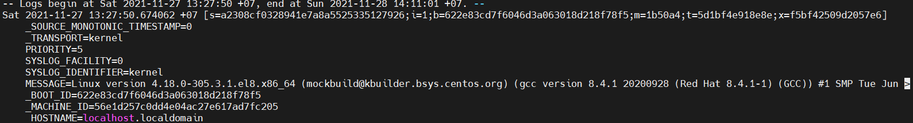

# Mục lục 
- [1. Understanding System Logging](#1)
  - [1.1 Understanding the Role of rsyslogd and journald](#11)
  - [1.2 Reading log files](#12)
  - [1.3 Understanding Log File Contents](#13)
  - [1.4 Live Log File Monitoring](#14)
  - [1.5 Using logger](#15)
- [2. Configuring rsyslogd](#2)
  - [2.1 Understanding rsyslogd Configuration Files](#21)
  - [2.2 Understanding rsyslog.conf Sections](#22)
- [3. Rotating Log Files](#3)
- [4. Working with journald](#4)
  - [4.1 Using journalctl to Find Events](#41)
  - [4.2 Preserving the Systemd Journal](#42)
- [Tham khảo](#tm)

  ---

# 1. Understanding System Logging 

- Mọi service được sử dụng trong linux server được ghi thông tin đến log file. Thông tin có thể được ghi đến các điểm đến khác nhau và có nhiều giải pháp để tìm các thông tin liên quan trong system logs. 
- 3 cách tiếp cần được sử dụng vởi service để ghi thông tin log
  - **Direct write**: Một số dịch vụ ghi trực tiếp thông tin vào log files, ngay các một số dịch vụ quan trọng như Apache web server và Samba file server.
  - **rsyslogd**: rsyslogd là bản nâng cao của syslogd, một dịch vụ quản lý tập trung log files
  - **journald**: cùng với systemd, journald log service systemd-journald cũng được giới thiệu. Dịch vụ này tích hợp chặt chẽ với systemd, cho phép quản trị viên đọc thông tin chi tiết từ journald trong khi giám sát trạng thái dịch vụ bằng cách sử dụng lệnh `systemctl status`

## 1.1 Understanding the Role of rsyslogd and journald
- Syslog là một giao thức để chuyển tiếp và thu thập log
- Rsyslog (The rocket-fast system for log processing) dùng để chuyển tiếp các log message đến một địa chỉ trên mạng (log receiver, log server) 
- Trên RHEL 8, journald (được triển khai bởi systemd-journald daemon) cũng cấp hệ thống quản lý log nâng cao. 
- journald thu thập tin tức từ kernel, quy trình khởi đông hệ thống và dịch vụ và ghi các tin tức này vào event journal. Event journal được lưu trữ ở dạng nhị phân.
- Lệnh `journalctl` để truy vấn nội dung trong event jounral. Nó cho phép một cấp độ sâu về chi tiết messages được ghi lại 

- Journal được viết bởi journald không chỉ liên tục giữa các lần reboot , message cũng được chuyển tiếp đến rsyslogd service, nó viết messgae đến các file khau nhau trong thư mục /var/log. rsyslogd cung cấp các chức năng không tồn tại trong journald ví du như ghi và lọc message bởi module
- journald chỉ là công cụ ghi thông tin log chứ không thay thế cho rsyslog. journald được gắn kết chặt chẽ với systemd, ghi lại mọi thứ máy chủ đang làm.  
- rsyslogd sẽ thêm một vài dịch vụ để lại mọi thứ server đang làm, nó sẽ viết log information vào file cụ thể và cho phép cấu hình từ xa logging và log servers 
- Ngoài ra còn có auditd service, dịch vụ cung cấp kiểm tra, đi sâu vào các service, process, hoặc user cụ thể đang hoạt động 

- 3 cách tiếp cận thông tin về những thứ xảy ra trong server
  - Giám sát qua file trong /var/log được ghi bởi rsyslogd
  - Lệnh journalctl để xem thông tin chi tiết từ journal
  - Lệnh systemctl status \<unit> xem tổng quan ngắn về các sự kiện quan trọng được ghi bởi systemd unit thông qua journald

## 1.2 Reading log files
- Ngoài message được ghi bởi journald có thể sử dụng lệnh `journalctl` 
- Các file log khác nhau được lưu tại /var/log. Một số file được tạo trực tiếp bởi các dịch vụ cụ thể mà không thông qua rsyslogd.
- Số lượng file trong /var/log sẽ thay đổi tùy theo cấu hình máy và các dịch vụ đang chạy trên server. 

Log File | Explanation
---|---
/var/log/messages| log file chung, nơi hầu hết các log file được ghi 
/var/log/dmesg | nội dụng kernel log messages
/var/log/secure | nội dung message liên quan để xác thực, xem các lỗi xác thực xảy ra trên máy chủ  
/var/log/boot.log | message liên quan đến khởi động hệ thống
/var/log/audit/audit.log| nội dung audit message. SELinux ghi đến file  
/var/log/maillog |  lưu trữ các thông tin từ máy chủ mail đang chạy trên hệ thống bao gồm các thông tin về postfix, smtpd, MailScanner, SpamAssassain hoặc bất kỳ dịch vụ liên quan đến email nào khác.
/var/log/samba | cung cấp log file cho Samba service. Mặc định Samba không được quản lý bởi rsyslog mà ghi trực tiếp vào thư mục /var/log
/var/log/sssd | chứa nội dung được ghi bởi sssd service, nó quan trong trong việc xác thực process
/var/log/cups | nội dung log message được tạo bởi print service CUPS
/var/log/httpd/ |  thư mục chứa nội dung log file được ghi bởi Apache web service. Apache writes messages được viết trực tiếp và không thông qua rsyslog

## 1.3 Understanding Log File Contents
 - Ví dụ nội dung file log /var/log/message
  

- Nội dung trong mỗi dòng trong log file 
  - **Date and time**: Mọi log  message bắt đầu với một timestamp. Timestamp được viết như military time.
  - **Host**: Các host có liên quan, , rsyslogd có thể được cấu hình xử lý log  từ xa
  - **Service or process name**:tên service hoặc process tạo ra message
  - **Message content**: chứa nội dung chính xác được log của message

## 1.4 Live Log File Monitoring

- Sử dụng lệnh `tail -f <logfile>` để quan sát những gì đang xảy ra trong hệ thống 
 
  

  

## 1.5 Using logger

- Lệnh `logger` cho phép người dùng ghi message đến rsyslog từ dòng lệnh hoặc một tập lệnh

  

  
- `logger -p mail.debug "Test"` để nhập vào log message với facilities là mail và priorities là debug với nội dung Test

# 2. Configuring rsyslogd

- File cấu hình /etc/rsyslog.conf 
  - Chứa thông tin về vị trí nới mà các thông tin được ghi lại
  - Có thể cấu hình rsyslogd service thông qua file này. 
  - Tìm kiếm các phần  khác nhau cho phép  chỉ định thông tin được ghi ở đâu và như thế nào

## 2.1 Understanding rsyslogd Configuration Files

- Cấu hình cho rsyslogd không được mặc định trong một file cấu hình.  
- File /etc/rsyslog.conf 
  - Là file trọng tâm nơi mà rsyslogd được cấu hình
  - Nội dung của file /etc/rsyslog.d được bao gồm trong file /etc/rsyslog.conf
  - Thư mục có thể được thêm bằng cách cài đặt các gói RPM trên service

- File /etc/sysconfig/rsyslog. 
  - Nếu các tùy chọn cụ thể cần được chuyển sang rsyslogd khi khởi động, có thể làm điều này qua file
  - *SYSLOGD_OPTIONS=""* là dòng mặc định trong file,, có thể chỉ định tham số khởi động rsyslogd
  

## 2.2 Understanding rsyslog.conf Sections

- File rsyslog.conf được sử dụng để chỉ định những gì nên đăng nhập và nơi nó sẽ được đăng nhập. Để thực hiện việc này, bạn sẽ tìm thấy các phần khác nhau trong tệp rsyslog.conf:

  - \#### MODULES ####: rsyslogd là module. Các module được bao gồm để nâng cao các tính năng được hỗ trợ trong rsyslogd
  

  - \#### GLOBAL DIRECTIVES ####: Chỉ định các tham số chung như vị trí nơi mà file phụ được ghi hoặc định dạng timestamp mặc định
  

  - \#### RULES ####: Là phần quan trọng nhất của file, chứa các quy tắc chỉ định thông tin nào được ghi vào đích 
   

  
## 2.3 Understanding Facilities, Priorities, and Log Destinations
- Để chỉ định thông tin nào sẽ được ghi vòa đích, rsyslogd sử dụng facilities, priorities và destinations
  - Facilities chỉ định một danh mục thông tin được ghi lại. rsyslogd sử dụng một danh sách cố định không mở thể mở rộng.
  - Priorities được sủ dụng để định nghĩa mức độ nghiêm trọng của message cần để ghi lại. Chỉ định một priority, the mặc định tất cả message với độ ưu tiên và tất cả độ ưu tiên cao hơn được ghi lại 
  - Destination định nghĩa nơi mà message được ghi, điểm đến chính là file.  rsyslog modules cũng có thể  được sử dụng làm đích 
   

- Trên hình cho thấy sự facilities và priorities khác nhau để xác định vị trí nơi thông tin được ghi. facilities and priorities có sẵn không được phép sửa và thêm vào  
- Khi chỉ định điểm đến, một file thường được sử dụng. Nếu tên file bắt đầu bằng một dấu gạch nối (như trong -/var/log/maillog), các log message sẽ không ngay lập tức ghi vào file mà sẽ được đệm để ghi hiệu quả hơn. 

- Bảng mức độ cảnh cáo

Value | Severity | keyword
---|---|---
0| emergency| `emerg` thông báo tình trạng khẩn cấp
1| alerts| `alert` hệ thống cần can thiệp ngay
2| critical| `crit` thình trạng nguy kịch
3| errors| `err` thông báo lỗi với hệ thống
4| warning | `warning` mức cảnh cáo với hệ thống
5| notice|`notice` chú ý đối với hệ thống
6| info | `info` thông tin của hệ thống
7| debug| `debug` quá trình kiểm tra hệ thống

- File thiết bị có thể được sử dụng như /dev/console. Nếu file device được sử dụng thì message sẽ được viết trong thời gian thực vào console

Facility| Used by
---|---
auth/authpriv |Messages có liên quan đến xác thực 
cron |Messages được tạo ra bởi crond service.
daemon| Generic facility được sử dụng cho deamon không xác định.
kern |Kernel messages.
lpr| Messages được tạo ra thông qua legacy lpd print system.
mail| Email liên quan đến messages.
mark |Special facility có thể được sử dụng để ghi một đánh dấu định kì  
news| Messages tạo ra bởi  NNTP news system.
security| Giống như  auth/authpriv. Không nên sử dụng.
syslog| Messages tạo ra bởi syslog system.
user| Messages tạo ra trong không gian người dùng.
uucp| Messages tạo ra bởi legacy UUCP system.
local0-7| Messages tạo ra bởi  services, được cấu hình bởi bất kì loal 0-7 facilities.

Priority| Description
---|---
debug |Debug messages  cung cấp nhiều thông tin về hoạt động dịch vụ
info |Thông tin  messages về hoạt động service thông thường 
notice| Thông tin  messages về items, nó có thể trở thành một số vấn đề sau này
warning / warn| Một vài cảnh cáo dưới mức tối ưu, nhưng không có lỗi nào xảy ra
err /error| Xảy ra lỗi không xác định 
crit| Xảy ra lỗi nghiêm trọng 
alert| Sử dụng khi khả năng sẵn có của dịch vụ bị ngưng
emerg/panic |Message được tạo ra khi tính sẵ có của dịch vụ vị ngưng.

- Khi một mức độ ưu tiên cụ thể được sử dụng, tất cả các message có mức độ ưu tiên đó và cao hơn sẽ được ghi lại theo các thông số kỹ thuật được sử dụng trong rule cụ thể đó

Lap: Tạo file cấu hình rsyslog server để ghi message-notice

  - Tạo file cấu hình /etc/rsyslog.d/notice.conf và nhập nội dung `*.notice /var/log/messages-notice` 
  - Tạo file lưu trữ log message /var/log/messages-notice
  - Chỉnh sửa file  /etc/rsyslog.d/notice.conf với nội dung **.notice /var/log/messages-notice*
  - Nhập `systemctl restart rsyslog` để khởi chạy lại rsyslog  service
  - Dùng `lênh tail -n /var/log/messages-notice` để quan sát  
  - `logger -p user.notice "Notice Message Test"` để ghi message vào /var/log/messages-notice

# 3. Rotating Log Files
- Để ngăn rsyslog message lấp đầy toàn hệ thống. các log message có thể được xoay vòng. Khi đạt đến một ngưỡng nhất định file message cũ sẽ đóng lại và một message mới sẽ được mở. Tiện ích logrotate thông qua cron service để theo dõi  rotating log files
- Khi một file được xoay vòng , file cũ được copy đến một file khác có ngày xoay vòng của thời điểm đó. Vd  /var/log/message được xoay vòng vào ngày 26/11/2021 thì tên của file rotate /var/log/messages-20211126, 4 file gần nhất sẽ được giữ lại trong hệ thống.

- Cài đặt mặc định cho log rotation được giữ trong file /etc/logrotate.conf

  - Khi logrotate chạy, nó sẽ kiểm tra bất kỳ tệp nào ở /var/log/cron, /var/log/maillog, /var/log/messages, /var/log/secure, /var/log/spooler và rotate chúng, nếu chúng không trống.
  - Nếu nó kiểm tra thư mục cron, maillog, messages, secure, spooler và không tìm thấy bất kỳ tệp nhật ký nào, nó sẽ không phát sinh lỗi
- File /etc/logrotate.d/syslog ghi lại cấu hình gói syslog

- Lệnh `man logrotate` để xem thông tin về các tham số trong tệp tin  
 - Thư mục /etc/logrotate.d lưu trữ các file cấu hình, có thể tạo thêm file cấu hình trong thư mục này  

- Lựa chọn Log file được rotate
  - Chỉ định cụ thể một hay nhiều file log với đường dẫn tuyệt đối của file log đó, phân biệt danh sách các log file cụ thể bằng khoảng trắng.
- Rotate theo thời gian
  - Có 4 giá trị cấu hình tương ứng với khoảng thời gian log file sẽ được rotate.

    - Daily: mỗi ngày
    - Weekly: mỗi đầu tuần
    - Monthly: mỗi đầu tháng
    - Yearly: mỗi năm
- Rotate theo dung lượng file log
  - Khi file log đạt tới giới hạn dung lượng thì sẽ tiến hành rotate. Đơn vị kích thước có thể sử dụng là K, M, G.
    - size 100k
    - size 100M
    - size 100G
- Rotate theo số lượng Log file
  - rotate [number]
- Xử lý Log file trống
  - Tham số `missingok`: nếu file log vì lý do gì đấy bị mất hoặc không tồn tại *.log thì logrotate sẽ tự động di chuyển tới phần cấu hình log của file log khác mà không cần phải xuất ra thông báo lỗi. Ngược lại sẽ là cấu hình nomissingok

  - Tham số `Notifempty`: không rotate log nếu file log này trống.

- Tự động nén Log file
  - Tùy chọn `Compress`: Logrotate sẽ nén tất cả các file log lại sau khi đã được rotate, mặc định bằng gzip.
  - Nếu muốn sử dụng chương trình nén khác như bzip2, xz hoặc zip thì hãy đặt tên chương trình đó thành biến sau giá trị cấu hình ví dụ: `Compresscmd xz`
  - Tham số `Delaycompress` sẽ hữu dụng trong trường hợp không muốn file log cũ phải nén ngay sau khi vừa được rotate. Thay vào đó, công việc nén sẽ được delay trễ hơn bằng việc sẽ nén file log cũ đó vào lần chạy rotate kế tiếp. 
  - Tùy chọn `nocompress` không sử dụng tính năng nén đối với file log cũ
- Phân quyền cho Log file
  - Tham số create sẽ quy định việc file log mới tạo ra. có thể phân quyền cho file log mới được tạo ra tại đây. 
  - Ví dụ: `create 660 appuser www-data`. File log mới sẽ có owner là appuser và thuộc group www-data. Quyền hạn 660 cho phép cả owner và user trong cùng 1 nhóm được phép viết, sửa nội dung lên file. Điều này cho phép các ứng dụng PHP viết vào log file.
  - Tham số `Dateext` sẽ giúp cài đặt hậu tố của tên log file là thời gian theo cấu trúc yyyymmdd

# 4. Working with journald

- Systemd-journald service lưu trữ log message trong journal, mọt file nhị phân được lưu trữ tạm thời trong /run/log/journal. Sử dụng lệnh `journalctl` để kiểm tra file 

## 4.1 Using journalctl to Find Events
- Nhập lệnh`journalctl` mặc định hiển thị  các sự kiện xảy ra từ khi hệ thống khởi động lần cuối, chúng sẽ in ra phàn đầu của journal.Nhập `G` để xem các sự kiện cuối được ghi lại.
- Nhập `journalctl -f` để xem các dòng cuối của message và chúng được tự động được thêm vào khi có các sự kiện mới  
- `journalctl -u` để xem journal về service. `systemctl list-units --type=service` để xem danh sách service
 

- `journalctl --no-pager` hiển thị nội dung của journal không sử dụng paper
- `journalctl _PID=1009` để hiển thị các message có PID= 1009, 
 

- ` journalctl -n 20` hiển thị 20 dòng cuối của journal
- `journalctl -p number` chỉ hiển thị  theo mức độ ưu tiên. Vd `journalctl -p err` hoặc `journalctl -p 3` chỉ hiện thị  errors
 

- `journalctl --since` hoặc `journalctl --until` để hiển thị một thời gian nhất định. Tham số thời gian có dạng yyyy-mm-dd hh:mm:ss. Có thể sử dụng yesterday, today và tomorrow như một tham số  

- ` journalctl -o verbose` để hiển thị chi tiết về trong journal
 
 

- `journalctl --dmesg` chỉ hiển thị kernel-related messages

## 4.2 Preserving the Systemd Journal
- journal được lưu trữ tại file /run/log/journal. Toàn bộ thư mục /run được sủ dụng cho thông tin trạng thái process hiện tại, nó sẽ bị xóa khi reboot. Để tạo một jouranl persistent giữa các lần bắt đầu hệ thống, file /var/log/journal nên tồn tại
- Lưu trữ journal thường xuyên yêu cầu cài đặt tham số *Storage=auto* trong /etc/systemd/journald.conf. Ngoài ra còn có các giá trị khác: 
  - **Storage=auto** journal sẽ được viết trên disk nếu thư mục /var/log/journal
  - **Storage=volatile** The journal được lưu trữ chỉ trong thư mục /run/log/journal
  - **Storage=persistent** The journal sẽ được lưu trữ trên disk trong thư mục /var/log/journal, thư mục sẽ được tạo nếu không tồn tại. 
  - **Storage=none** No data will be stored, but forwarding to other targets such as the kernel log buffer or syslog will still work.
   

- journal được ghi cố định trong /var/log/journal không tồn tại mãi, sẽ có định kì xoay vòng mỗi tháng  
   
  - Journal bị giới hạn kích thước tối đa bằng 10% kích thước file hệ thống mà nó đang sử dụng, nó sẽ bị dừng nếu kích thước phát triển tới file hệ thống còn trống ít hơn 15%.
  - Nếu điều đó xảy ra, những message cũ nhất từ ​​journal là tự động giảm để nhường chỗ cho message mới hơn

#  Tham khảo 
https://www.youtube.com/watch?v=ikfTEpT9b5M

https://cloudzone.vn/su-dung-journalctl-de-doc-va-phan-tich-systemd-logs/

https://hocvps.com/logrotate/