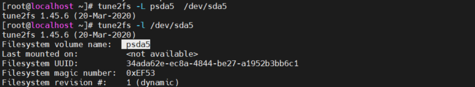

# Mục lục 
- [1. Understanding MBR and GPT Partitions](#1)
  - [1.1 Understanding the MBR Partitioning Scheme](#11)
  - [1.2 Understanding the Need for GPT Partitioning](#12)
  - [1.3 Understanding Storage Measurement Units](#13)
- [2. Managing Partitions and File Systems](#2)
  - [2.1 Creating MBR Partitions with fdisk](#21)
  - [2.2 Using Extended and Logical Partitions on MBR](#22)
  - [2.3 Creating GPT Partitions with gdisk](#23)
  - [2.4 Creating GPT Partitions with parted](#24)
  - [2.5 Creating File Systems](#25)
  - [2.6 Changing File System Properties](#26)
  - [2.6.1 Managing Ext4 File System Propertie](#261)
  - [2.6.2 Managing XFS File System Properties](#262)
  - [2.7 Adding Swap Partitions](#27)
  - [2.8 Adding Swap Files](#28)
- [3. Mounting File Systems](#3)
  - [3.1 Manually Mounting File Systems](#31)
  - [3.2 Automating File System Mounts Through /etc/fstab](#32)
- [Tham khảo](tm)
---

# 1. Understanding MBR and GPT Partitions
- Nên sử dụng nhiều vách ngăn trên một hệ thống:
  - Dễ dàng phân biệt các loại dữ liệu khác nhau.
  - Mount option cụ thể có thể được sử dụng để nâng cao bảo mật và hiệu suất.
  - Dễ dàng tạo bản sao lưu nơi chỉ các phần liên quan của OS được sao lưu.
  - Khi một phần bị lấp đầy, các phần khác  vẫn còn có thể sử dụng được và hệ thống không gặp sự cố ngay.

  
## 1.1 Understanding the MBR Partitioning Scheme
- Master Boot Record (MBR) là lược đồ phân vùng dùng để xác định cách phân vùng ổ cứng.
- Từ BIOS (Basic Input Output System), thiết bị đĩa khởi động được đọc và trên thiết bị có thể khởi động, MBR được cấp phát.
- MBR chứa tất cả những gì cần thiết để khởi động máy tính, bao gồm bộ tải khởi động và bảng phân vùng.
- MBR được định nghĩa bằng 512bit đầu tiên của ổ đĩa và trong MBR một hệ thống vận hàng boot loader (chương trình khởi động hệ thống và hệ điều hành) có sẵb và bảng phân vùng (64bit).
- MBR giới hạn tạo được 4 phân vùng ổ cứng, kích thước tối đa 1 phân vùng là 2TiB
- Phân vùng mở rộng là giải pháp giải quyết giới hạn 4 phân vùng, trong phân vùng mở rộng có thể tạo ra nhiều phân vùng logic (tổng 15 phân vùng) có thể giải quyết bởi nhân của linux

## 1.2 Understanding the Need for GPT Partitioning
- GUID Partition Table (GPT) là một lược đồ phân vùng mới được phát triển.
- GPT liên quan với UEFI - UEFI(Unified Extensible Firmware Interface) thay thế cho BIOS, UEFI có giao diện và tính năng hiện đại hơn , và GPT cũng thay thế các hệ thống phân vùng MBR xa xưa bằng các tính năng, giao diện hiện đại hơn.
- Lợi ích của GUID 
  - Kích thước tối đa của phân vùng là 8 ZiB (1024 x 1024 x 1024 GB)
  - Phân vùng được tạo tối đa là 128 phân vùng 
  - Không có giới hạn 2 TiB như MBR
  - Không cần phân biệt phân vùng chính, phân vùng mở rộng, phân vùng logic
  - GPT sử dụng ID duy nhất toàn cấu 128 bit (GUID) để xác định các phân vùng 
  - Một bản sao lưu của GPT được tạo theo mặc định ở cuối đĩa.

## 1.3 Understanding Storage Measurement Units 

- Các đơn vị đo khác nhau được sử dụng như MB(megabyte) và MiB(megibyte)
  - Một megabyte là bội số của 1000
  - Một mebibyte là bội số của 1024
- Trong máy tính, nói về bội số của 1,024 là hợp lý vì đó là cách máy tính giải quyết các mục.
- Tuy nhiên sự nhầm lẫn được tạo ra cách đây khá lâu do các nhà cung cấp bắt đầu đề cập đến megabyte thay vì mebibyte
- Trước đây sự khác biệt này không quan trong nhưng hiện tại với nhưng kích thước lơn thì chênh lệnh giữa 2 loại đơn vị ngày càng khác rõi ràng. Ví dụ 1GB là 1,000,000,000 byte  và 1 GiB là 1,073,741,824 bytes; 1 Gib lớn hơn 1 Gb lên tới hơn 70 Mb

- Tổng quát các giá trị được sử dụng
  

# 2. Managing Partitions and File Systems

- **fdisk** và **gdisk** là 2 tiện ích cho việc tạo phân vùng bằng MBR và GPT. Ngoài ra còn có tiện ích **parted**.

- Tên thiết bị đĩa thông thường được sử dụng trong RHEL8 

Device  name | Description
---|---
/dev/sda| ổ đĩa sử dụng trình điều khiển  SCSI. Được sử dụng cho các thiết bị đĩa  SCSI và SATA. Chúng phổ biến trong các máy chủ vật lý và các máy ảo vmware
/dev/nvme0n1| Đĩa cứng đầu tiên trong giao diện NVM Express (NVMe). NVme là phương pháp cấp máy chủ để giải quyết các thiết bị SSD nâng cao. Ở cuối tên thiết bị ở đây là *n1* thay vì *a*
/dev/hda| Loại thiết bị đĩa  IDE (legacy). 
/dev/vda| Một disk trong máy chủ ảo KVM sử dụng trình điều khiển virtio
/dev/xvda| disk trong máy chủ ảo Xen sử dụng trình điều khiển đĩa ảo Xen

## 2.1 Creating MBR Partitions with fdisk
- Các bước thự hiện tạo phân vùng bằng MBR với fdisk

1. Nhập `dd if=/dev/sda of=/root/diskfile bs=1M count=1` Sử dụng lệnh này cho phép tạo bản sao lưu megabyte đầu tiên của ram lock và ghi nó vào tệp /root/diskfile. File này cho phép ta dễ dàng trở về trạng thái ban đầu trước khi thực hiện chia ổ đĩa.
2. Nhập `cp /etc/fstab /root/fstab` để tạo bản sao lưu của /etc/fstab
  

3. Sử dụng lệnh `fdisk` để phân vùng ổ cứng cần phân vùng.

    Vd `fdisk /dev/sda`

  

4. Nhập `p` để xem tổng quan về phân bố ổ đĩa hiện tại
  
5. Nhập `n` để thêm phân vùng mới 
- Nếu disk hết không gian có sẵn, mở rộng disk để có thêm không gian tạo phân vùng mới 
  
6. Nhập `p` để tự động tạo phân vùng tiếp theo theo mặc định  
  
7. Chỉ định first sector trên đĩa mà phân vùng mới sẽ bắt đầu.  First sector có sẵn  được đề xuất theo mặc định. Enter để chấp nhận
8. Chỉ định last sector  mà phân vùng sẽ kết thúc, theo mặc định last sertor có sẵn sẽ được gợi ý, nó sẽ sửa dụng hết không gian có sẵn. có các lựa chọn khác nhau: 
- Nhập số last sector muốn sử dụng 
- Nhập `+ number` để tạo một phân vùng với kích thước cho một sector cụ thể 
- Nhập ` +number(K,M,G) ` để chỉ định kích thước muốn gán cho phan vùng trong KiB, MiB hoặc GiB
- Nhập + 10G để tạo một phân vùng 10Gib
  
9. Nhâp `t` để xác định loại phân vùng. Có  3 loại phân vùng phổ biến: 
  - 82: Linux swap
  - 83: Linux
  - 8e: Linux LVM

  
  

10. Nhập `w` để viết chúng vào disk và thoát fdisk

11. Nếu có thông báo này xuất hiện tức ta đã tạo một phân vùng đã được sử dụng  
     
 - Thông báo này chỉ ra rằng phân vùng đã được thêm thành công vào
bảng phân vùng, nhưng không thể cập nhật bảng phân vùng kernel trong bộ nhớ.
 - Có thể so sánh 2 đầu ra của  `fdisk -l /dev/sda` và  `cat /proc/partitions`, cái mà hiển thị bảng phân vùng kernel.
12. Nhập `partprobe /dev/sda` để  viết thay đổi đến bảng phân vùng kernel

## 2.2 Using Extended and Logical Partitions on MBR

- Nếu muốn sử dụng thêm phân vùng ngoài 4 phân vùng chính bằng MBR disk, ta phải tạo thêm phân vùng mở rộng. Có thể tạo các phân vùng logic trong phân vùng mở rộng,
- Tất cả các phân vùng logic đều nằm trong phân vùng mở rộng. Nếu có sự có ảnh hưởng tới phân vùng mở rộng thì tất cả phân vùng logic trong nó sẽ bị ảnh hưởng.

- Tạo một phân vùng logic
  - 1. Nhập `fdisk /dev/sda` để mở giao diện fdisk
  - 2. Nhập `n` để tạo một phân vùng mới, nhập `e` để tạo phân vùng logic. Nếu đã dùng hết cả 4 phân vùng chính, muốn sử dụng phân vùng mở rộng phải thay thế một phân vùng chính thành phân vùng mở rộng. 
     

  - 3. Nhập first sector và last sector cho phân vùng mới. Lúc này phân vùng mới được tạo.
     
  - 4. Sau khi phân vùng ở rộng được tạo, nhập n để thêm phân vùng logic.
       
  - 5. Nhập `w` để ghi vào disk và thoát.
  - 6. Nhập `partprobe` để cập nhập bảng phân vùng kernel.
    - Nếu sử dụng lệnh `partprobe` bị lỗi không thêm phân vùng vào bảng phân vùng kernel được, chỉ cần reboot hệ thống.

## 2.3 Creating GPT Partitions with gdisk
- **Lưu ý**: không thể sử dụng gdisk trên đĩa đã sử dụng fdisk. gdisk sẽ phát hiện MBR và chuyển đổi chúng thành GPT, điều này có thể gây ra lỗi khiến hệ thống không thể khởi động lại. 
- Tạo một phân vùng với gdisk
  - 1. Nhập `gdisk /dev/sdb` để phân vùng cho đĩa sdb
  

  - 2. Nhập `n` để thêm phân vùng mới 
  - 3. Nhập first secter và last sector cho phân vùng 
    
  - 4. Chọn type cho phân vùng, nhập `l` để hiển thị danh sách type cho phân vùng. Ở đây mặc định là 8300: Linux file system
    
  - 5. Nhập `w` để ghi vào thay đổi vào disk và thoát
    
  - 6. Nhập `partprobe` để cập nhập bảng phân vùng kernel.

## 2.4 Creating GPT Partitions with parted

- Tạo phân vùng với parted
  - 1. Nhập  `parted /dev/sdc` để mở giao điện của parted 
  - 2. Nhập `help` để xem các lệnh có sẵn trong parted
    
  - 3. Nhập `mklabel` để chọn một nhãn dán của phân vùng, ở đây ta chọn gpt
   
  - 4. Nhập mkpart để nhập tên phân vùng 
  - 5. Tiếp theo sẽ chọn file system type. Theo mặc định được gợi ý là ext2, nhưng nên sử dụng type mà ta hay sử dụng. Ở đây ta nhấp xfs.
   
  - 6. Chỉ định vị trí bắt đầu và vị trí kết thúc
     
  - 7. Nhập `print` để in vào bảng  phân vùng hiện tại và nhập quit đẻ thoát khỏi tiện ích và lưu thay đổi
     

## 2.5 Creating File Systems

- Các file system được sử dụng trong RHEL 8 

FIle system | Description
--- | --- 
XFS| File system mặc định trong RHEL 8.
Ext4|File system mặc định trong các phiên bản trước của RHEL, vẫn được sử dụng. 
Ext3|Phiên bản trước của ext4. Trong RHEL 8 không sử dụng nữa.
Ext2| File system cơ bản được phát triển trong những năm  1990, hiện tại không được sử dụng.
BtrFS|Một hệ thống tệp tương đối mới không được hỗ trợ trong RHEL 8.
NTFS| File system tương tích với windows, không được hỗ trợ trong RHEL 8.
VFAT|Một hệ thống tệp cung cấp khả năng tương thích với Windows và Mac có chức năng tương tự như FAT32. Hữu ích trên USB thumb drives trao đổi dữ liệu với các máy tính khác nhưng không phải trên các đĩa cứng của máy chủ.

- Lệnh `mkfs -t` để chỉ định  một file hệ thống cụ thể được sử dụng. Ngoài ra còn có thể sử dụng `mkfs.type` để chỉ định loại file hệ thống.
     

## 2.6 Changing File System Properties
- Khi làm việc với các file hệ thống, một số thuộc tính cũng có thể được quản lý. Thuộc tính file hệ thống  là cụ thể cho file hệ thống bạn đang sử dụng, vì vậy ta  làm việc với các thuộc tính khác nhau và các công cụ khác nhau cho các file hệ thống  khác nhau.

### 2.6.1 Managing Ext4 File System Properties
- `tune2fs` là công cụ để quản lý thuộc tính cho các file hệ thống Ext2, Ext3,và Ext4.
- `tune2fs -l` thường được sử dụng để bắt đầu 
   
- File system label là một thuộc tính  được hiển thị dưới dạng  Filesystem volume name. Label được sử dụng để đặt tên duy nhất cho file hệ thống, cho phép file hệ thống được gắn theo cách nhất quán, ngay cả khi tên thiết bị cơ bản được thay đổi 

  - tune2fs -o
    - Đặt tùy chọn tệp gắn kết mặc định.
    - tune2fs -o acl,user_xattr để bật quyền truy cập danh sách điều khiển và thuộc tính người dùng mở rộng. Sử dụn ^ sau option để bật trở lại ví dụ như tune2fs -o ^acl,user_xattr
  - tune2fs -O
    - Để bật tính năg file hệ thống 
    - Thêm ^ trước tên đặc tính để  tắt
  - tune2fs -L
    - Thiết lập label trên file hệ thống
       

### 2.6.2 Managing XFS File System Properties
- Hệ thống tệp XFS là một hệ thống tệp hoàn toàn khác và vì lý do đó cũng có một tập hợp các công cụ hoàn toàn khác nhau để quản lý các thuộc tính của nó. 
- Nó không cho phép bạn đặt thuộc tính hệ thống tệp trong siêu dữ liệu hệ thống tệp.
- Tuy nhiên, ta có thể thay đổi một số thuộc tính XFS như sử dụng lệnh `xfs_admin`. Ví dụ sử dụng `xfs_admin -L mylabel` để đặt nhãn hệ thống tệp cho mylabel.

## 2.7 Adding Swap Partitions
- Swap trên Linux là một cách thuận tiện để cải thiện việc sử dụng bộ nhớ kernel Linux
- Nếu ram vật lý bị thiếu, các trang bộ nhớ không sử dụng gần đây có thể được di chuyển để chuyển đổi, nó sẽ cung cấp nhiều ram hơn cho chương trìn cần truy cập vào trang bộ nhớ.
- Nếu swap bắt đầu được sử dụng nhiều, ta có thể gặp rắc rối và sử dụng swap cần được giám sát chặt chẽ
- Tạo một phân  vùng được định dạng để swap 

  - 1.  Nhập `fdisk  /dev/sda` để vào tiện ích fdisk
  - 2. Nhập `n` để thêm phân vùng mới(xem lại 2.2)
  - 3. Nhập `t` để chọn loại phân vùng, sử dụng phân vùng type 82 
     

  - 4. Nhập `mkswap dev/sda3` để định dạng không gian swap
   
  - 5. Nhập `free -m` để xem không gian được trao đổi 
     
  - 6. Nhập `swapon /dev/sda6` để bật không gian swap mới được tạo 
  - 7. Nhập free -m để xem không gian swap mới

## 2.8 Adding Swap Files
- Trong một số trường hợp cần thiết, khi dung lượng của ổ đĩa không còn để tạo thêm phân vùng, ta cũng có thể sử dụng file swap.
- Tạo tệp trước khi thêm tệp hoán đổi. 
- Lệnh `dd if=/dev/zero of=/swapfile bs=1M count=100` sẽ thêm 100 blocks với khích thước mỗi block là 1MiB từ thiết bị /dev/zero đến file /swapfile. 100 MiB có thể được cấu hình như swap
- Dùng `mkswap /swapfile` để đánh dấu file dưới dạng swap file, sau đó dùng `swapon /swapfile` để kích hoạt nó. 
     

# 3. Mounting File Systems

- Để sử dụng phân vùng hiệu quả, cần phải mount phân vùng đó.
- Bằng cách mount một phân vùng, ta có thể truy cập nội dung trên một thư mục cụ thể 
- Để mount file hệ thống, một vài thông tin cần thiết: 
  - **What to mount**: là thông tin tên bắt buộc và chỉ định của thiết bị cần được mount. 
  - **Where to mount it**: thông tin bắt buộc về thư mục chỉ định  nươi device đưuọc mount tới.
  - **What file system to mount**:  có thể chỉ định loại file hệ thống. Trong hầu hết các trường hợp điều này là không cần thiết. Lệnh `mount` sẽ phát hiện file hệ thống được sử dụng trên thiế bị và đảm bảo trình diều khiển chính xác được sử dụng
  - **Mount options**: Nhiều option có thể được sử dụng để gắn kết device. Điều này không bắt buộc.

## 3.1 Manually Mounting File Systems

- Lệnh `mount` được sử dụng để mount  file hệ thống. Vd mount file hệ thống trên /dev/sda5 vào thư mục /mnt nhập `mount /dev/sda5 /mnt` 
- Lệnh `umount` được sử dụng để ngắn kết nối file hệ thống được mount. Vd để bỏ kết nối  file hệ thống trên /dev/sda5 và  thư mục /mnt nhập `umount /dev/sda5` hoặc `umount /mnt`

**Using Device Names, UUIDs, or Disk Labels**

- Trong cài đặt mặc định RHEL 8, sử dụng UUIDs(mã định danh duy nhất) được sử dụng thay  name device
- Mọi file hệ thống theo mặc định sẽ có UUID liên kết với nó 
- Lệnh `blkid` để xem tổng quát về các file hệ thống hiện tại trong hệ thống  và UUID được sử dụng bởi các file hệ thống đó  
     

- Mount /dev/sda5 có UUID="34ada62e-ec8a-4844-be27-a1952b3bb6c1" vào /mnt nhập `muont UUID="34ada62e-ec8a-4844-be27-a1952b3bb6c1" /mnt`
- Để mount thiết bị bằng lable, sử dụng `mount LABEL=labelname dir`

## 3.2 Automating File System Mounts Through /etc/fstab

- Thực hiện mount tự động thông qua file /etc/fstab 

     
- Trong file /etc/fstab, mọi thứ được chỉ định để mount file hệ thống tự động

Field | Description 
---|--- 
Device | Device được gắn. có thể là name, UUID hoặc label
Mount Point| Thư mục hoặc kernel interface  nơi device được mount đến 
File System| Loại file hệ thống
Mount Options| Mount options
Dump Support|Sử dụng 1 để cho phép hỗ trợ sao lưu ử dụng tiện ích dump
Automatic Check| Chỉ định file hệ thống có được kiểm tra tự động khi khởi động hay không. Dùng 0 để tắt tự động kiểm tra, 1 nếu là file hệ thống root và nó phải được kiểm tra tự động, 2 để cho phép tất cả các hệ thống tệp khác cần kiểm tra tự động khi khởi động. Network file systém nên để thiếp lập là 0.

- Một số mount point không sử dụng tên thư mục, device system như swap không được gắn lên thư mục mà trên kernel interface. Dễ dàng nhận ra  kernel interface được sử dụng, tên của nó không được bắt đầu bằng a/ (Không tồn trại trong file hệ thống trên máy chủ)

- Các option của mount

Option| Use
---|---
auto/ noauto | file hệ thống sẽ hoặc không được gán tự động 
acl | Thêm support cho file hệ thống truy cập danh sách điều khiển 
user_xattr | thêm support cho thuộc tính user-extended
ro| Mount file hệ thống chỉ ở chế độ đọc 
atime / noatime| Không cho phép hoặc cho phép truy cập thời gian sửa đổi
noexec / exec| Phủ nhận hoặc cho phép thực thi các file chương trình từ file hệ thống
_netdev| Sử dụng để mount file network system. Điều này yêu cầu fstab đợi cho đến khi mạng khả dụng trước khi gắn file hệ thống này

- Cột thứu 5 của /etc/fstab chỉ định hỗ trợ cho tiện ích dump, được sử dụng để tạp file backup. Nên bật tính năng này bằng cách chỉ định giá trị 1 cho tất cả các file  hệ thống thực và tắt nó bằng cách chỉ định 0 cho tất cả các mount hệ thống.

- Cột cuối cùng cho biết có cần kiểm tra tính toàn vẹn của file hệ thống khi khởi động hay không. Đặt 0 nếu không muốn kiểm tra file hệ thống nào cả, số 1 nếu đây là file hệ thống gốc cần được kiểm tra trước bất kỳ thứ gì khác và số 2 nếu đây là file  hệ thống nonroot cần được kiểm tra trong khi khởi động
- Vd: 
  - Nhập  `blkid` lấy UUID của /dev/sda5
  - Nhập  `mkdir -p /mounts/data` để tạo mount point cho phân vùng 
  - Sửa nội dung trong /etc/fstab là `UUID="nnnn" /mounts/data xfs defaults 1 2`
    

  - Nhập mount -a để gắn mọi thứ được chỉ định trong /etc/fstab
  - Nhập df -h để xác định phân vùng được mount
    

