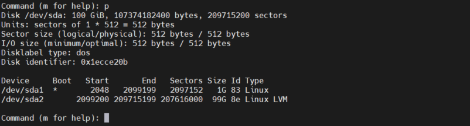

# Mục lục 
- [1. Understanding MBR and GPT Partitions](#1)
  - [1.1 Understanding the MBR Partitioning Scheme](#11)
  - [1.2 Understanding the Need for GPT Partitioning](#12)
  - [1.3 Understanding Storage Measurement Units](#13)
- [2. Managing Partitions and File Systems](#2)
  - [2.1 Creating MBR Partitions with fdisk](#21)
  - [2.2 Using Extended and Logical Partitions on MBR](#22)
  - [2.3 Creating GPT Partitions with gdisk](#23)
  - [2.4 Creating GPT Partitions with parted](#24)
  - [2.5 Creating File Systems](#25)
  - [2.6 Changing File System Properties](#26)
  - [2.7 Managing Ext4 File System Propertie](#27)
  - [2.8 Managing XFS File System Properties](#28)
  - [2.9 Adding Swap Partitions](#29)
  - [2.10 Adding Swap Files](#210)
- [3. Mounting File Systems](#3)
  - [3.1 Manually Mounting File Systems](#31)
  - [3.2 Using Device Names, UUIDs, or Disk Labels](#32)
  - [3.3 Automating File System Mounts Through /etc/fstab](#33)
- [Tham khảo](tm)
---

# 1. Understanding MBR and GPT Partitions
- Nên sử dụng nhiều vách ngăn trên một hệ thống:
  - Dễ dàng phân biệt các loại dữ liệu khác nhau.
  - Mount option cụ thể có thể được sử dụng để nâng cao bảo mật và hiệu suất.
  - Dễ dàng tạo bản sao lưu nơi chỉ các phần liên quan của OS được sao lưu.
  - Khi một phần bị lấp đầy, các phần khác  vẫn còn có thể sử dụng được và hệ thống không gặp sự cố ngay.

  
## 1.1 Understanding the MBR Partitioning Scheme
- Master Boot Record (MBR) là lược đồ phân vùng dùng để xác định cách phân vùng ổ cứng.
- Từ BIOS (Basic Input Output System), thiết bị đĩa khởi động được đọc và trên thiết bị có thể khởi động, MBR được cấp phát.
- MBR chứa tất cả những gì cần thiết để khởi động máy tính, bao gồm bộ tải khởi động và bảng phân vùng.
- MBR được định nghĩa bằng 512bit đầu tiên của ổ đĩa và trong MBR một hệ thống vận hàng boot loader (chương trình khởi động hệ thống và hệ điều hành) có sẵb và bảng phân vùng (64bit).
- MBR giới hạn tạo được 4 phân vùng ổ cứng, kích thước tối đa 1 phân vùng là 2TiB
- Phân vùng mở rộng là giải pháp giải quyết giới hạn 4 phân vùng, trong phân vùng mở rộng có thể tạo ra nhiều phân vùng logic (tổng 15 phân vùng) có thể giải quyết bởi nhân của linux

## 1.2 Understanding the Need for GPT Partitioning
- GUID Partition Table (GPT) là một lược đồ phân vùng mới được phát triển.
- GPT liên quan với UEFI - UEFI(Unified Extensible Firmware Interface) thay thế cho BIOS, UEFI có giao diện và tính năng hiện đại hơn , và GPT cũng thay thế các hệ thống phân vùng MBR xa xưa bằng các tính năng, giao diện hiện đại hơn.
- Lợi ích của GUID 
  - Kích thước tối đa của phân vùng là 8 ZiB (1024 x 1024 x 1024 GB)
  - Phân vùng được tạo tối đa là 128 phân vùng 
  - Không có giới hạn 2 TiB như MBR
  - Không cần phân biệt phân vùng chính, phân vùng mở rộng, phân vùng logic
  - GPT sử dụng ID duy nhất toàn cấu 128 bit (GUID) để xác định các phân vùng 
  - Một bản sao lưu của GPT được tạo theo mặc định ở cuối đĩa.

## 1.3 Understanding Storage Measurement Units 

- Các đơn vị đo khác nhau được sử dụng như MB(megabyte) và MiB(megibyte)
  - Một megabyte là bội số của 1000
  - Một mebibyte là bội số của 1024
- Trong máy tính, nói về bội số của 1,024 là hợp lý vì đó là cách máy tính giải quyết các mục.
- Tuy nhiên sự nhầm lẫn được tạo ra cách đây khá lâu do các nhà cung cấp bắt đầu đề cập đến megabyte thay vì mebibyte
- Trước đây sự khác biệt này không quan trong nhưng hiện tại với nhưng kích thước lơn thì chênh lệnh giữa 2 loại đơn vị ngày càng khác rõi ràng. Ví dụ 1GB là 1,000,000,000 byte  và 1 GiB là 1,073,741,824 bytes; 1 Gib lớn hơn 1 Gb lên tới hơn 70 Mb

- Tổng quát các giá trị được sử dụng
  

# 2. Managing Partitions and File Systems

- **fdisk** và **gdisk** là 2 tiện ích cho việc tạo phân vùng bằng MBR và GPT. Ngoài ra còn có tiện ích **parted**.

- Tên thiết bị đĩa thông thường được sử dụng trong RHEL8 

Device  name | Description
---|---
/dev/sda| ổ đĩa sử dụng trình điều khiển  SCSI. Được sử dụng cho các thiết bị đĩa  SCSI và SATA. Chúng phổ biến trong các máy chủ vật lý và các máy ảo vmware
/dev/nvme0n1| Đĩa cứng đầu tiên trong giao diện NVM Express (NVMe). NVme là phương pháp cấp máy chủ để giải quyết các thiết bị SSD nâng cao. Ở cuối tên thiết bị ở đây là *n1* thay vì *a*
/dev/hda| Loại thiết bị đĩa  IDE (legacy). 
/dev/sda| Một disk trong máy chủ ảo KVM sử dụng trình điều khiển virtio
/dev/xvda| disk trong máy chủ ảo Xen sử dụng trình điều khiển đĩa ảo Xen

<a name ='21'>
2.1 Creating MBR Partitions with fdisk
- Các bước thự hiện tạo phân vùng bằng MBR với fdisk

1. Nhập `dd if=/dev/sda of=/root/diskfile bs=1M count=1` Sử dụng lệnh này cho phép tạo bản sao lưu megabyte đầu tiên của ram lock và ghi nó vào tệp /root/diskfile. File này cho phép ta dễ dàng trở về trạng thái ban đầu trước khi thực hiện chia ổ đĩa.
2. Nhập `cp /etc/fstab /root/fstab` để tạo bản sao lưu của /etc/fstab
  

3. Sử dụng lệnh `fdisk` để phân vùng ổ cứng cần phân vùng.

    Vd `fdisk /dev/sda`
  

4. Nhập `p` để xem tổng quan về phân bố ổ đĩa hiện tại
  
5. Nhập `n` để thêm phân vùng mới 
- Nếu disk hết không gian có sẵn, mở rộng disk để có thêm không gian tạo phân vùng mới 
  
6. Nhập `p` để tự động tạo phân vùng tiếp theo theo mặc định  
  
7. Chỉ định first sector trên đĩa mà phân vùng mới sẽ bắt đầu.  First sector có sẵn  được đề xuất theo mặc định. Enter để chấp nhận
8. Chỉ định last sector  mà phân vùng sẽ kết thúc, theo mặc định last sertor có sẵn sẽ được gợi ý, nó sẽ sửa dụng hết không gian có sẵn. có các lựa chọn khác nhau: 
- Nhập số last sector muốn sử dụng 
- Nhập `+ number` để tạo một phân vùng với kích thước cho một sector cụ thể 
- Nhập ` +number(K,M,G) ` để 