# Mục lục 
- [1. Understanding LVM ](#1)
  - [1.1 LVM Architecture](#11)
  - [1.2LVM Features](#12)
- [2. Creating LVM Logical Volumes](#2)
  - [2.1 Creating the Physical Volumes](#21)
  - [2.2 Creating the Volume Groups](#22)
  - [2.3 Creating the Logical Volumes and File Systems](#23)
  - [2.4 Understanding LVM Device Naming](#24)
- [3. Resizing LVM Logical Volumes](#3)
  - [3.1 Resizing Volume Groups](#31)
  - [3.2 Resizing Logical Volumes and File Systems](#32)
- [4. Configuring Stratis](#4)
  - [4.1 Understanding Stratis Architecture](#41)
  - [4.2 Creating Stratis Storage](#42)
  - [4.3 Managing Stratis](#43)
- [5. Configuring VDO](#5)
  - [5.1 Understanding VDO](#51)
  - [5.2 Setting Up VDO](#52)

  --- 

# 1. Understanding LVM

- Việc xử lý storage bằng cách phân vùng trên disk  vẫn tồn tại nhược điểm và nó không linh hoạt. 
- Logical Volume Manager (LVM) : LVM là kỹ thuật quản lý việc thay đổi kích thước lưu trữ của ổ cứng. Là một phương pháp ấn định không gian ổ đĩa thành những logical volume khiến cho việc thay đổi kích thước của một phân vùng trở nên dễ dàng 
- Một số khái niệm khác: 
  - Physical volume: Một ổ đĩa vật lý có thể phân chia thành nhiều phân vùng vật lý gọi là Physical Volumes.
  - Volume group: Là một nhóm bao gồm nhiều Physical Volume trên 1 hoặc nhiều ổ đĩa khác nhau được kết hợp lại thành một Volume Group
  - Logical volume: Một Volume Group được chia nhỏ thành nhiều Logical Volume. Nó được dùng cho các để mount tới hệ thống tập tin (File System) và được format với những chuẩn định dạng khác nhau như ext2, ext3, ext4…

## 1.1 LVM Architecture

- Trong kiến trúc LVM, một số layer có thể được phân biệt. Trong layer thấp nhất, thiết bị lưu trữ được sử dụng. 

- Các thiết bị lưu trữ cần được gắn cờ (flag) như physical volumes, nó cho phép chúng có thể sử dụng trong môi trường LVM và làm cho chúng có thể sử dụng được bởi các tiện ích khác đang cố gắng truy cập vào logical volume

- Các layer của LVM 
  - Tầng đầu tiên : hard drives là tầng các disk ban đầu khi chưa chia phân vùng
  - Partitions: Sau đó ta chia các disk ra thành các phân vùng nhỏ hơn
  - Physical volume : từ một partitions ta sẽ tạo ra được một physical
  - Group volume : Ta sẽ ghép nhiều physical volume thành một group volume
  - Logical volume : Ta sẽ có thể tạo ra được logical volume
- Một thiết bị lưu trữ là một khối vật lý có thể thêm đến volume group. Đó là tính trừu tượng (abstraction) của tất cả các bộ nhớ có sẵn. Abstraction có nghĩa là volume group không phải thứ cố định, có thể thay đổi khi cần thiết, nó giúp thêm nhiều không gian trên cấp độ volume group khi sắp hết dung lượng ổ đĩa. Tức khi hết không gian disk trên một logical volume, sẽ có dung lượng có sẵn từ volume group, nếu không có dung lượng có sẵn trên volume group thì chúng sẽ được thêm bởi physical volume. 

- Ở đầu volume group là logical volume. Logic không hoạt động trực tiếp trên đĩa nhưng lấy dung lượng đĩa từ dung lượng đĩa có sẵn trên volume group. Logical volume bao gồm bộ nhớ có sẵn từ nhiều physical volume, 

- Các file hệ thống thực tế được tạo trên volume group, logical volume linh hoạt với kích thước. Nếu một file hệ thống sắp hết không gian ổ đĩa, nó tương đối dễ dàng để mở rộng file hệ thống hoặc để giảm bộ nhớ nếu file hệ thống cho phép. 

- Tổng quan kiến trúc LVM 
  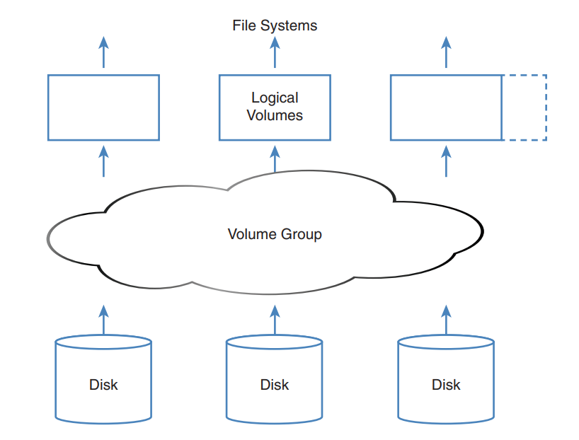

## 1.2 LVM Features

- LVM cung cấp một giải pháp linh hoạt để quản lý lưu trữ, volume không còn bị ràng buộc đến những hạn chế của ổ cứng vật lý
- Nếu cần thêm dung lượng, volume group đễ dàng mở rộng bằng cách thêm một plysical volume mới, vì vậy dung lượng đĩa có thể được thêm đến logical  volume. 
- Có thể giảm kích thước của một logical nhưng chỉ khi nếu file hệ thống được tạo  trên volume hỗ trợ tính năng giảm kích thước hệ thống
- LVM hỗ trợ snapshot giúp trở lại trường hợp trước đó hoặc sao lưu hệ thống trên logical volume
  - LVM snapshot được tạo bằng cách copy dữ liệu quản trị logical volume  mô tả trạng thái hiện tại của file đến snapshot volume.
  - Snapshot sẽ thay đổi khi file nguyên gốc volume thay đổi, khi lập kết hoạch cho snapshot nên chắc chắn dung lượng ổ đĩa có sẵn. 

-  LVM logical volumes có thể thay thế phần cứng lỗi dễ dàng. Nếu phần cứng bị lỗi, dững liệu có thể được di chuyến ra ngoài volume group (thông qua lệnh pvmove) ổ đĩa lỗi có thể được xóa khỏi volume group  và một đĩa cứng mới có thể thêm vào một cách linh hoặ mà không cân thời gian chết nào cho chính logical volume 

# 2. Creating LVM Logical Volumes

- Tạo LVM  logical volume liên quan đến việc tạo layer 3 trong kiến trúc LVM
  - Đầu tiên phải chuyển đổi các thiết bị vật lý vào volume physical(PVs)
  - Tiếp theo tạo volume group(VG) và gán PVs cho nó  
  - Cuối cùng, tạo logical volume(LV) chính.

## 2.1 Creating the Physical Volumes

- Tạo một phân vùng với type là LVM. 
  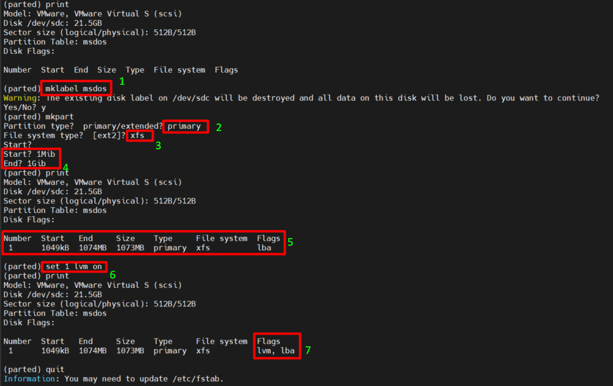

- Tạo physical volume 

  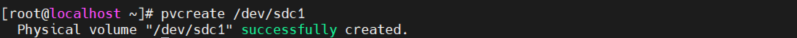

- Nhập `pvs` để xác định pv đã được tạo
  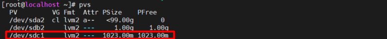

- Nhập `pvdisplay` để hiển thị thêm nhiều thông tin
  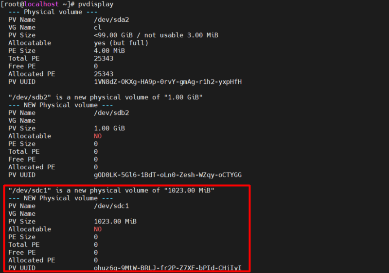

- Nhập `lsblk  ` để xem tổng quát về cấu hình lưu trữ hiện tại của sever.
  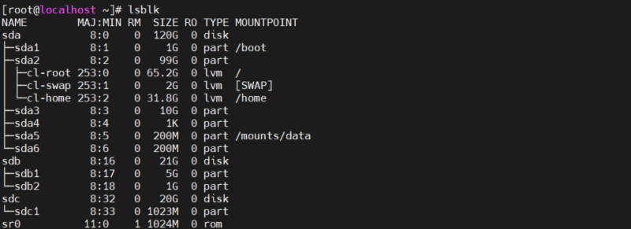
   

## 2.2 Creating the Volume Groups

- Nhập `vgcreate name physical-volume` để tạo một volume group mới. 
  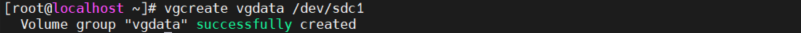
- Khi tạo các volume group,  physical extent size được sử dụng.
- Physical extent size (kích thước phạm vi vật lý)xác định kích thước của build block được sử dụng khi tạo logical volume.
- Một logical volume luôn có kích thước là bội số của kích thước phạm vi vật lý.
- Nếu tạo logical volume khổng lồ, sẽ hiệu quả nếu sử dụng  kích thước phạm vi vật lý lớn. Nếu không chỉ định kích thước phạm vi mặc định là 4 MiB. Kích thước phạm vi vật lý luân luôn là bội số của 2 MiB với kích thước tối đa là 128 MiB.
- Nhập `vgcreate -s` để tạo kích thước phạm vi vật lý.
- Nhập `vgs` để xem tóm tắm và `vgdisplay` để xem thông tin chi tiết 
 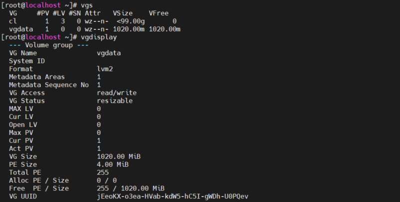

Item vgs | mô tả 
---|---
VG| Tên Volume Group
#PV| Physical Volume sử dụng trong Volume Group
VFree| Hiển thị không gian trống có sẵn trong Volume Group
VSize| Tổng kích thước của Volume Group
#LV| Logical Volume nằm trong volume group
#SN| Số lượng Snapshot của volume group
Attr| Trạng thái của Volume group có thể ghi, có thể đọc, có thể thay đổi,

Item vgdisplay | mô tả 
---|---
VG Name| Tên Volume Group.
Format| Kiến trúc LVM được sử dụng.
VG Access| Volume Group có thể đọc và viết và sẵn sàng để sử dụng.
VG Status| Volume Group có thể được định cỡ lại, chúng ta có thể mở rộng thêm nếu cần thêm dung lượng.
PE Size| Mở rộng Physical, Kích thước cho đĩa có thể được xác định bằng kích thước PE hoặc GB, 4MB là kích thước PE mặc định của LVM
Total PE| Dung lượng Volume Group có
Alloc PE| Tổng PE đã sử dụng
Free PE| Tổng PE chưa được sử dụng

## 2.3 Creating the Logical Volumes and File Systems
- Sử dụng lệnh `lvcreate option` tạo logical, có nhiều option đi với lệnh này

option | description
---|---
-L | gán kích thước, vd `-L 5G`
-l | Gán kích thước tương đối, vd `-l 50%free`
-n | chỉ định tên của logical volume

- VD `lvcreate -n lvvol1 -L 100M vgdata` 
  - Để tạo một logical volume tên lvvol1 với kích thước 100 MiB và thêm vào volume group vgdata
  - Dùng tiên ích mkfs để tạo file hệ thống 
 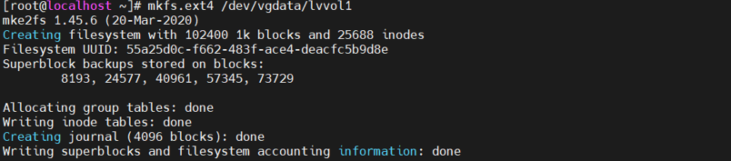

## 2.4  Understanding LVM Device Naming

- LVM volume device names có thể được giải quyết bằng nhiều cách. Phương pháp đơn giản là đến địa chỉ thiết bị như là /dev/vgname/lvname, thực tế nó là một symbolic ink đến device mapper name
- Để đặt tên LVM volume, một hệ thống khác đóng vai trò là device mapper.
  -  Device mapper là giao diện chung được kernel linux sử dụng để chỉ định thiết bị lưu trữ
  - Device mapper được sử dụng bởi nhiều loại thiết bị như LVM volumes, nhưng cũng bởi phần mềm RAID và thiết bị mạng nâng cao như nhiều thiết bị 
- Device mapper được tạo khi phát hiện các tên vô nghĩa như /dev/dm-0 và /dev/dm-1. 
  - Để làm cho các thiết bị này dễ dàng truy cập, device mapper tạo các symbolic trong thư mục /dev/mapper chỉ vào các tên vô nghĩa này. 
  - Các symbolic link đặt theo cấu trúc tên  dev/mapper/vgname-lvname.
  - Do đó /dev/vgdata/lvdata cũng được biết đến như /dev/mapper/vgdata-lvvol1
   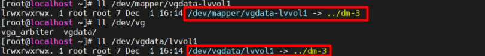

- LVM Management Essential Commands

Command  | Exphanation
----|  ----
pvcreate |tạo  physical volumes
pvs| hiển thị tóm lược  physical volumes có sẵn 
pvdisplay |hiển thị danh sách  physical volumes và tính chất
pvremove| loại bỏ physical volume signature từ  block device
vgcreate |tạo volume groups
vgs| hiển thị tóm lược volume groups có sẵn
vgdisplay| hiển thị danh sách volume groups avà tính chất
vgremove| loại bỏ volume group
lvcreate| tạo  logical volumes
lvs| hiển thị tóm lược logical volumes có sẵn
lvdisplay| hiển thị danh sách logical volumes tính chất
lvremove|loại bỏ logical volume

# 3. Resizing LVM Logical Volumes
- Nếu file hệ thống XFS được sử dụng, volume  chỉ có thể tăng dung lượng  mà không thể giảm dung lượng 
- File hệ thống khác như EXT4 hỗ trợ giảm khích thước nhưng chỉ thực hiện được khi ở chế độ ngoại tuyến.

## 3.1 Resizing Volume Groups

- Lệnh `vgextend` được sử dụng để thêm dung lượng đến volume group
   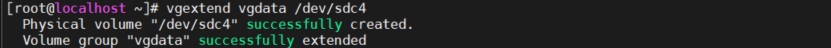

- Lệnh `vgreduce` để lấy dung lượng  plysical volume ra khỏi volume group
   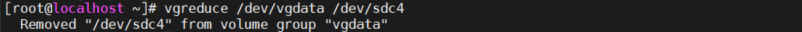

## 3.2 Resizing Logical Volumes and File Systems
- Trước khi thay đổi kích thước logical volume cần phải xác định loại file hệ thống cho logical volume. Ext4 có thể tăng và giảm dụng dượng, xfs chỉ tăng dung lượng.
- Lệnh `lvextend` để mở rộng dung lượng cho logical volume 
- Lệnh `lvreduce` để thay đổi dung lượng cho logical (tăng và giảm)
- Mở rộng logical volume  `lvextend -L +50M /dev/vgdata/lvvlo1`
 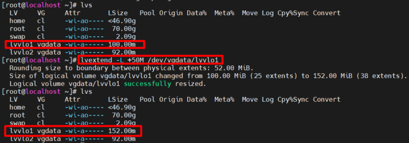

- Option `-r` để mở rộng file hệ thống trên logical volume tại cùng thời gian. 
- Option `-L` để thay đổi kích thước logical volume 
  - Ví dụ: `lvresize -L +1G -r /dev/vgdata/lvvlo1` 
- Option `-l` chỉ định phạm vi mở rộng 
- Hầu hết các hoạt động thay đổi kích thước file  hệ thống có thể được thực hiện trực tuyến nếu hệ file thống là rất lớn , không cần phải ngắt kết nối file hệ thống.
- Có thể chỉ định số lượng của logic extend cần được thêm vào hoặc loại bỏ trực tiếp bằng cách sử dụng option `-l` với `lvresize` 

  - `lvresize -r -l 75%VG /dev/vgdata/lvvlo1` thay đổi kích logical volume để nó chiếm 75% tổng số dung lượng đĩa trong volume group.
  - `lvresize -r -l +75%VG /dev/vgdata/lvvlo1` thêm 75% của toàn bộ kích thước của volume group đến logical volume.  
  - `lvresize -r -l +75%FREE /dev/vgdata/lvvlo1` thêm 75% của tất cả không gian đĩa trống đến logical volume.
  - `lvresize -r -l 75%FREE /dev/vgdata/lvvlo1` thay đổi kích thước logical volume  để tổng kích thước bằng 75% dung lượng ổ đĩa trống. 

# 4. Configuring Stratis

- Trong RHEL 8, Red Hat đã bổ xung 2 loại lưu trữ nâng cao: Stratis và VDO
- Stratis được gọi là volume-managing file system  và nó bổ sung các tính năng không có sẵn trong các phiên bản trước của Red Hat
  - **Thin provisioning** tính năng này cho phép một file Stratis tự hiển thị tới người dùng dung lượng lớn hơn với so với thực tế.Ví dụ trong một máy tính để bàn ảo, mỗi người dùng có thể thấy 20GiB  dung dượng có sẵn trong tổng số mặc dùng số lượng này trong thực tế là thấp hơn
  - **Snapshots** Stratis  snapshot cho hép người dùng chụp lại một *picture*  của trạng thái hiện tại của file hệ thống. Snapshot cho phép dễ dàng trở lại trạng thái trước của một file hệ thống, giúp quay lại bất kì thay đổi nào đã được thực hiện.
  - **Cache tier** là một tính năng lưu trữ  đảm bảo dữ liệu có thể được lưu trữ vật lý gần máu khác Ceph hơn, giúp truy cập dữ liệu nhanh hơn.
  - **Programmatic API** đảm bảo lưu trữ có thể dễ dàng được cấu hình và giám sát thông qua API access. 
  - **Monitoring and repair** trái lại các file hệ thống cũ cần công cụ `fsck` để xác định tính toàn vẹn của file hệ thống, Stratis có các tính năng tích hợp để theo dõi sức khỏe của file hệ thống và sửa chữa chúng nếu cần. 

## 4.1 Understanding Stratis Architecture
- Lớp thấp nhất trong kiến trúc Stratis là pool. từ góc độ chức năng, Stratis pool có thể so sáng với LVM volume group 
- Pool đại diện cho tất cả các bộ nhớ có sẵn và bao gồm một hay nhiều thiết bị lưu trữ cái mà trog môi trường Stratis được gọi là *blockdev*
- Các block device có thể không dự phòng trong cấp độ phần cứng cơ bản. Stratis tạo một thư mục /dev/stratis/poolname cho mỗi pool.
- Từ Stratis pool , file hệ thống XFS được tạo ra.Stratis chỉ làm việc với XFS và  file hệ thống XFS mà nó sử dụng được tích hợp với Stratics volume.
- Khi tạo file hệ thống, không có kích thước được chỉ định, mỗi file có thể phát triển tới khích thước của tất cả dung lượng có sẵn trong pool.
- File hệ thống Stratis luôn là thin provisioned. Thin volume sẽ tư động tăng lên khi nhiều dữ liệu được thêm vào hệ thống tệp

## 4.2 Creating Stratis Storage

- 1. Cài `stratis-cli` bằng `yum`
- 2. Bắt đầu và cho phép Stratis daemon `systemctl enable --now stratisd`.
- 3. Khi daemon đang chạy, sử dụng lệnh `stratis pool create` để tạo pool. VD: `stratis pool create mypool /dev/sdd`. Có thể thêm các block device sau đó, sử dụng `stratis pool add-data poolname blockdevname` 
- 4. Khi đã tạo pool, thêm file hệ thống sử dụng `stratis fs create poolname fsname` 
- 5. Để xác định tất cả đã được tạo thành công, sử dụng `stratis fs list`
- 6. Sau khi tạo file hệ thống, ta có thể mount nó. Để mount file hệ thống Stratis thông qua /etc/fstab, phải sử dụng UUID để mount, name device không được hỗ trợ. 

  - Khi mount Stratis thông volume thống qua /etc/fstab, bao gồm tùy chọn `s-systemd.requires=stratisd.service` để chắc chắn Systemd chờ kích hoặt thiết bị cho đến khi stratisd service được tải. 

    
## 4.3 Managing Stratis
- Sau khi tạo file hệ thống Stratis, đã có thể thi kahnfh một vài tác vụ quản lý khác nhau.
- Tự động mửo rộng pool dùng `stratis pool add-data`.
- Sử dụng công cụ Stratis-specific để giám sát Stratis, Các công cụ truyền thống của linux không thể xử lý các thin-provisioned volumes.

Command | Description
---|---
stratis blockdev | hiện thị thông tin về tất cả block devices được sử dụng cho Stratis
stratis pool | cũng cấp thông tin về các Stratis pool. Các tham số vật lý được sử dụng không nên quá gần với kích thước vật lý
stratis filesystem | cho phép giám sát file hệ thống riêng biệt

- Tính năng khác của Stratis là snapshot. Nội dung một snapshot là trạng thái của file hệ thống tại thời điểm snapshot được tạo. 
- Sau khi được tạo, snapshot có thể được sửa đổi. Snapshot có thể tồn tại lâu hơn file hệ thống mà nó được tạo ra từ đó. Nó khác với LVM, LVM snapshot không thể sống sót nếu volume của chúng liên kết bị xóa. 

- Managing Stratis Volumes
  - 1. Nhập `yum -y install stratisd stratis-cli` để cài tất cả package yêu cầu   
  - 2. Nhập `systemctl enable --now stratisd` để cho phép Stratis daemon.
  - 3. Nhập `stratis pool create mypool /dev/sdd` để thêm toàn bộ ổ đĩa /dev/sdd đến bộ nhớ pool
  - 4. Nhập `stratis pool list` để xác đinhj pool đã được tạo thành công
   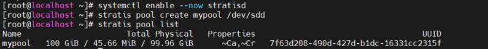
  
  - 5. Nhập `stratis fs create mypool stratis1` để tạo file hệ thống Stratis đầu tiên 
  - 6. Nhập `stratis fs list` để xác định file hệ thống được tạo thành công.
    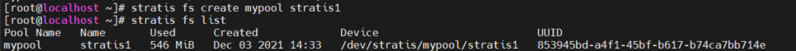
 
  - 7. Nhập `mkdir /stratis1` để tạo mount point cho file hệ thống Stratis
  - 8. Nhập `blkid` để tìm Stratis volume UUID
     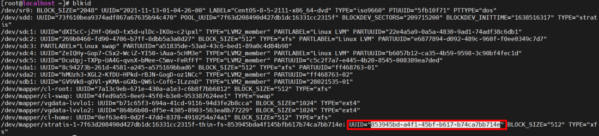
  - 9. Thêm dòng `UUID=xxx /stratis1 xfs defaults,x-systemd.requires=stratisd.service 0 0` để cho phép volume tự động được mount
  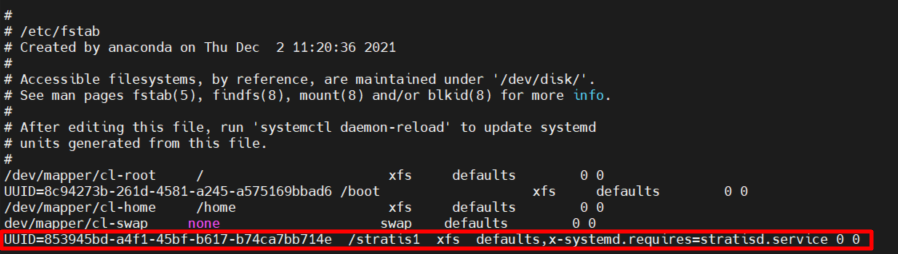
 
  - 10. Nhập `mount -a` để mount Stratis volume. 
  - 11. Nhập `cp -r /etc/[a-f]* /stratis1` để copy vài file đến Stratis volume
  - 12. Nhập `stratis filesystem snapshot mypool stratis1 stratis1-snap` để tạo snapshot  của volume mới được tạo 
  - 13. Nhập `stratis filesystem list ` để nhận số liệu thống kê về file hệ thống sử dụng hiện tại.
    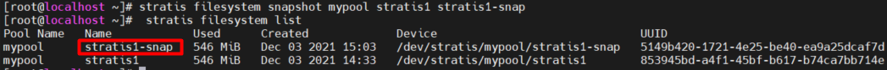

  - 14. Nhập `rm -rf /stratis1/a*` để xóa tất cả các file có tên bắt đầu bằng a
  - 15. Nhập `mount /dev/stratis/mypool/stratis1-snap /mnt` và xác định file với tên bắt đầu bằng a vẫn có trong thư mục /mnt 
  - 16. Reboot hệ thống. Xác nhập Stratis volume vẫn được mount tự động.

# 5. Configuring VDO
## 5.1 Understanding VDO

- Virtual Data Optimizer (VDO) là một giải pháp lưu trữ nâng cao được cung cấp trong RHEL 8. VDO được phát triển để giảm không gian ổ đĩa sử dụng trên block device bằng các áp dụng chứ năng chống sao chép.
- VDO tạo volume, thực hiện loại trừ trùng lặp trên bất kì khối thiết bị hiện có nào   
- Trên đầu thiết bị VDO, tạo một file hệ thống hoặc sẽ sử dụng nó như một physical volume trong thiết lập LVM.
- VDO sử dùng 3 công nghệ chung để soát sự trùng lặp dữ liệu.
  -  Zero-block sàn lọc loại bỏ các block data chỉ chứa số 0. 
  - Nhân bản làm giảm các block data dư thừa
  - Quá trình nén  xảy ra khi kvdo kernel module  nén các block data
- VDO đặc biệt hữu ích trong môi trường cụ thể. Cụ thể là các nền tảng máy chủ (host platform) cho container và máy ảo, nơi công cụ chống trùng lặp đảm bảo việc sử dụng lưu trữ đĩa hiệu quả hơn.
- Một môi trường khác VDO làm việc hiệu quả là  cloud block storage. Ví dụ VDO được sử dụng làm lớp lưu trữ bên dưới để lưu trữ Ceph, kích thước logic có thể sử dụng tối đa ba lần kích thước vật lý.

## 5.2 Setting Up VDO

- Để cấu hình VDO
  -  Đầu tiên  block device phải  có kích thước thấp nhất là 4GiB, sau đó cần cài đặt vdo và kmod-vdo package.
  - Dùng lệnh `vdo create`để tạo device. Có thể dùng  `--vdiLogicalSize= ` để xác định kích thước logic của volume. Ví dụ `vdo create --name=vdo1 --device=/dev/sde --vdoLogicalSize=1T` để tạo một volume với kích thước logic 1TiB 
  - Có thể đặt file hệ thống xfs trên thiết bị đó. Sử dụng option `-K` để loại bỏ các block trong file hệ thống bị loại bỏ ngay lập tức giúp tăng tốc độ chạy lệnh.
  - Sau khi tạo file hệ thống, có thể thêm vào file /etc/fstab để tự động mount. Đảm bảo gồm các option  `x-systemd.requires=vdo.service,discard` kích hoạt vdo systemd service để được tải. Để chắcc chắn chúng làm việc tốt dùng lệnh `vdostats --human-readable`.

- Managing VDO Storage
  - 1. Nhập `lsblk` để xác định ổ đĩa có sẵn 
  - 2. Nhập `yum -y install vdo kmod-kvdo` để cài các gói liên quan. 
  - 3. Nhập  `vdo create --name=vdo1 --device=/dev/sde --vdoLogicalSize=1T` để tạo VDO device với kích thước logic 1TiB
  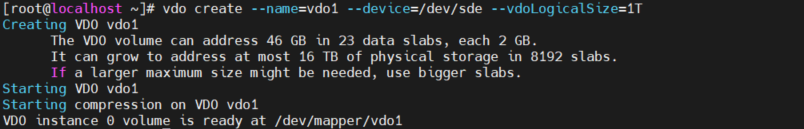

  - 4. Nhập ` mkfs.xfs -K /dev/mapper/vdo1` để đặt file hệ thống xfs cho thiết bị 
    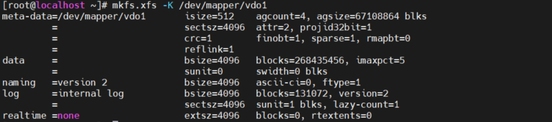

  - 5. Nhập `mkdir /vod1` để tạo mount point cho VDO device
  - 6. Nhập `cp /usr/share/doc/vdo/examples/systemd/VDO.mount.example /etc/systemd/system/vdo1.mount` để copy  Systemd mount file từ VDO đến /etc/systemd/system
  - 7. Sửa file gồm các dòng 

    `what = /dev/mapper/vdo1`
  
    `where = /vdo1`

     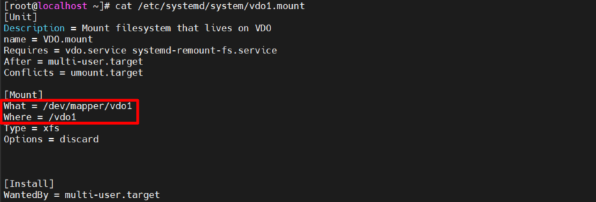
   
  - 8. Nhập ` systemctl enable --now vdo1.mount ` để mount đến block device mới
  - 9. Nhập  `vdostats --human-readable` để giám sát trạng thái hện tại của VDO device
  - 10. Nhập `df -h` để xác định  kích thước logic là 1GiB
      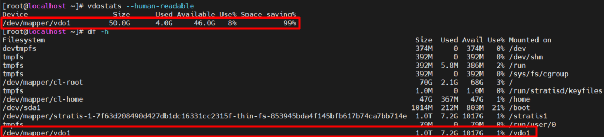

  - 11. Reboot server để chắc chắn sau khi reboot VDO device được mount chính xác.

Tham khảo 

https://blog.cloud365.vn/linux%20tutorial/tong-quan-lvm/

https://vinasupport.com/lvm-la-gi-tao-vao-quan-ly-logical-volume-manager/

https://bachkhoa-aptech.edu.vn/gioi-thieu-ve-logical-volume-manager/279.html 

https://blogd.net/linux/tao-va-quan-ly-lvm-trong-linux/