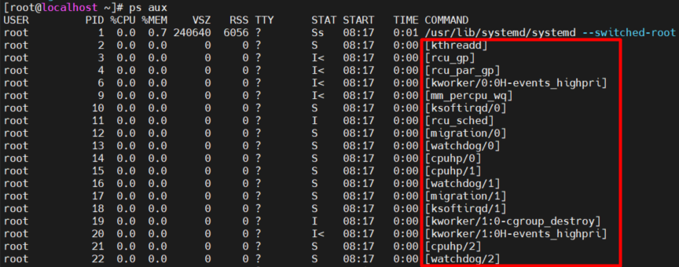
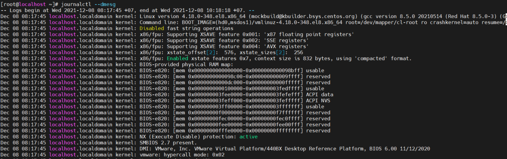
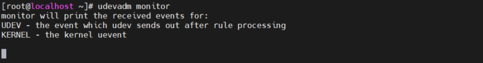
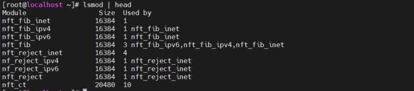
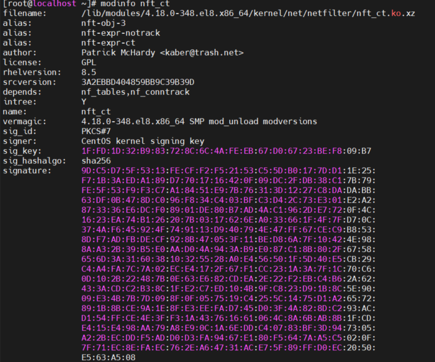
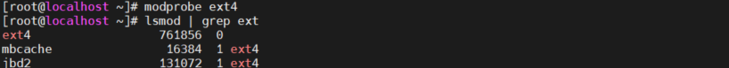
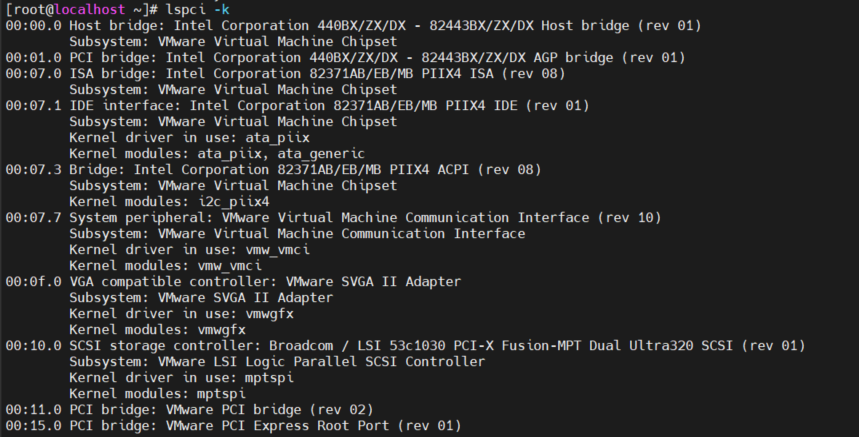

# Mục lục 
- [1. Understanding the Role of the Linux Kernel](#1)
  - [1.1 Understanding the Use of Kernel Threads and Drivers](#11)
  - [1.2 Analyzing What the Kernel Is Doing](#12)
- [2. Working with Kernel Modules](#2)
  - [2.1 Understanding Hardware Initialization](#21)
  - [2.2 Managing Kernel Modules](#22)
  - [2.3 Checking Driver Availability for Hardware Devices](#23)
  - [2.4 Managing Kernel Module Parameters](#24)
- [3. Upgrading the Linux Kernel](#3)
- [Tham khảo](#tm)

---

# 1. Understanding the Role of the Linux Kernel
- Linux kernel là trung tâm cả hệ điều hành. Nó là lớp giữa người dung mà làm việc với Linux thông qua môi trường shell và phần cứng có sẵn trong máy tính người dùng làm việc.
- Kernel quản lý các I/O mà nó nhận được từ phần mềm và chuyển chúng thành các lệnh xử lý được thực thi bới các CPU hoặc các phần cứng khác trong máy tính  
- Kernel đảm nhận  việc xử lý các tác vụ thiết yếu của hệ điều hành. 

## 1.1 Understanding the Use of Kernel Threads and Drivers
- Tác vụ của hệ điều hành được thi hành bởi các kernel được thực hiện bởi các kernel threads khác nhau.
  

- Khởi tạo phần cứng là tác vụ quan trọng của linux kernel.
  - Drivers được linux kernel sử dụng để chắc chắn phần cứng được sử dụng. 
  - Mỗi phần của phần cứng đều chứa các tính năng cụ thể và để sử dụng các tính năng đó, một driver phải được load
  - Linux kernel là một modun và driver được tải như kernel modun
- Trong một vài trường hợp, driver được cung cấp bởi các nhà sản xuất phần cứng không tương tích hết với Linux kernel dẫn đến không sử dụng được hết các tính năng của phần cứng cung cấp.   
  - Khi điều này xảy ra, cộng đồng linux kernal có thể trợ giúp với. Đây là điều mà driver mã nguồn đóng không làm được.
- Khái niệm *tainted kernel* được sử dụng để nói về kernel sử dụng driver mã nguồn đóng hay không. 
  - Một tainted kernel là một kernel bap gồm các driver mã nguồn đóng. 
  - Khái niệm của tainted kernel giúp khắc phục sự cố driver. Ví dụ, nếu kernel RHEL 8 bị tainted, Red Hat support có thể xác định nó là một tainted kernel và nhận biết driver nào là tainted đó. Để khắc phục, Red Hat có thể yêu cầu gỡ bỏ driver làm tainted kernel.

## 1.2 Analyzing What the Kernel Is Doing
- Để phân tích những cái mà kernel đang làm, một và công cụ được cung cấp bởi hệ điều hành linux
  - Tiện ích `dmesg`
  - File hệ thống /proc
  - Tiện ích `uname`
- Tiện ích `dmesg` xem xét thông tin chi tiết  về hoạt động của kernel. Nó hiển thị nội dung của kernel ring buffer (vòng đệm), vùng của bộ nhớ  nơi Linux kernel  giữ log message của nó. 
  - Một phương pháp thay thế để truy cập đến cùng một thông tin  trong kernel ring buffer là lệnh  `journalctl --dmesg`, tương đương với `journalctl -k`
  
- File hệ thống /proc là nguồn thông tin có giá trị. Nội dung trong file chứa thông tin trạng thái về những thứ xảy ra trong máy chủ.
- Tiện ích `uname` cho các thông tin khác nhau về hệ điều hành
  - `uname -a` hiện thị tất cả các tham số liên quan.
  - `uname -r` hiển thị thông tin phiên bản hiện tại.
  - Có thể sử dụng `hostnamectl status` để hiển thị thông tin bổ sung  hữu ích. 

# 2. Working with Kernel Modules
- Module kernel bao gồm một core kernel tương đối nhỏ và cung cấp driver hỗ trợ thông qua module được tải khi yêu cầu. 
- Module kernel thực hiện chức năng kernel cụ thể. Module kernel được sử dụng để tải driver cho phép liên lạc tích hợp với thiết bị phần cứng nhưng không giới hạn việc chỉ load một phần cứng 

## 2.1 Understanding Hardware Initialization
- Load driver là một quá trình tự động: 
  - 1. Trong boot, kernel sẽ tham dò các phần cứng có sẵn
  - 2. Khi phát hiện phần cứng, systemd-udevd process xử lý việc tải driver thích hơpk  và cung cấp cho phần cứng có sẵn
  - 3. Để quyết định thiết bị sẽ được khởi tạo như thế nào. `systemd-udevd` đọc file rule trong  /usr/lib/udev/rules.d. 
  - 4. Sau khi xử lý file rule do systemd-udevd cung cấp, `systemd-udevd` đến thư mục /etc/udev/rules.d để đọc các quy tắc tùy chỉnh nếu có. 
  - 5. Các module kernel được yêu cầu tải tự động và trạng thái về kernel modules và phần cứng liên quan được ghi đến file hệ thống sysfs nằm trong  thư mục /sys. Linux kernel sử dụng các file hệ thống giả này để theo dõi các các cài đặt liên quan đến phần cứng.
- Process systemd-udevd là một process chạy liên tục. Để giám sát  nó sử dụng lệnh `udevadm monitor`. 
  

## 2.2 Managing Kernel Modules
- Các lệnh sử dụng để quản lý thủ công kernel module 

Command | Use
---|---
lsmod | Danh sách kernel module hiện tại được load
modinfo  |  hiển thị thông tin về kernel module 
modprobe |  Load kernel modules, bao gồm tất cả phụ thuộc của nó  
modprobe -r |  Unloads kernel modules, xem xét đến kernel module phụ thuộc

  - `lsmod`

  - `modinfo`

  - `modprobe`

## 2.3 Checking Driver Availability for Hardware Devices
- Lệnh `lspci` hiển thị danh sách PCI. Sử dụng option -k để hiển thị danh sách kernel module được phát hiện và sử dụng cho PCI device 

- Nếu PCI device được tìm thấy không có module kernel nào có thể load, có thể sử dụng module kernel nguồn đóng, nhưng điều đó có thể gây nguy hiểm cho sự ổn định của kernel. 

## 2.4 Managing Kernel Module Parameters
- Có 2 cách để  quản lý các tham số kernel module 
  - Thêm thủ công qua dòng lệnh
    - Ví dụ `modprobe cdrom debug=1`  
  - Thêm qua file bằng cách tạo file trong thư mục /etc/modprobe.d
    - Ví dụ tạo file /etc/modprobe.d/cdrom.conf và thêm thông tin `options cdrom debug=1` vào file để cho phép tham số tự động được thêm khi cdrom kernel modle được load
- Ví dụ Loading Kernel Modules with Parameters
  - Nhập `lsmod | grep cdrom` để hiển thị module cdrom 

# 3. Upgrading the Linux Kernel
- Sử dụng lệnh  `yum upgrade kernel` hoặc `yum install kernel` để cập nhập kernel. Phiên bản mới sẽ được cài đặt, bản cũ sẽ vẫn tồn tại. 
- File kernel cho 4 kernel được cài đặt cuối cùng trên sever được giữ trong thư mục /boot.

