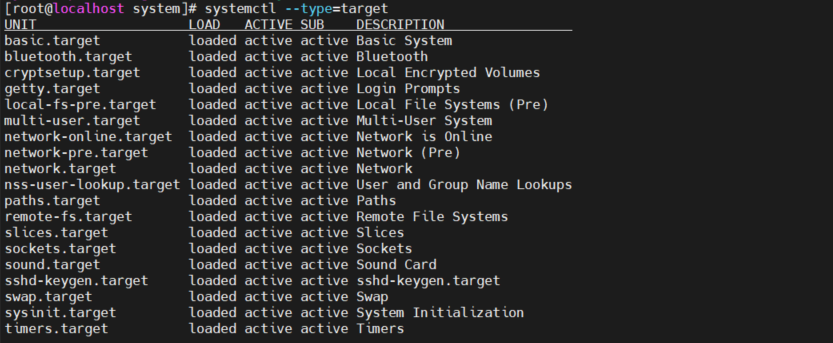
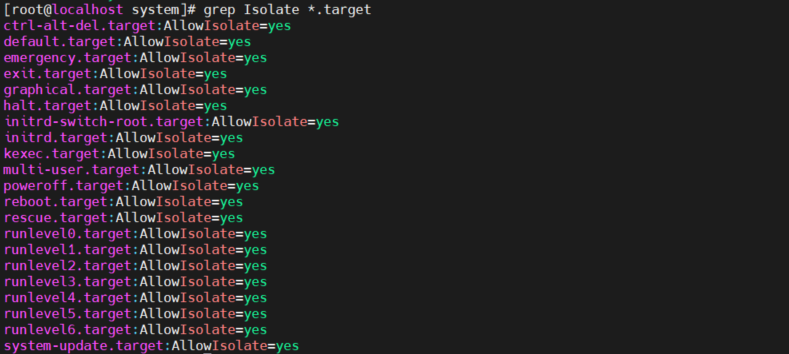
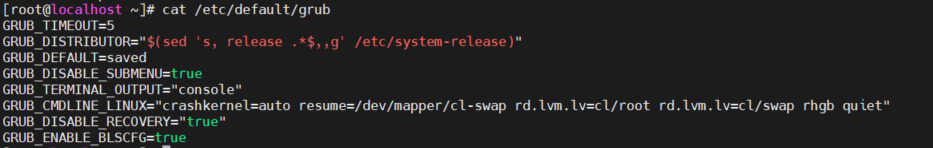

# Mục lục
- [1. Managing Systemd Targets](#1)
  - [1.1 Understanding Systemd Targets](#11)
  - [1.2 Working with Targets](#12)
  - [1.3 Understanding Target Units](#13)
  - [1.4 Understanding Want](#14)
  - [1.5 Isolating Targets](#15)
  - [1.6 Setting the Default Target](#16)
- [2. Working with GRUB 2](#2)
  - [2.1 Understanding GRUB 2](#21)
  - [2.2 Modifying Default GRUB 2 Boot Options](#22)
- [Tham khảo](#tm)

---

# 1. Managing Systemd Targets

## 1.1 Understanding Systemd Targets
-  Systemd Targets là một là một nhóm của unit. mọt vài targets không có gì khác, mội vài thì có thể được sử dụng để xác định trạng thái một hệ thống khi đang khởi động. Bởi vì các target này có thuộc tính cụ thể mà các target khác không có 
- Các target bao gồm mọi thứ mà hệ thống cần để boot hoặc thay đổi trạng thái hiện tại của nó  
- 4 Target có thể được sử dụng trong khi boot
  - **emergency.target** chỉ một só lượng unit tối thiểu được bắt đầu, chỉ đủ để sửa chữa hệ thống nếu có thứ gì đó nghiêm trọng xảy ra
  - **rescue.target** target này khởi động tất cả các unit được yêu cầu để hệ thống linux hoạt động đầy đủ. Nó không khởi động các dịch vụ không cần thiết 
  - **multi-user.target** target thường xuyên được sử dụng làm target mặc định  mà hệ thống khởi động vào. nó khởi động mọi thứ cần thiết  cho tất cả chức năng hệ thống và thường được sử dụng trên server
  - **graphical.target**  target này được sử dụng phổ biến. nNó khởi động  tất cả unit cần thiết cho toàn bộ chức năng, cũng như giao diện đồ họa. 

## 1.2 Working with Targets
- Target thực hiện 3 tác vụ phổ biến 
  - Thêm unit tự động khởi động
  - Thiết lập target mặc định 
  - Chạy một target không mặc định  để vào chế độ xử lý sự cố 

## 1.3 Understanding Target Units
- Cấu hình target gồm 2 bộ phận: 
  - File unit target
  - "want", chứa các tham chiếu đến tất cả các file unit cần để load khi vào một target cụ thể.
- Để quản lý target sử dụng systemd service.
  - `systemctl status [target]` để xem trạng thhái hiện tại của target
  - `ls /etc/systemd/system/multi-user.target.wants` xem danh sách sysbolic links được bắt đầu với các dịch vụ khác nhau trên máy
  - `systemctl enable [service]` để cho phép service bắt đầu một service khi hệ thống khởi động. Lệnh này sẽ tạo một symbolic link cho file ở /usr/lib/systemd/systelm/ đến thư mục  /etc/systemd/system/multi-user.target.wants

## 1.4 Understanding Wants

- Want trong systemd xác định cái mà unit systemd muốn khi khở động một target cụ thể.
- Want được tạo khi unit systemd sử dụng `systemctl enable` và nó xảy ra khi tạo một sysbolic link trong thư mục /etc/systemd/system. Trong thư mục /etc/systemd/system sẽ tìm thấy mọi thư mục con cho mọi target.

## 1.5 Isolating Targets

- Cô lập target, bắt đầu target với tất cả các phụ thuộc của của nó.
- Chỉ target có option isolate cho phép mới có thể cô lập. 

- Nhập `systemctl --type=target` để xem target hiện tại được hoạt động, `systemctl --type=target --all` để xem tất cả target tồn tại trong máy.
  

- Một vài target có vai trò quan trọng bởi chúng có thể khỏi động (cô lập)  để xác định trạng thái của server khởi động. Đây là những target được thiết lập nhưu target mặc định.  Các target này cũng tương ứng với các runlevel được sử dụng trong các phiên bản trước của RHEL: 

    poweroff.target runlevel 0

    rescue.target runlevel 1

    multi-user.target runlevel 3

    graphical.target runlevel 5

    reboot.target runlevel 6

- Trong nội dung của target có dòng AllowIsolate=yes, điều này có nghĩa có thể thay đổi trạng thái hiện tại của máy tính cho target bằng cách sử dụng lệnh `systemctl isolate`.
- Ví dụ cô lập một targate 
  - Đến thư mục /usr/lib/systemd/system và nhập `grep Isolate *.target` để xem danh sach các target cho phép cô lập
   
  - Nhập `systemctl isolate rescue.target`. Nó sẽ chuyển máy tính thành rescue.target. 
  - Nhập `systemctl isolate reboot.target` để restart máy tính  

## 1.6 Setting the Default Target
- Nhập `systemctl get-default` để xem danh sách default target hiện tại, `systemctl get-default [target]` để thiết thập default target

# 2. Working with GRUB 2
- GRUB (GRand Unified Bootloader) 2 boot loader là một trong  những thú đầu tiên hoạt động để khởi động linux server. Quản trị viên có thể áp dụng các sửa đổi đói với GRUB 2 

## 2.1 Understanding GRUB 2

- GRUB 2 boot loader sử dụng để chắc chắn thiết bị thể boot linux. 
- GRUB 2 được cài đặt trong khu vực boot ở ổ cứng của server và được cấu hình để load một linux kernel  và  initramfs
  - Initramfs là một hệ thống file ram ban đầu dựa trên tmpfs. Nó chứa các công cụ và script cần thiết để mount các hệ thống file trước khi file nhị phân init trên hệ thống file root thực được gọi.
  - Initramfs chứa driver cần để khởi động server. Nó chứa file hệ thống mini được gắn trong khi boot. Trong đó là các kernel module cần thiết trong phần còn lại của quá trình boot. 

- Trong một số trường hợp có thể thay đổi cấu hình của GRUB 2 
  - Để áp dụng thay đổi cho GRUB 2, điểm bắt đầu là file /etc/default/grub, có các option để gọi GRUB  làm cái gì và làm như thế nào  
 
  - Tronng file phần quan trọng nhất là GRUB_CMDLINE_LINUX, nó chứa các đối số khởi động cho kernel trên server
  - Ngoài ra còn có các file cấu hình trong /etc/grub.d. Trong file này sẽ tìm thấy shell code phức tạp cho GRUB biết những gì cần tải và cách tải nó. 
- Thông thường sẽ không phải chỉnh sửa các file cấu hình này. GRUB 2 tự động chọn kernel mới tự động và thêm chúng đến boot menu tự động
- Dựa trên các file cấu hình, file cấu hình chính được tạo. 
  - Nếu hệ thống thuộc loại BIOS, tên của file là /boot/grub2/grub.cf. 
  - Nếu Hệ thống thuộc loại UEFI file sẽ được ghi đến /boot/efi/EFI/rethat.
- Sau khi thực hiện sửa đổi cấu hình GRUB 2, cần phải tạo lại các tệp cấu hình có liên quan, do đó cần biết tên của file cấu hình để áp dụn và kiến trúc hệ thống.

## 2.2 Modifying Default GRUB 2 Boot Options
- Để áp dụng sửa đổi cho GRUB 2 boot loader, file /etc/default/grub là điểm đến. Dòng quan trọng là GRUB_CMDLINE_LINUX, nó xác định  Linux kernel nên được bắt đầu như thé nào. Trong dòng này có thể áp dụng sửa đổi vĩnh viễn vào file cấu hình của GRUB 2. 
- Một số ứng cử viên có khả năng loại bỏ là *rhgb* và *quiet*, nó nói với kernel ẩn đầu ra trong khi khởi động
- Tham số GRUB_TIMEOUT  xác định số lượng thời gian server chờ để truy cập GRUB 2 boot menu troăc khi nó tiếp tục khởi động tự động 
- Để ghi nội dung sửa đổi cấu hình đến file thích hợp, sử dụng lệnh `grub2-mkconfig` và chuyển hướng đầu ra đến file cấu hình thích hợp.
  - Ví dụ, Hệ thống BOIS ,  `grub2-mkconfig -o /boot/grub2/grub.cfg`, hệ thôgns UEFI `grub2-mkconfig -o /boot/efi/EFI/redhat/grub.cfg`

