# Mục lục 
- [1. Understanding Shell Scripting Core Elements ](#1)
- [2. Using Variables and Input](#2)
- [3. Using Conditional Loops](#3)

---
<a name ='1'></a>
# 1. Understanding Shell Scripting Core Elements
- Shell Scripti là một danh sách các lệnh được thực thi liên tục với một đối số logic trong đó cho phép  code được thực thi theo điều kiện cụ thể duy nhất. 
- Một file shell script  được bắt đầu bằng #!/bin/bash để thông  báo cho chương trình tương tác shell của hệ thống
- Muốn thực hiện một shell script cần cấp quyền cho nó, dùng `chmod +x[755] filename` 
- Sử dụng `./filename`  hoặc `bash filename`để thực thi shell script 

    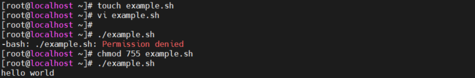

<a name ='2'></a>
# 2. Using Variables and Input

<a name ='21'></a>
## 2.1 Using Positional Parameters
- Một số tham số dòng lệnh hay dùng 

Biến | Ý nghĩa
---|---
$0| Tên của file script.
$1 -> \$9| Các tham số truyền vào
$#| Là bộ đếm cho thấy số lượng của tham số truyền vào khi bắt đầu script
$*| Danh sách các tham số được truyền vào (các trường hợp \$# và $* sẽ không bao gồm $0)
$@| Đề cập đến tất cả tham số được sử dụng khi bắt đầu script
$? | Trạng thái thoát của quy trình chạy gần đây nhất.
\$$ | ID tiến trình của tập lệnh hiện tại.
$! |là PID của tiến trình cuối cùng được chạy, giúp theo dói tiến trình job đang chạy.
$USER | Tên người dùng của người dùng đang chạy tập lệnh.
$HOSTNAME | Tên máy chủ của máy mà tập lệnh đang chạy.
$SECONDS | Số giây kể từ khi tập lệnh được bắt đầu.
$RANDOM | Trả về một số ngẫu nhiên khác nhau mỗi lần được nhắc đến.
$LINENO | Trả về số dòng hiện tại trong tập lệnh Bash.
$BASH_VERSION | vesion của trình shellscript hiện tại
$BASH | Thư mục cài đặt bash
$HOME | Thư mục home
$PATH | Danh sách các đường dẫn môi trường (vd: sau khi cài ruby thì môi trường sẽ được thêm vào đường dẫn rvm tới thư mục cài ruby, vậy là có thể chạy các câu lệnh shell ruby --version, rvm list, ruby -h ... của phần mềm ruby. Tương tự với git, curl, python3, mysql, elastichsearch ... hay bất cứ phần mềm nào)
- Sử dụng lệnh `printenv` để xem các biến có sẵn  
- Ví dụ sử dụng biến  
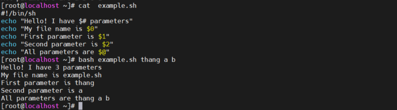

<a name ='22'></a>
## 2.2 Work with variable
- Một biến là một nhãn được sử dụng để chỉ một vị trí cụ thể trong bộ nhớ mà chứa một giá trị cụ thể 
- Biến có thể được xác định bằng cách dùng NAME=Value hoặc một cách linh hoạt.
  - 2 cách xác định biến linh hoạt 
    - Dùng `read`  trong script để hỏi người dùng chạy script cho đầu vào. 
    - Dùng lệnh thay thế để sử dụng kết quả của một lệnh sau đó gán vào một biến. Có 2 cách gán lệnh là dùng dấu backtick  hoặc dùng dấu dollar
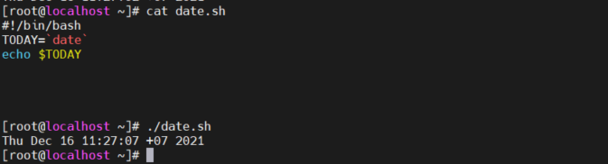


<a name ='3'></a>
# 3. Using Conditional Loops
- Các vòng lặp được sử dụng 
  - **if … then … else** Được sử dụng để thực thi mã nếu một điều kiện cụ thể là đúng
  - **for** Được sử dụng để thực thi các lệnh cho một loạt giá trị  
  - **while** Được sử dụng để thực thi code miễn là một điều kiện cụ thể đúng 
  - **until** Được sử dụng để thực hiện code cho đến khi một điều kiện cụ thể là đúng
  - **case** Được sử dụng để đánh giá các giá trị cụ thể, trong đó trước một số lượng hạn chế của giá trị được mong đợi

<a name ='31'></a>
## 3.1 if … then … else
- Sử dụng phổ biến để đánh giá các điều kiện cụ thể
- Cú pháp:
```
if [ ... ]
then
  # if-code
else
  # else-code
fi
```
hoặc 
```
if  [ something ]; then
 echo "Something"
elif [ something_else ]; then
  echo "Something else"
else
  echo "None of the above"
fi
```
  - Dấu ";" có thể dùng làm phân định 2 dòng lệnh, cặp [ ] có thể sử dụng như 1 lệnh kiểm tra điều kiện

- Ví dụ  
```
#!/bin/bash
# run this script with one argument
# the goal is to find out if the argument is a file or a directory
if [ -f $1 ]
then
echo "$1 is a file"
elif [ -d $1 ]
then
echo "$1 is a directory"
else
echo "I do not know what \$1 is"
fi
exit 0      
```
- Ví dụ 
```
#!/bin/bash
# Testing nested ifs - use elif & else
#
testuser=NoSuchUser
#
if grep $testuser /etc/passwd
then
echo “The user $testuser exists on this system.”
#
elif ls -d /home/$testuser
then
echo “The user $testuser does not exist on this system.”
echo “However, $testuser has a directory.”
#
else
echo “The user $testuser does not exist on this system.”
echo “And, $testuser does not have a directory.”
fi
```
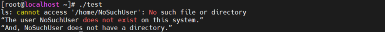

<a name ='32'></a>
## 3.2 Using || and &&

- || là phép toán logic OR và sẽ chỉ thực thi phần thứ 2 của câu lệnh nếu phần đầu tiên không đúng 
- && là phép toán logic AND và sẽ chỉ thực thi phần thứ 2 của câu lệnh  nếu phần đầu đúng  
- Ví dụ 
  - `[ -z $1 ] && echo no argument provided` : Một kiểm tra được thực hiện với $1 liệu có trống hay không, nếu kiểm tra đúng sẽ thực thi lệnh thứ 2
  - `ping -c 1 10.0.0.20 2>/dev/null || echo node is not available`: Lệnh ping kiểm tra tính có sẵn của một host. Lệnh echo sẽ được thực hiện nếu lệnh ping không thành công.

- Ví dụ 
```
#!/bin/bash
# testing compound comparisons
#
if [ -d $HOME ] && [ -w $HOME/testing ]
then
echo “The file exists and you can write to it”
else
echo “I cannot write to the file”
fi
```
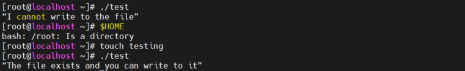

<a name ='33'></a>
## 3.3 for
- for cung cấp một giải pháp để xử lý các phạm vi dữ liệu 

- Dạng đơn giản của for  
```
#!/bin/bash
for var in list
do
commands
done
```
- Ví dụ Đọc giá trị thành một list
```
#!/bin/bash
# basic for command
for test in Alabama Alaska Arizona Arkansas California Colorado
do
echo The next state is $test
done
```
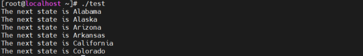


- Ví dụ 
```
for i in {133..135}
do ping -c 1 192.168.247.$i
192.168.247.$ix is up
done
 ```
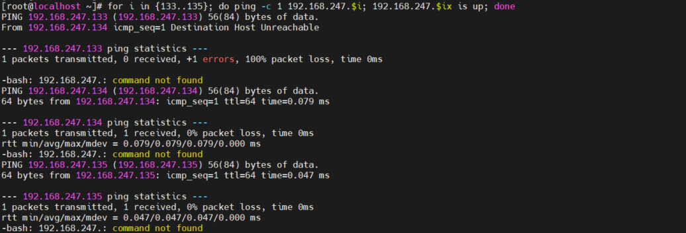

<a name ='34'></a>
## 3.4 Understanding while and until

- Lệnh while hữu ích nếu muốn theo dõi một thứ gì đó giống như sự có sẵn của một tiến trình
- Dạng đơn giản của while
```
while test command
do
other commands
done
```
- Ví dụ: 
```
#!/bin/bash
# while command test
var1=10
while [ $var1 -gt 0 ]
do
echo $var1
var1=$[ $var1 - 1 ]
done
```

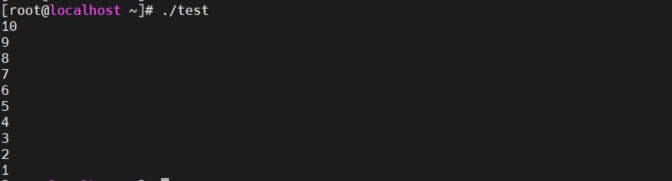

- Ví dụ dùng nhiều lệnh test 
```
#!/bin/bash
# testing a multicommand while loop
var1=10
while echo $var1
[ $var1 -ge 0 ]
do
echo “This is inside the loop”
var1=$[ $var1 - 1 ]
done
```
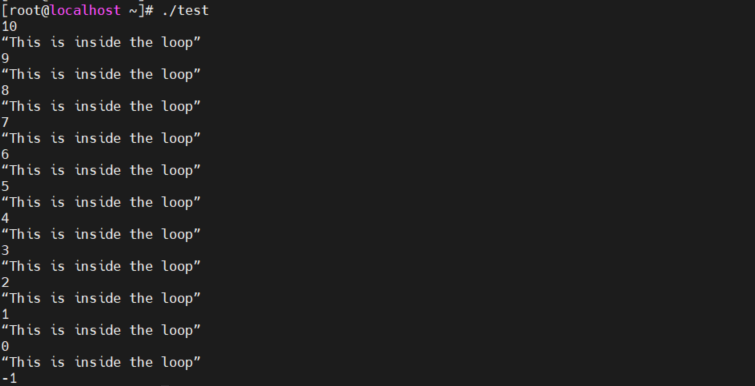


- Lệnh until giữ cho quá trình lặp mửo cho đến khi một điều kiện cụ thể là đúng  
- Dạng cơ bản của lệnh 
```
until test commands
do
other commands
done
```
- Ví dụ  
```
#!/bin/bash
# using the until command
var1=100
until [ $var1 -eq 0 ]
do
echo $var1
var1=$[ $var1 - 25 ]
done
```
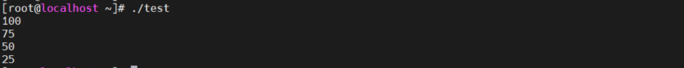


- Ví dụ  
```
#!/bin/bash
# using the until command
var1=100
until echo $var1
[ $var1 -eq 0 ]
do
echo Inside the loop: $var1
var1=$[ $var1 - 25 ]
done
```
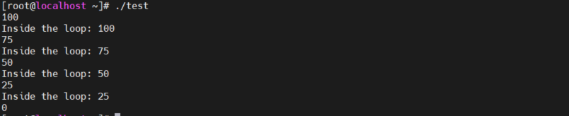


<a name ='34'></a>
## 3.5 Understanding case
- Lệnh case kiểm tra nhiều lệnh của một biến trong một định đạng danh sách
```
case variable in
pattern1 | pattern2) commands1;;
pattern3) commands2;;
*) default commands;;
esac
```
- Ví dụ  
```
#!/bin/bash# using the case command
#
case $USER in
root | barbara)
echo “Welcome, $USER”
echo “Please enjoy your visit”;;
testing)
echo “Special testing account”;;
jessica)
echo “Do not forget to log off when you’re done”;;
*)
echo “Sorry, you are not allowed here”;;
esac
```
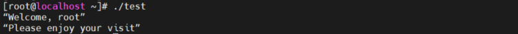


<a name ='34'></a>
## 3.6 Bash Shell Script Debugging

- Lệnh `bash -x` để xem các lệnh bên trong shell script đang thực hiện  
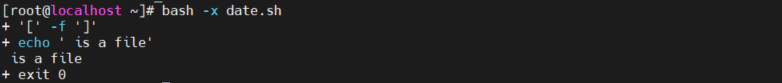


# Tham khảo 

https://viblo.asia/p/tim-hieu-shell-script-p2-63vKjDoNl2R

Linux Command Line and Shell Scripting Bible by Richard Blum, Christine Bresnahan (z-lib.org)