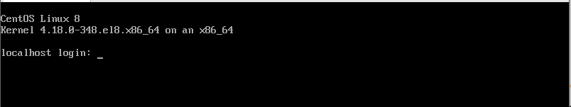
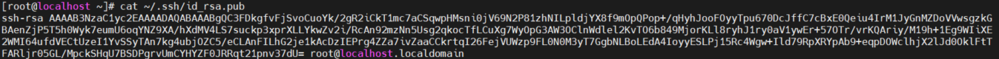
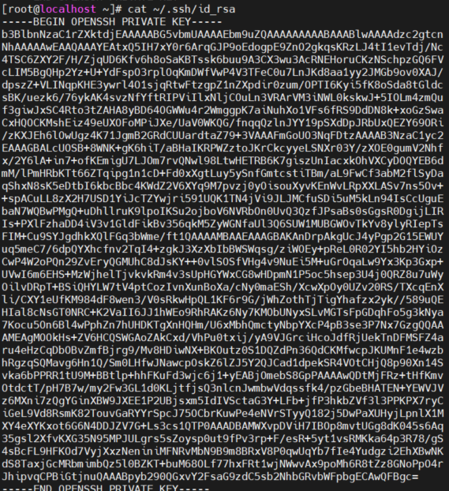
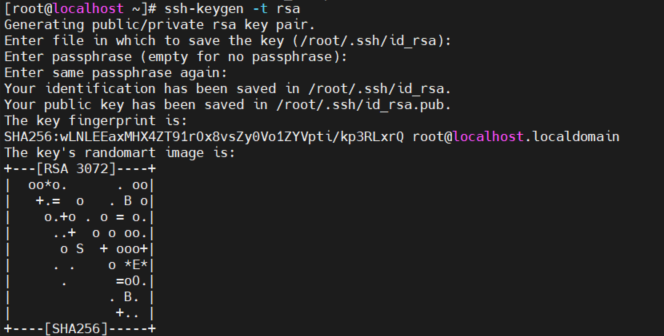
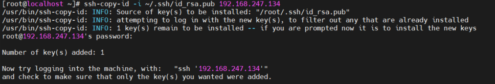
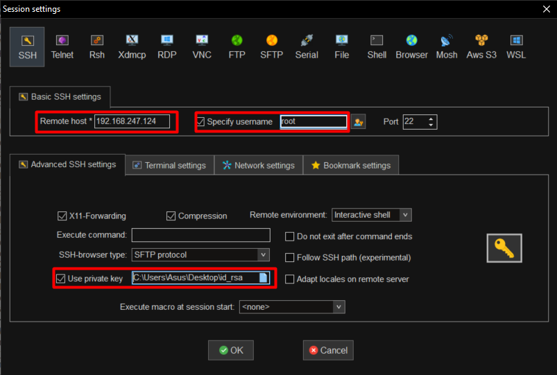
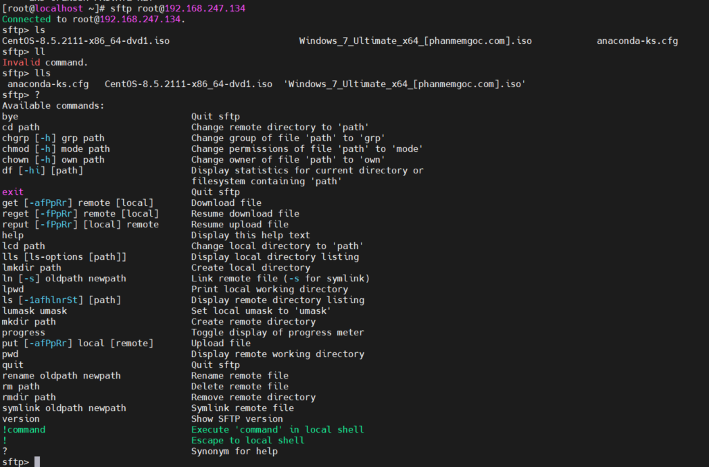
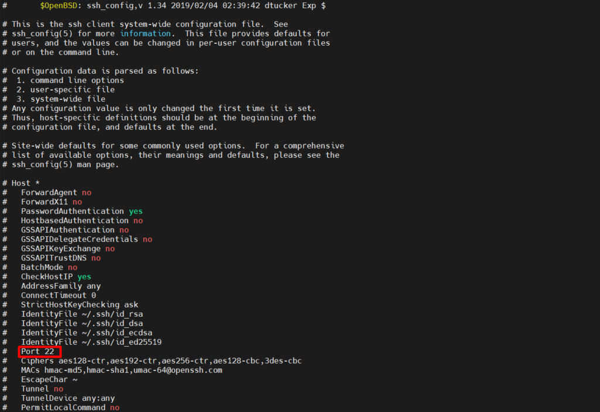

# Mục lục 
- [1. Local Consoles ](#1)
- [2. Hardening the SSH Server](#2)
  - [2.1 Access server from remote through ssh](#21)
  - [2.2 Securely Transferring Files Between Systems](#22)
- [3. Hardening the SSH Server](#1)

---

# 1 Local Consoles 
- Một Linux console terminal là một trong những console hệ thống cung cấp trong  Linux kernel.The Linux console như là phương tiện cho các hoạt động đầu vào và đầu ra cho một hệ thống Linux.
- Terminal là môi trường được ở trên console  và cung cấp quyền truy cập vào một text shell, môi trường thực hiện nhập lệnh.
- Login local console
  - Khi mở một server không sử dụng đồ họa, màn hình sẽ xuất hiện một console dựa trên văn bản 
  
  - Muốn dùng nhiều console trên một service, sử dụng virtual terminal cho phép mở 6 cửa sổ terminal bằng cách nhập Alt F1-F6 một console muốn. Các virtual console này có file divice đặt tại thư mục /dev và có tên là /dev/tty1-tty6

# 2. SSH

- SSH (Secure (Socket) Shell) là giao thức đăng nhập vào server từ xa, cho phép người dùng kiểm soát, chỉnh sửa và quản trị dữ liệu của server thông qua nền tảng Internet. SSH cũng giúp việc kết nối của mạng lưới máy chủ và máy khách an toàn, hiệu quả và bảo mật thông tin tốt hơn

## 2.1 Access server from remote through ssh
- Sử dụng password
  - Dịch vụ sshd chạy và sử dụng port 22 (mặc định tron RHEL 8) 
  - Cần thông tin về user và inet hoặc domain của máy chủ cần ssh tới 
  

  - Các option với ssh 

  Option | Use
  ---|---
  -v| hiển thị chi tiết những gì xảy ra trong quá trình kết nối
  -Y|  cho phép hỗ trợ cho ứng dụng độ họa
  -p \<port> | sử dụng để kết nối ssh service khi port ssh mặc định không phải port 22

  - Để sử dụng X forwarding (sử dụng các ứng dụng đồ họa thông qua ssh) nhập dòng  `ForwardX11 yes` trong file /etc/ssh/ssh_config
- Sử dụng key
  - Sử dụng cặp khóa public/private 
    - Public Key khóa chung: là một file text - nó lại lưu ở phía Server SSH, nó dùng để Client gửi Private Key (file lưu ở Client) lên để xác thực thì kiểm tra phù hợp giữa Private Key và Public Key này. Nếu phù hợp thì cho kết nối.
  

    - Private Key khóa riêng: là một file text bên trong nó chứa mã riêng để xác thực (xác thực là kiểm tra sự phù hợp của Private Key và Public Key). Client kết nối với Server phải chỉ ra file này khi kết nối SSH thay vì nhập mật khẩu.
  
    

  - Tạo key sử dụng lệnh `ssh-keygen [option]`
    Options| Description
    ---|---
    -f| là key name và nơi sẽ lưu trữ key. Mặc định tại thư mục ~/.ssd
    -t| là thuật toán mã hóa để sinh khóa.(rsa, dsa, ecdsa, ed25519)
    -b| kích thước khóa

    

  - Gán public key cho service `ssh-copy-id -i ~/.ssh/your-key.pub username@host` public key sẽ được lưu tại ~/.ssh/authorized_keys để xác thực khi có private key gửi đến. 
  

  - Lúc này có thể sử dụng private key để ssh đến máy chủ.
  

   
## 2.2 Securely Transferring Files Between Systems
- Using scp to Securely Copy Files
  - Lệnh `scp` được sử dụng như lệnh `cp`, một số option cho phép nó hoặt động với host từ xa. Có thể sử dụng lệnh để sao chép file và thư mục con đến và đi từ các host từ xa 
  - Cấu trúc `scp [OPTION] [user_src@]src_host:]src_file [user@]desk_host:]des_file`
    - [user_src@]src_host:]src_file là file, thư mục nguồn, ví dụ abcuser@192.168.1.55:/home/file1.txt là file /home/file1.txt tại máy abcuser@192.168.1.55, như dấu :, nếu là tại máy local thì không cần chỉ ra user, host tức bỏ đoạn abcuser@192.168.1.55:
    - [user@]desk_host:]des_file đường dẫn file, thư mục đích muốn copy - ý nghĩa tương tự như trên
    - [OPTIONS] các thiết lập cho thêm vào nếu muốn, như cho thêm tham số -r để đệ quy copy cả thư mục, các file, thư mục con theo đường dẫn.
- Using sftp to Securely Transfer Files
  - SFTP (SSH File Transfer Protocol) là một giao thức truyền file an toàn được sử dụng để truy cập, quản lý và truyền file thông qua SSH được mã hóa
  - Khi làm việc với SFTP, bạn sẽ mở một phiên  FTP client vào remote server,trong đó yêu cầu duy nhất trên remote server là nó phải chạy sshd process
  - Kết nối sftp:  `sftp user@remotehost` 
  

    Lệnh| 	Thông tin
    ------|------
    ls|	Liệt kê file trên Server, giống lệnh ls của Linux
    lls|	Liệt kê file thư mục hiện tại của máy Local
    cd	|Chuyển thư mục làm việc trên Server - giống lệnh cd của Linux
    lcd	|Chuyển thư mục làm việc của máy Local
    df [path]	|Thông tin file, thư mục (kích thước ...)
    pwd	|Xem đường dẫn hiện tại của Server, giống pwd Linux
    lpwd	|Xem đường dẫn hiện tại của máy Local
    mkdir|	Tạo thư mục, giống mkdir Linux
     renname oldpath newpath	|Đổi tên file trên Server
    rm path	|Xóa file, thư mục (đệ quy thêm -r)
    get remote [local]	|Tải file remote (thư mục), về lưu tại thư mục local hiện tại hoặc chỉ ra local. Để tải đệ quy cả thư mục thêm tham số -r
    get -r data|Lệnh trên tải thư mục data, thư mục con trong data của Server về thư mục hiện tại của máy local (client)
    put local [remote]|	Tải lên local lưu vào thư mục hiện tại của Server, hoặc chỉ ra trong tham số remote Để upload cả thư mục con bên trong, thêm vào -r
    put -r mycode|Lệnh trên upload thư mục mycode, thư mục con trong mycode của máy Local lên thư mục hiện tại của Server
    exit|	Thoát

- Using rsync to Synchronize Files
  - Rsync (remote sync) là công cụ đồng bộ file, thư mục của Linux. Nó sử dụng thuật toán khi copy dữ liệu sao cho dữ liệu phải copy là nhỏ nhất (chỉ copy những gì thay đổi giữa nguồn và gốc), khi đồng bộ nó giữ nguyên mọi thuộc tính của file, thư mục (từ chủ sở hữu, quyền truy cập file ...).

  Option | Use
  ---|---
  -r |Synchronizes the entire directory tree
  -l| Also synchronizes symbolic links
  -p| Preserves symbolic links
  -n| Performs only a dry run, not actually synchronizing anything
  -a| Uses archive mode, thus ensuring that entire subdirectory trees and all file properties will be synchronized
  -A |Uses archive mode, and in addition synchronizes ACLs
  -X| Synchronizes SELinux context as well

  - Rsync - Đồng bộ giữa 2 máy Linux

# 3. Hardening the SSH Server
- Nó là một giải pháp thuận tiện nhưng cũng là một giải pháp nguy hiểm. 
- Hacker sẽ cố gắng tấn công các máy chủ ssh qua port 22 và thông qua các tài khoản root bằng thuật toán đoán password.
- Một số biện pháp để ngăn chăn tấn công qua ssh.
  - Vô hiệu hóa đăng nhập root
  - Vô hiệu hóa mật khẩu root
  - Cấu hình port nondefault cho ssh lắng nghe
  - Chỉ định người đùng được phép ssh 

## 3.1 Limiting Root Access
- Sửa đổi tham số PermitRootLogin trong file /etc/ssh/sshd_config để vô hiệu hóa đăng nhập root
- Sau khi thiết lập restart lại service
  

## 3.2 Configuring Alternative Ports

- Có tất cả 65535 port có khả năng lắng nghe. Kẻ tấng công có thể quét tất cả các công hoặc tập trung vào các port đã biết, và ssh port 22 luôn nằm trong các cổng này
- Có thể thay đổi port 22 bằng một port khác để để lắng nghe ssh. Có thể chọn một port ngẫu nhiên hoặc port 443
- Port 443 theo mặc định được gán cho web server sử dụng TLS (Transport Layer Security) để cung cấp mã hóa.  
- Nếu người dùng muốn truy cập vào máy chủ SSH thường đứng sau một proxy chỉ cho phép truy cập đến các cổng 80 và 443, thì việc định cấu hình SSH để lắng nghe trên cổng 443 có thể có ý nghĩa.
- Một port chỉ có thể lắng nghe một service tại một thời điểm 
  

## 3.3 Modifying SELinux to Allow for Port Changes
- Sau khi thay đổi port SSH, cần cấu hình SElinux đẻ cho phép các thay đổi. Network port được dán nhán với SELinux security labels để ngăn chặn các dịch vụ  từ các port nơi mà nó không nên đi 
- Để cho phép một dịch vụ kết nối tới một nonedefault port, cần sử dụng `semanage port` để thay đổi nhãn trên port đích. Nên dụng `semanage port -l` để kiểm tra port đã có label. 

- Nếu port không có thiết lập security label, sử dụng -a để thêm label cho port. Nếu security label được thiết lập, dùng -m để sửa đổi security label. 
- Ví dụ lệnh  `semanage port -a -t ssh_port_t -p tcp 2022` để port label 2022 cho truy cập bởi sshd

## 3.4 Limiting User Access

- Trong file /etc/ssh/sshd_config, tham số AllowUsers sử dụng để chỉ định người dùng được truy cập qua ssh. 
-  AllowUsers không được sử dụng mặc định ở trong /etc/ssh/sshd_config
- Tùy chọn AllowUsers là một lựa chọn tốt hơn PermitRootLogin vì nó hạn chế hơn việc chỉ từ chối root để đăng nhập.
- Nếu AllowUsers không chỉ định root, vẫn có thể trở thành root bằng cách sử dụng su - sau khi tạo kết nối với tư cách người dùng bình thường.

https://xuanthulab.net/tao-ssh-key-va-xac-thuc-ket-noi-ssh-bang-public-private-key.html

https://xuanthulab.net/su-dung-chuong-trinh-sftp-truyen-tai-file-an-toan.html

https://xuanthulab.net/su-dung-rsync-dong-bo-thu-muc-tren-linux-va-windows.html

https://xuanthulab.net/lenh-scp-copy-file-va-thu-muc-tu-server-ve-may-local-va-nguoc-lai.html