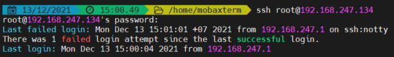

# Mục lục 
- [1. Local Consoles ](#1)
- [2. Hardening the SSH Server](#2)
  - [2.1 Access server from remote through ssh](#21)
  - [2.2 Securely Transferring Files Between Systems](#22)
- [3. Hardening the SSH Server](#3)
- [Tham khảo](tm) 
---

<a name ='1'></a>
# 1. Local Consoles 
- Một Linux console terminal là một trong những console hệ thống cung cấp trong  Linux kernel.The Linux console như là phương tiện cho các hoạt động đầu vào và đầu ra cho một hệ thống Linux.
- Terminal là môi trường được ở trên console  và cung cấp quyền truy cập vào một text shell, môi trường thực hiện nhập lệnh.
- Login local console
  - Khi mở một server không sử dụng đồ họa, màn hình sẽ xuất hiện một console dựa trên văn bản 
  
  - Muốn dùng nhiều console trên một service, sử dụng virtual terminal cho phép mở 6 cửa sổ terminal bằng cách nhập Alt F1-F6 một console muốn. Các virtual console này có file divice đặt tại thư mục /dev và có tên là /dev/tty1-tty6


<a name ='2'></a>
# 2. SSH

- SSH (Secure (Socket) Shell) là giao thức đăng nhập vào server từ xa, cho phép người dùng kiểm soát, chỉnh sửa và quản trị dữ liệu của server thông qua nền tảng Internet. SSH cũng giúp việc kết nối của mạng lưới máy chủ và máy khách an toàn, hiệu quả và bảo mật thông tin tốt hơn

<a name ='21'></a>
## 2.1 Access server from remote through ssh
- Sử dụng password
  - Dịch vụ sshd chạy và sử dụng port 22 (mặc định tron RHEL 8) 
  - Cần thông tin về user và inet hoặc domain của máy chủ cần ssh tới 
  

  - Các option với ssh 

  Option | Use
  ---|---
  -v| hiển thị chi tiết những gì xảy ra trong quá trình kết nối
  -Y|  cho phép hỗ trợ cho ứng dụng độ họa
  -p \<port> | sử dụng để kết nối ssh service khi port ssh mặc định không phải port 22

  - Để sử dụng X forwarding (sử dụng các ứng dụng đồ họa thông qua ssh) nhập dòng  `ForwardX11 yes` trong file /etc/ssh/ssh_config
- Sử dụng key
  - Sử dụng cặp khóa public/private 
    - Public Key khóa chung: là một file text - nó lại lưu ở phía Server SSH, nó dùng để Client gửi Private Key (file lưu ở Client) lên để xác thực thì kiểm tra phù hợp giữa Private Key và Public Key này. Nếu phù hợp thì cho kết nối.
  

    - Private Key khóa riêng: là một file text bên trong nó chứa mã riêng để xác thực (xác thực là kiểm tra sự phù hợp của Private Key và Public Key). Client kết nối với Server phải chỉ ra file này khi kết nối SSH thay vì nhập mật khẩu.
  
    

  - Tạo key sử dụng lệnh `ssh-keygen [option]`
    Options| Description
    ---|---
    -f| là key name và nơi sẽ lưu trữ key. Mặc định tại thư mục ~/.ssd
    -t| là thuật toán mã hóa để sinh khóa.(rsa, dsa, ecdsa, ed25519)
    -b| kích thước khóa

    


  - Gán public key cho service `ssh-copy-id -i ~/.ssh/your-key.pub username@host` public key sẽ được lưu tại ~/.ssh/authorized_keys để xác thực khi có private key gửi đến. 
  

  - Lúc này có thể sử dụng private key để ssh đến máy chủ.
  

<a name ='22'></a>   
## 2.2 Securely Transferring Files Between Systems
- Using scp to Securely Copy Files
  - Lệnh `scp` được sử dụng như lệnh `cp`, một số option cho phép nó hoặt động với host từ xa. Có thể sử dụng lệnh để sao chép file và thư mục con đến và đi từ các host từ xa 
  - Cấu trúc `scp [OPTION] [user_src@]src_host:]src_file [user@]desk_host:]des_file`
    - [user_src@]src_host:]src_file là file, thư mục nguồn, ví dụ abcuser@192.168.1.55:/home/file1.txt là file /home/file1.txt tại máy abcuser@192.168.1.55, như dấu :, nếu là tại máy local thì không cần chỉ ra user, host tức bỏ đoạn abcuser@192.168.1.55:
    - [user@]desk_host:]des_file đường dẫn file, thư mục đích muốn copy - ý nghĩa tương tự như trên
    - [OPTIONS] các thiết lập cho thêm vào nếu muốn, như cho thêm tham số -r để đệ quy copy cả thư mục, các file, thư mục con theo đường dẫn.
  

- Using sftp to Securely Transfer Files
  - SFTP (SSH File Transfer Protocol) là một giao thức truyền file an toàn được sử dụng để truy cập, quản lý và truyền file thông qua SSH được mã hóa
  - Khi làm việc với SFTP, bạn sẽ mở một phiên  FTP client vào remote server,trong đó yêu cầu duy nhất trên remote server là nó phải chạy sshd process
  - Kết nối sftp:  `sftp user@remotehost` 
  


    Lệnh| 	Thông tin
    ------|------
    ls|	Liệt kê file trên Server, giống lệnh ls của Linux
    lls|	Liệt kê file thư mục hiện tại của máy Local
    cd	|Chuyển thư mục làm việc trên Server - giống lệnh cd của Linux
    lcd	|Chuyển thư mục làm việc của máy Local
    df [path]	|Thông tin file, thư mục (kích thước ...)
    pwd	|Xem đường dẫn hiện tại của Server, giống pwd Linux
    lpwd	|Xem đường dẫn hiện tại của máy Local
    mkdir|	Tạo thư mục, giống mkdir Linux
     renname oldpath newpath	|Đổi tên file trên Server
    rm path	|Xóa file, thư mục (đệ quy thêm -r)
    get remote [local]	|Tải file remote (thư mục), về lưu tại thư mục local hiện tại hoặc chỉ ra local. Để tải đệ quy cả thư mục thêm tham số -r
    get -r data|Lệnh trên tải thư mục data, thư mục con trong data của Server về thư mục hiện tại của máy local (client)
    put local [remote]|	Tải lên local lưu vào thư mục hiện tại của Server, hoặc chỉ ra trong tham số remote Để upload cả thư mục con bên trong, thêm vào -r
    put -r mycode|Lệnh trên upload thư mục mycode, thư mục con trong mycode của máy Local lên thư mục hiện tại của Server
    exit|	Thoát


  
  

- Using rsync to Synchronize Files
  - Rsync (remote sync) là công cụ đồng bộ file, thư mục của Linux. Nó sử dụng thuật toán khi copy dữ liệu sao cho dữ liệu phải copy là nhỏ nhất (chỉ copy những gì thay đổi giữa nguồn và gốc), khi đồng bộ nó giữ nguyên mọi thuộc tính của file, thư mục (từ chủ sở hữu, quyền truy cập file ...).

  Option | Use
  ---|---
  -r |Đồng bộ hóa toàn bộ cây thư mục
  -l| Đồng thời đồng bộ hóa các liên kết tượng trưng
  -p| Bảo tồn các liên kết tượng trưng
  -n| Chỉ thực hiện chạy phơi, không thực sự đồng bộ hóa bất kỳ thứ gì
  -a| Sử dụng chế độ lưu trữ, do đó đảm bảo rằng toàn bộ cây thư mục con và tất cả các thuộc tính tệp sẽ được đồng bộ hóa
  -A |Sử dụng chế độ lưu trữ và ngoài ra còn đồng bộ hóa ACL
  -X| Đồng bộ hóa ngữ cảnh SELinux

  - Rsync - Đồng bộ giữa 2 máy Linux

<a name ='3'></a>
# 3. Hardening the SSH Server
- Nó là một giải pháp thuận tiện nhưng cũng là một giải pháp nguy hiểm. 
- Hacker sẽ cố gắng tấn công các máy chủ ssh qua port 22 và thông qua các tài khoản root bằng thuật toán đoán password.
- Một số biện pháp để ngăn chăn tấn công qua ssh.
  - Vô hiệu hóa đăng nhập root
  - Vô hiệu hóa mật khẩu root
  - Cấu hình port nondefault cho ssh lắng nghe
  - Chỉ định người đùng được phép ssh 
- Các tham số trong file /etc/ssh/sshd_config giúp chúng ta làm những điều này  
```
#       $OpenBSD: sshd_config,v 1.103 2018/04/09 20:41:22 tj Exp $

# This is the sshd server system-wide configuration file.  See
# sshd_config(5) for more information.

# This sshd was compiled with PATH=/usr/local/bin:/usr/bin:/usr/local/sbin:/usr/sbin

# The strategy used for options in the default sshd_config shipped with
# OpenSSH is to specify options with their default value where
# possible, but leave them commented.  Uncommented options override the
# default value.

# If you want to change the port on a SELinux system, you have to tell
# SELinux about this change.
# semanage port -a -t ssh_port_t -p tcp #PORTNUMBER
#
#Port 22
#AddressFamily any
#ListenAddress 0.0.0.0
#ListenAddress ::

HostKey /etc/ssh/ssh_host_rsa_key
HostKey /etc/ssh/ssh_host_ecdsa_key
HostKey /etc/ssh/ssh_host_ed25519_key

# Ciphers and keying
#RekeyLimit default none

# This system is following system-wide crypto policy. The changes to
# crypto properties (Ciphers, MACs, ...) will not have any effect here.
# They will be overridden by command-line options passed to the server
# on command line.
# Please, check manual pages for update-crypto-policies(8) and sshd_config(5).

# Logging
#SyslogFacility AUTH
SyslogFacility AUTHPRIV
#LogLevel INFO

# Authentication:

#LoginGraceTime 2m
PermitRootLogin yes
#StrictModes yes
#MaxAuthTries 6
#MaxSessions 10

#PubkeyAuthentication yes

# The default is to check both .ssh/authorized_keys and .ssh/authorized_keys2
# but this is overridden so installations will only check .ssh/authorized_keys
AuthorizedKeysFile      .ssh/authorized_keys

#AuthorizedPrincipalsFile none

#AuthorizedKeysCommand none
#AuthorizedKeysCommandUser nobody

# For this to work you will also need host keys in /etc/ssh/ssh_known_hosts
#HostbasedAuthentication no
# Change to yes if you don't trust ~/.ssh/known_hosts for
# HostbasedAuthentication
#IgnoreUserKnownHosts no
# Don't read the user's ~/.rhosts and ~/.shosts files
#IgnoreRhosts yes

# To disable tunneled clear text passwords, change to no here!
#PasswordAuthentication yes
#PermitEmptyPasswords no
PasswordAuthentication yes

# Change to no to disable s/key passwords
#ChallengeResponseAuthentication yes
ChallengeResponseAuthentication no

# Kerberos options
#KerberosAuthentication no
#KerberosOrLocalPasswd yes
#KerberosTicketCleanup yes
#KerberosGetAFSToken no
#KerberosUseKuserok yes

# GSSAPI options
GSSAPIAuthentication yes
GSSAPICleanupCredentials no
#GSSAPIStrictAcceptorCheck yes
#GSSAPIKeyExchange no
#GSSAPIEnablek5users no

# Set this to 'yes' to enable PAM authentication, account processing,
# and session processing. If this is enabled, PAM authentication will
# be allowed through the ChallengeResponseAuthentication and
# PasswordAuthentication.  Depending on your PAM configuration,
# PAM authentication via ChallengeResponseAuthentication may bypass
# the setting of "PermitRootLogin without-password".
# If you just want the PAM account and session checks to run without
# PAM authentication, then enable this but set PasswordAuthentication
# and ChallengeResponseAuthentication to 'no'.
# WARNING: 'UsePAM no' is not supported in Fedora and may cause several
# problems.
UsePAM yes

#AllowAgentForwarding yes
#AllowTcpForwarding yes
#GatewayPorts no
X11Forwarding yes
#X11DisplayOffset 10
#X11UseLocalhost yes
#PermitTTY yes

# It is recommended to use pam_motd in /etc/pam.d/sshd instead of PrintMotd,
# as it is more configurable and versatile than the built-in version.
PrintMotd no

#PrintLastLog yes
#TCPKeepAlive yes
#PermitUserEnvironment no
#Compression delayed
#ClientAliveInterval 0
#ClientAliveCountMax 3
#UseDNS no
#PidFile /var/run/sshd.pid
#MaxStartups 10:30:100
#PermitTunnel no
#ChrootDirectory none
#VersionAddendum none

# no default banner path
#Banner none

# Accept locale-related environment variables
AcceptEnv LANG LC_CTYPE LC_NUMERIC LC_TIME LC_COLLATE LC_MONETARY LC_MESSAGES
AcceptEnv LC_PAPER LC_NAME LC_ADDRESS LC_TELEPHONE LC_MEASUREMENT
AcceptEnv LC_IDENTIFICATION LC_ALL LANGUAGE
AcceptEnv XMODIFIERS

# override default of no subsystems
Subsystem       sftp    /usr/libexec/openssh/sftp-server

# Example of overriding settings on a per-user basis
#Match User anoncvs
#       X11Forwarding no
#       AllowTcpForwarding no
#       PermitTTY no
#       ForceCommand cvs server
```

Option | Use
---|---
Port| Xác định port TCP listening 
PermitRootLogin| Cho phép hoặc không cho phép đăng nhập root
MaxAuthTries| Số lượng số lần xác thực tối đa. Khi đạt một nửa số này sẽ được ghi đến syslog
MaxSessions| Số lượng session tối đa có thể mở qua một địa chỉ IP
AllowUsers| Chỉ định danh sách người dùng được kết nối đến server
PasswordAuthentication| chỉ định cho phép xác thực bằng mật khẩu hay không. Mặc định on
GSSAPIAuthentication| Xác thực thông qua GSSAPI cần được cho phép, được sử dụng cho  Kerberos-based authentication 
TCPKeepAlive|  Chỉ định có hay không làm sạch kết nối TCP không hoạt động
ClientAliveInterval|Chỉ định khoảng thời gian (giây) các gói được gửi đến client  để tìm ra client còn sống
ClientAliveCountMax| Chỉ định số lượng gói client còn sống cần được gửi 
UseDNS| Nếu bật sử dụng DNS name để tra cứu khớp với địa chỉ ip đến tên
ServerAliveInterval| Chỉ định khoảng thời gian (giây), một client gửi một gói đến một server để giữ kết nối còn sống
ServerAliveCountMax| Chỉ định số lượng gói tối đa môt client gửid đến một server để giữ kết nối sống

<a name ='tm'></a>
# Tham khảo 

https://xuanthulab.net/tao-ssh-key-va-xac-thuc-ket-noi-ssh-bang-public-private-key.html

https://xuanthulab.net/su-dung-chuong-trinh-sftp-truyen-tai-file-an-toan.html

https://xuanthulab.net/su-dung-rsync-dong-bo-thu-muc-tren-linux-va-windows.html

https://xuanthulab.net/lenh-scp-copy-file-va-thu-muc-tu-server-ve-may-local-va-nguoc-lai.html