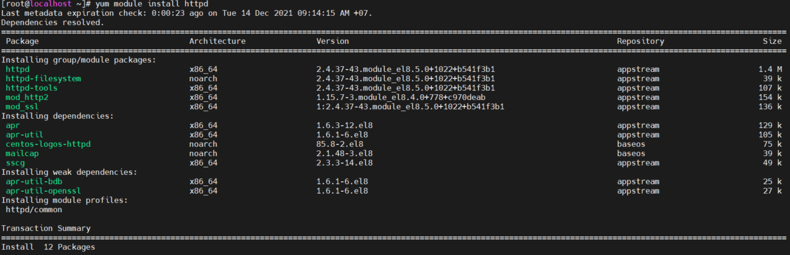
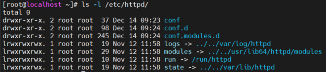
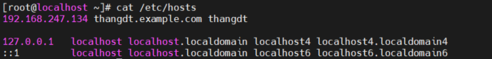
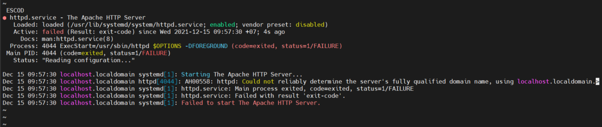

# Mục lục
- [1. Configuring a Basic Apache Server](#1)
- [2.  Apache Configuration Files](#2)
- [3. Creating Apache Virtual Hosts](#3)


---
<a name ='1'></a>
# 1. Configuring a Basic Apache Server
- Cấu hình cơ bản Apache server qua 3 bước
  - [1] Cài đặt phần mềm liên quan
    - `yum search http` tìm các package liên quan
    - `yum module install httpd` cài đặt package cơ sở và module bổ sung. 
    
  - [2] Xác đinh tệp cấu hình chính  
    - File cấu hình của Apache web server thông qua các file cấu hình khác nhau 
    - /etc/httpd/conf/httpd.conf – Tệp cấu hình chính của Apache
    - Tham số DocumentRoot là quan trọng nhất để hiểu thiết lập  web server cơ bản, nó chỉ định vị trí mặc định nơi Apache web server tìm kiếm nội dung của nó  
    - Tham số ServerRoot định nghĩa thư mục mặc định nơi Apache sẽ tìm kiếm các file cấu hình của nó
 Apache gặp phải
      ```
      [root@localhost ~]# grep -v '#' /etc/httpd/conf/httpd.conf

      ServerRoot "/etc/httpd"

      Listen 80

      Include conf.modules.d/*.conf

      User apache
      Group apache

      ServerAdmin root@localhost

      <Directory />
          AllowOverride none
          Require all denied
      </Directory>
   

      DocumentRoot "/var/www/html"
   
      <Directory "/var/www">
          AllowOverride None
          Require all granted
      </Directory>

      <Directory "/var/www/html">
          Options Indexes FollowSymLinks

          AllowOverride None

          Require all granted
      </Directory>

         <IfModule dir_module>
       DirectoryIndex index.html
      </IfModule>

      <Files ".ht*">
       Require all denied
      </Files>

      ErrorLog "logs/error_log"

      LogLevel warn

      <IfModule log_config_module>
          LogFormat "%h %l %u %t \"%r\" %>s %b \"%{Referer}i\" \"%{User-Agent}i\"" combined
          LogFormat "%h %l %u %t \"%r\" %>s %b" common

          <IfModule logio_module>
            LogFormat "%h %l %u %t \"%r\" %>s %b \"%{Referer}i\" \"%{User-Agent}i\" %I %O" combinedio
          </IfModule>
   

          CustomLog "logs/access_log" combined
      </IfModule>

      <IfModule alias_module>


          ScriptAlias /cgi-bin/ "/var/www/cgi-bin/"

      </IfModule>

        <Directory "/var/www/cgi-bin">
          AllowOverride None
          Options None
          Require all granted
      </Directory>

      <IfModule mime_module>
          TypesConfig /etc/mime.types

          AddType application/x-compress .Z
          AddType application/x-gzip .gz .tgz


          AddType text/html .shtml
          AddOutputFilter INCLUDES .shtml
      </IfModule>

      AddDefaultCharset UTF-8

      <IfModule mime_magic_module>
          MIMEMagicFile conf/magic
      </IfModule>


      EnableSendfile on

      IncludeOptional conf.d/*.conf
      ```    
  - [3] Tạo nội dung Web Server
    - Apache web server sẽ mác định chọn một file với tên index.html và sẽ trình bày nội dung nói tới client sử dụng một trình duyệt để truy cập vào web server
    - Tạo file /var/www/html/index.html. Apachi sẽ mặc định chọn file này để trình bày nội dung tới client khi sử dụng một trình duyệt để truy cập vào web server
    ```
    [root@localhost ~]# touch /var/www/html/index.html
    [root@localhost ~]# vi  /var/www/html/index.html
    [root@localhost ~]#  systemctl enable --now httpd
    Created symlink /etc/systemd/system/multi-user.target.wants/httpd.service → /usr/lib/systemd/system/httpd.service.
    [root@localhost ~]# systemctl status httpd
    ● httpd.service - The Apache HTTP Server
       Loaded: loaded (/usr/lib/systemd/system/httpd.service; enabled; vendor preset: disabled)
       Active: active (running) since Tue 2021-12-14 09:40:28 +07; 16s ago
         Docs: man:httpd.service(8)
      Main PID: 3667 (httpd)
      Status: "Running, listening on: port 443, port 80"
      Tasks: 213 (limit: 10423)
      Memory: 35.1M
      CGroup: /system.slice/httpd.service
               ├─3667 /usr/sbin/httpd -DFOREGROUND
               ├─3670 /usr/sbin/httpd -DFOREGROUND
               ├─3671 /usr/sbin/httpd -DFOREGROUND
               ├─3672 /usr/sbin/httpd -DFOREGROUND
               └─3673 /usr/sbin/httpd -DFOREGROUND

    Dec 14 09:40:28 localhost.localdomain systemd[1]: Starting The Apache HTTP Server...
    Dec 14 09:40:28 localhost.localdomain httpd[3667]: AH00558: httpd: Could not reliably determine the server's fully qualified domain name, using localhost.localdomain.>
    Dec 14 09:40:28 localhost.localdomain systemd[1]: Started The Apache HTTP Server.
    Dec 14 09:40:28 localhost.localdomain httpd[3667]: Server configured, listening on: port 443, port 80

    [root@localhost ~]# curl 192.168.247.134
    Welcome to my web server
    ```
- Nếu sử dụng Firewalld cần phải cho phép lưu lượng HTTP và HTTPS  có quyền truy cập vào port 80 và 443 
  ```
  firewall-cmd --permanent --zone=public --add-service=http
  firewall-cmd --permanent --zone=public --add-service=https
  firewall-cmd --reload
  ```

<a name ='2'></a>
# 2. Apache Configuration Files
- /etc/httpd/conf/httpd.conf - Tệp cấu hình chính của Apache
- /etc/httpd/ - Thư mục chứa tất cả các tệp cấu hình
- /etc/httpd/conf.d/ 
  - Tất cả các tệp cấu hình trong thư mục này sẽ được bao gồm trong tệp cấu hình chính
  - Thêm file được thực hiện bởi dòng Include conf.d/*.conf
  trong thư mục này. 
- /etc/httpd/conf.modules.d/ – Vị trí cho các tệp cấu hình modules của Apache.
  - Các chức năng mở rộng của Apacha web server có thể dễ dàng mở rộng bằng cách thêm các module bổ sung. 

    
  - Các symbolic link đến log, module và run được tạo để cho phép Apache để được bắt đầu trong môi trường chroot (fake root directory)


- Ngoài ra các file log của apache để theo dõi web server
    - /var/log/httpd/ – Vị trí lưu trữ các tệp nhật ký của Apache
    - /var/log/httpd/access_log – Hiển thị nhật ký của các truy cập tới máy chủ
    - /var/log/httpd/error_log – Hiển thị danh sách các lỗi mà

<a name ='3'></a>
# 3. Creating Apache Virtual Hosts
- Một Apache web server  có thể lưu trữ nhiều website cần chạy thông qua virtual host. 
- Virtual host là một file cấu hình hoặc một phần cấu hình apache riêng biệt được tạo trên máy chủ duy nhất
- Thủ tục truy cập host
  - [1] Client bắt đầu một phiên tới một virtual host chỉ định. Sử dụng trình duyệt và nhập URL
  - [2] DNS giúp phân giải địa chỉ của virtual host, đây là địa chỉ ip của Apache server có thể chứa các virtual host khác nhau 
  - [3] Quá trình Apache nhận yêu cầu cho tất cả các máy chủ ảo mà nó đang lưu trữ. 
  - [4] Quá trình Apache đọc HTTP header của yêu cầu để phân tích virtual host nào đang yêu cầu để chuyển tiếp đến
  - [5] Apache đọc file cấu hình virtual host chỉ định để tìm tài liệu root được sử dung bởi virtual host chỉ định  
  - [6] Yêu cầu được chuyển tiếp đến nội dung file trong tại liệu root cụ thể 

- Tạo một virtual host
  - Đặt tên miền 
    

  - Vhost được đặt tại /var/www/html, tạo một thư mục tại /var/www để chứa vhost riêng `mkdir -p /var/www/thangdt.example.com/html`
  - Tạo file index.html chứa nội dung web server 
  - Tạo file cấu hình cho web server tại /etc/httpd/conf.d/ 
  ```
  [root@localhost ~]# touch /etc/httpd/conf.d/thangdt.example.com.conf
   [root@localhost ~]# vi /etc/httpd/conf.d/thangdt.example.com.conf
  [root@localhost ~]# cat /etc/httpd/conf.d/thangdt.example.com.conf
   <VirtualHost *:80>
     ServerAdmin root@thangdt.example.com
     DocumentRoot /var/www/example.com/public_html
     ServerName www.thangdt.example.com
     ServerAlias thangdt.example.com
     ErrorLog /var/www/thangdt.example.com/log/error.log
     CustomLog /var/www/thangdt.example.com/log/requests.log common
   </VirtualHost>
   ```
  - Tạo file chứa log 
  ```
  [root@localhost ~]# mkdir /var/www/thangdt.example.com/log/
  [root@localhost ~]# touch /var/www/thangdt.example.com/log/error.log
  [root@localhost ~]# touch /var/www/thangdt.example.com/log/requests.log
  ```
    


<a name ='tm'></a>
# Tham khảo 

https://blog.hostvn.net/chia-se/huong-dan-cai-dat-apache-tren-centos-8.html


