# Mục lục  
- [1. SELinux Working and Modes](#1)
- [2. Context Settings and the Policy](#2)
  - [2.1 Monitoring Current Context Labels](#21)
  - [2.2 Setting Context Types](#22)
- [3. Restoring Default File Contexts](#3)
- [4. Boolean Settings to Modify SELinux Settings](#4)
- [5. Diagnosing and Addressing SELinux Policy Violations](#5)


---
<a name ='1'></a>
# 1. Understanding SELinux Working and Modes
- SELinux (Security-Enhanced Linux) là một mô đun bảo mật ở nhân của Linux, cung cấp cơ chế hỗ trợ các chính sách bảo mật kiểm soát truy cập (access control)

- SELinux core elements

Element | Use 
--- | --- 
Policy| Một tập hợp các quy tắc xác định nguồn nào có quyền truy cập vào mục tiêu 
Source domain| Đối tượng cố gắng truy cập vào mục tiêu. Thường là user hoặc process 
Target domain| Thứ mà source domain cố gắng để truy cập. Thường là file hoặc port
Context| Một nhãn bảo mật được sử dụng để phân loại các đối tượng trong SELinux
Rule| Một phần của chính sách xác định source domain được cho phép quyền để target domain
Labels| định nghĩa để xác định  source domain cho phép đến truy cập đến target domain nào 

- Trong linux system có thể chọn enable hoặc disable cho SELinux
  - Disabled: SELinux bị vô hiệu hóa. Không có hoạt động nào của SELinux xảy ra 
  - Enable: kernel support cho SELinux được load, một vài ứng dụng SELinux nhận thức được thay đổi của nó, vì thư viện chị định được sử dụng trên hệ thống được kích hoạt SELinux.
  - 2 chế độ được sử dụng khi SELinux khích hoạt là enforcing và permissive
    - Enforcing: Chế độ mặc định sẽ cho phép và thực thi chính sách bảo mật SELinux trên hệ thống, từ chối các hành động truy cập và ghi nhật ký
    - Permissive: Trong chế độ Permissive, SELinux được kích hoạt nhưng sẽ không thực thi chính sách bảo mật, chỉ cảnh báo và ghi lại các hành động. Chế độ Permissive hữu ích cho việc khắc phục sự cố
- Thiết lập chế độ mặc định khi khởi động sử dụng file /etc/sysconfig/selinux
    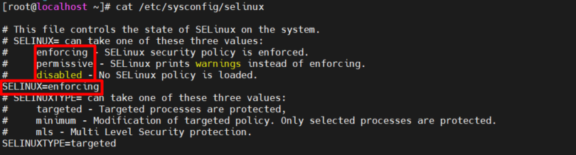

- Các lệnh thường dùng 
  - `getenforce` xem chế độ hiện tại 
  - `setenforce 0` SELinux tạm thời ở chế độ permissive
  - `setenforce 1` SELinux tạm thời ở chế độ enforcing 
  - `sestatus` xem trạng thái hiện tại của SELinux trên máy chủ, tùy chọn `-v` để hiển thị chi tiết thông tin
    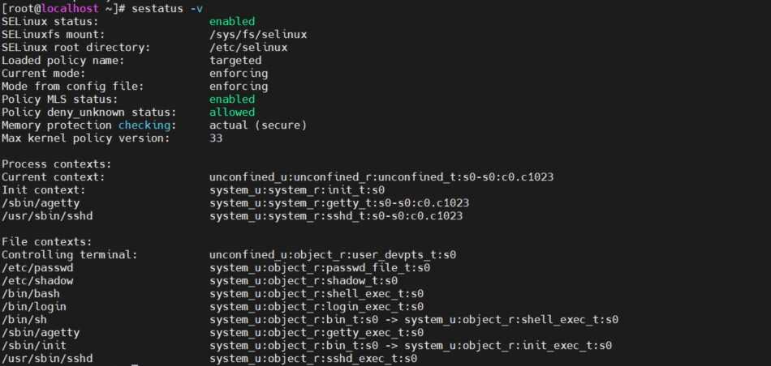


<a name ='2'></a>
# 2. Context Settings and the Policy
- Context là nhãn dán được áp dụng cho các đối tượng 
  - File và thư mục  
  - Ports
  - Processes
  - Users


<a name ='21'></a>
## 2.1 Monitoring Current Context Labels
- Sử dụng option -Z
  - `ls -Z` hiển thị cài đặt context cho mồi vài thư mục trong thư mục /
    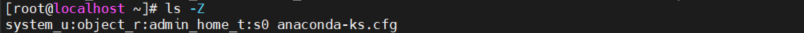

  - `ps Zaux` hiển thị danh dánh của tất cả process bao gồm context label
    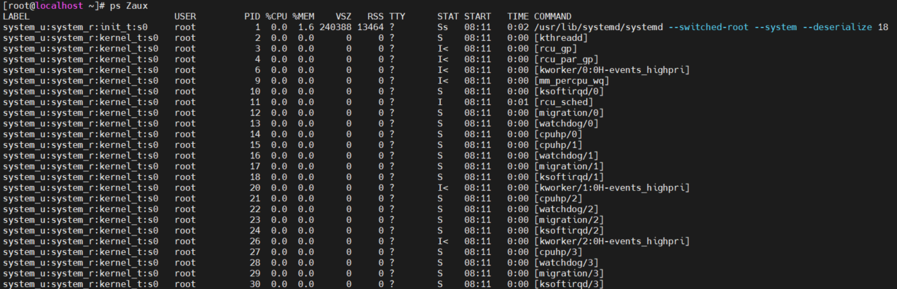

  - `ss -Ztul` hiển thị tất cả port network và context label hiện tại liên kết với port nào  
    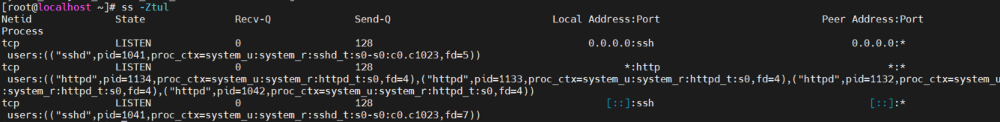

- Context label luôn có 3 nội dung
  - **User** User được nhận biết qua _u trong context label
  - **Role** Role được nhận biết qua _r trong context label. Trong quản lý SELinux nâng cao , người dùng SELinux cụ thể có thể được gán quyền cho các selinux role cụ thể
  - **Type** Type được nhận biết qua _t trong context label 


<a name ='22'></a>
## 2.2 Setting Context Types

- Lệnh `semanage` và `chcon` được sử dụng để thiếp lâọ context type
  - `semanage` viết context mới cho SELinux policy, từ đó áp dụng cho file hệ thống 
  - `chcon` viết context mới đến SELinux mà không đến policy. Mọi thứ được áp dụng với chcon được ghi đèn khi file system dược dán nhãn hoặc context gốc được khôi phục từ police đến file system  


- Lệnh `semanage fcontext -a -t httpd_sys_content_t "/myd(/.*)?"` để gán context file 
- Lệnh `restorecon -R -v /myd` để áp dụng context file 
    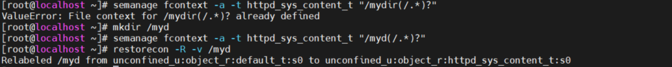
   - Option -a để thêm một context file 
   - Option -t thay đổi context type

- Lệnh chcon `chcon -t context_type dir`
    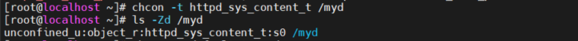

<a name ='23'></a>
## 2.3 Finding the Context Type 

- 3 cách để tìm thông tin context 
  - Xem ở môi trường mặc định 
  - Đọc file cấu hình
  - Dùng man -k _selinux.  Đây là phương pháp mạnh mẽ nhất 
- Cài đặt  SELinux-Specific Man Pages
  - `man -k _selinux` chỉ nhìn thấy 1-2 man page  
    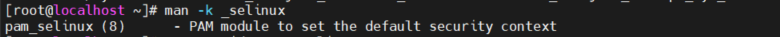
  - `yum provides */sepolicy` xem tên của RPM package 
  - `yum -y install policycoreutils-devel` để cài đặt package
  - `sepolicy manpage -a -p /usr/share/man/man8` để cài đặt man page 
    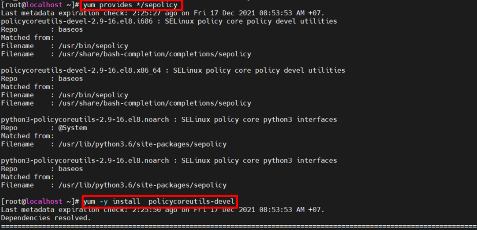
  - NHập `mandb` để update database chứa tên và mô tả của tất cả man page được cài đặt 
  - Nhập `man -k _selinux` để xen danh sách man page 
    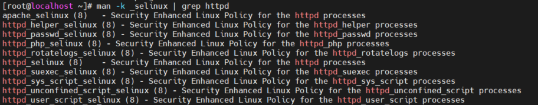


<a name ='3'></a>
# 3. Restoring Default File Contexts

- Lệnh `restorecon` sử dụng để áp dụng thiết lập context từ policy đến file system 
- Cấu trúc 
  - restorecon [-o outfilename ] [-R] [-n] [-v] [-e directory ] pathname
  - restorecon -f infilename [-o outfilename ] [-e directory ] [-R] [-n] [-v] [-F]

option | Desription
---|---
 -i | file ignore không tồn tại 
 -f infilename | infilename chứa một danh sách các tệp cần xử lý bởi ứng dụng
-e directory| thư mục để thực thi
-R -r | thay đổi label của file và directory
-n| không thay đổi file labels
-o outfilename | lưu danh sách file với incorrect context trong outfilename
-v| hiển thị thay đổi trong file label
-vv| hiển thị thay đổi trong file label, nếu type, role hoặc user đang thay đổi 
-F | Buộc lại context để khớp file context cho các file có thể tùy chỉnh  hoặc phần usêr nếu nó đã thay đổi 

<a name ='4'></a>
# 4. Boolean Settings to Modify SELinux Settings
-  SELinux Booleans được cung cấp để thay đổi hành vi của rule
- Lệnh  `getsebool -a` hiển thị danh sách booleans  trên hệ thống 
```
[root@localhost ~]#  getsebool -a
abrt_anon_write --> off
abrt_handle_event --> off
abrt_upload_watch_anon_write --> on
antivirus_can_scan_system --> off
antivirus_use_jit --> off
auditadm_exec_content --> on
authlogin_nsswitch_use_ldap --> off

...
...
zabbix_can_network --> off
zabbix_run_sudo --> off
zarafa_setrlimit --> off
zebra_write_config --> off
zoneminder_anon_write --> off
zoneminder_run_sudo --> off
```
- Lệnh `setsebool` thay đổi boolean trong thời gian chạy 

    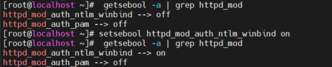

- Option -P để thay đổi boolean trong thời gian chạy và đặt mặc định cho boolean 
- Option -N policy trên disk sẽ không được tải vào kernel
- Option -V verbose error messages sẽ được in từ semanage libraries.


<a name ='5'></a>
# 5. Diagnosing and Addressing SELinux Policy Violations
- SELinux logs được ghi tại /var/log/audit/audit.log.
- Lệnh `grep AVC  /var/log/audit/audit.log` để xem log
    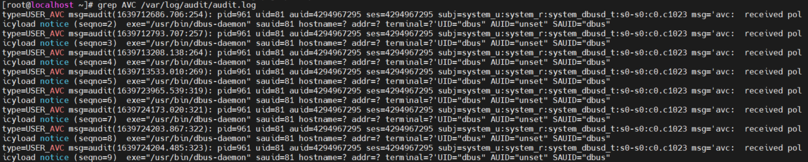

- sealert 
  - sealert là thành phần giao diện người dùng (GUI hoặc dòng lệnh) đối với hệ thống khắc phục sự cố.
  - sealert chạy như một quy trình của người dùng với các đặc quyền được liên kết với người dùng.
  - Lệnh `sealert`  

  Option | Use
  ---|---
  -b --browser | Khởi chạy trình duyệt
  -f --fix | Thực thi lệnh sửa lỗi cho avc với uuid và plugin đã cho, yêu cầu tùy chọn --plugin.
  -h -- help | Hiển thị message 
  -s -- service  | Bắt đầu dịch vụ serlert, thường được sử dụng bởi dbus.
  -S --noservice | Bắt đầu sealert mà không cần dịch vụ dbus như một ứng dụng độc lập
  -l -- lookupid id | Tra cứu cảnh báo theo id, nếu id là ký tự đại diện * thì trả về tất cả cảnh báo
  -a -- analyze file | Quét log file, phân tích file AVC
  -u -- user | đăng nhập với tư cách người dùng
  -p -- password | thiết lập mật khẩu người dùng 
  -P --plugin |Đặt tên plugin được liên kết với tùy chọn --fix

    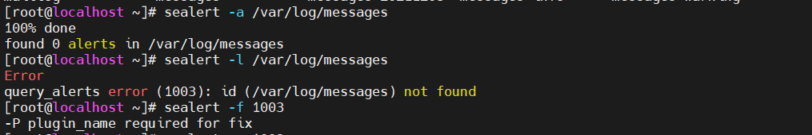

# Tham khảo


https://www.tutorialspoint.com/unix_commands/restorecon.htm

https://linux.die.net/man/8/sealert
