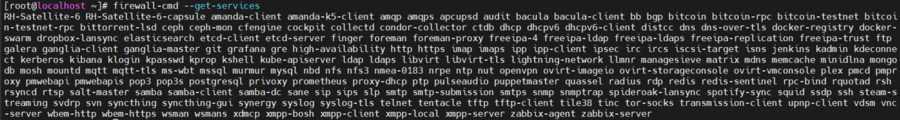
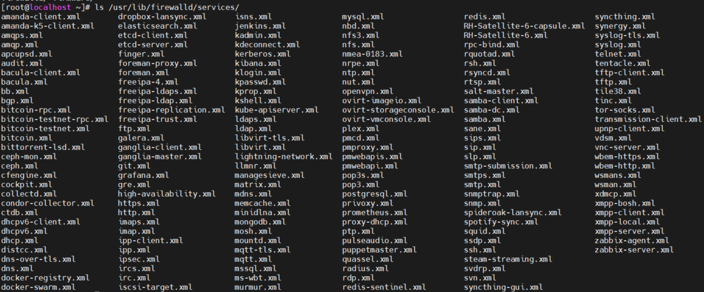
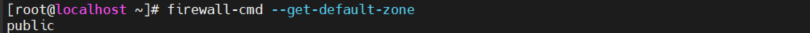
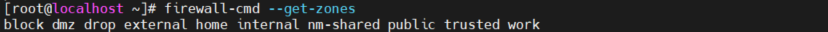
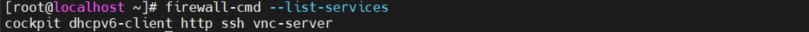
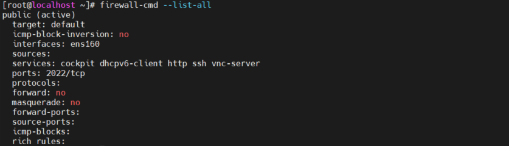
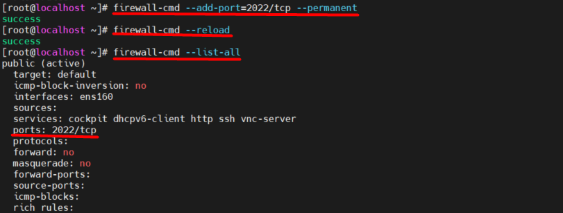
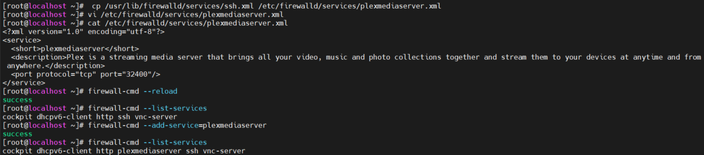

# Mục lục  
- [1. Linux Firewal](#1)
  - [1.1 Firewal Zones](#11)
  - [1.2 Firewalld services](#12)
- [2. Working with Firewalld](#2)
- [3. Creating a new FirewallD Service](#3)
- [Tham khảo](#tm)


---
<a name ='1'></a>
# 1. Linux Firewal
- Sử dụng firewall để giiới hạn lưu lượng  truy cập đến máy chủ hoặc đi ra khỏi máy chủ .
- Fire được triển khai trong linux kernel thông qua netfilter subsystem.
- Netfilter cho phép kernel module kiểm tra mọi thứ đầu vào đầu ra  hoặc chuyển tiếp packet và hoạt động trên một gói  
- Trước kia tiện ích `iptables` được sử dụng, hiện tại không còn cung cấp trên RHEL 8
- `nftables` là giải pháp thay thế `iptables` cung cấp giao diện nâng cao để viết rule trực tiếp đến  nftables
- Firewalld là dịch vụ hệ thống có thể cấu hình rule firewall 
- Sử dụng firewalld service để quản lý cấu hình netfilter firewall

<a name = '11'></a>
## 1.1 Firewalld Zones
- Firewalld quản lý firewall thông qua zone.
- Zone là một tập hợp các quy tác được áp dụng cho các gói đầu vào  khớp với một địa chỉ nguồn cụ thể hoặc giao điện mạng cụ thể 
- Theo mặc định firewalld áp dụng cho các gói đầu vào , không áp dụng cho các gói đầu ra  


Zone Name | Default Setting
---|---
block | Kết nối mạng đến sẽ bị từ chối với một tin nhắn "icmp-host-prohibited". Chỉ có kết nối mạng được khởi tạo trên hệ thống mới được cho phép 
dmz | Được sử dụng cho các máy tính nằm trong DMZ. Chỉ chọn đến các kết nối được chấp nhận, giới hạn truy  cập đến mạng nội bộ được cho phép 
drop | Bất kỳ gói đến nào cũng bị bỏ và không có phản hồi.
external| Đước sử dụng trên mạng bên ngoài với NAT được kích hoạt sử dụng trên router. Chỉ chọn các kết nối đến được chấp nhận
home | Được sử dụng trong mạng home. Hầu hết máy tính trên cùng mạng được tin cậy, chỉ chọn các kết nối đến được chấp nhận  
internal | Được sử dụng trong mạng nội bộ. Hầu hết các máy tính trên cùng mạng được tin cậy, chi chộn các kết nối đến được cho phép  
public | Được sử dụng trong khu vực công cộng. Các máy tính khác nhau trong cùng một mạng không được tin cậy và giới hạn các kết nối được cho phép 
trusted | Tất cả các kết nối được cho phép
work | Được sử dụng trong khu vực làm việc. Hầu hết các máy tính trên cùng mạng được tin cậy và chr chọn các kết nối đến được cho phép


<a name = '12'></a>
## 1.2 Firewalld services

- Firewall service chỉ định chính xác cái gì nên chấp nhận như lưu lượng đến và lưu lượng đi trong firewall.
- Firewall service bao gồm các port được mở cũng như hỗ trợ các kernel module 
- Trong firewalld một số dịch vụ mặc định được xác định, cho phép quản trị viên cho phép hoăc từ chối truy cập vào các cộng cụ thể trên máy chủ 

- Lệnh `firewall-cmd --get-services` để nhận danh sách tất cả dịch vụ có sẵn trên máy tính  
    

- Sau mỗi service là file cấu hình XML, nó được đặt tại /usr/lib/firewalld/service. Các file XML tùy chỉnh có thể thêm vào /etc/firewalld/services/ và tự động được chọn sau khi restart firewalld service 
    


<a name ='2'></a>
# 2. Working with Firewalld

-  Lệnh `firewall-cmd` được sử để quản lý firewall

firewall-cmd Options | Explanation
---|---
--get-zones | Danh sách zone có sẵn 
--get-default-zone| Hiển thị zone hiện tại được đặt mặc định 
--set-default-zone=<ZONE> |Thay đổi default zone
--get-services |Hiển thị tất cả service có sẵn
--list-services | Danh sách service hiện tại được sử dụng  
--add-service=<service-name> [--zone=<ZONE>] | Thêm service vào zone default hiện tại hoặc zone chỉ định  
--remove-service=<service-name> | Gỡ service  từ cấu hình 
--list-all [--zone=<ZONE>] |   Danh sách tất cả cấu hình trong một zone
--add-port=<port/protocol> [--zone=<ZONE>] |Thêm port và protocol  
--remove-port=<port/protocol> [--zone=<ZONE>] | Gỡ port từ cầu hình 
--add-interface=<INTERFACE> [--zone=<ZONE>] | Thêm interface đến zone default hoặc chỉ định 
--remove-interface=<INTERFACE> [--zone=<ZONE>] | Gỡ interface từ zone chỉ định 
--add-source=<ipaddress/netmask> [--zone=<ZONE>] | Thêm địa chỉ IP cụ thể 
--remove-source=<ipaddress/netmask> [--zone=<ZONE>] | Removes an IP address from the configuration
--permanent | Ghi cấu hình đến disk và không  runtime
--reload|  Reloads cấu hình trên disk 


- `firewall-cmd --get-default-zone` hiện thị zone mặc định hiện tại
    

- `firewall-cmd --get-zones` xem các zone khả dụng 
    

-  `firewall-cmd --get-services` hiển thị service có sẵn trên server. 
    

- `firewall-cmd --get-<item>` hiểu thị thông tin về service chỉ định  


- `firewall-cmd --list-services` xem địch vụ có sẵn trên zone hiện tại. 
    

- `firewall-cmd --list-all` hiển thị tổng quan đầy đủ về cấu hình firewall hiện tại của server
    

- `firewall-cmd --add-service=<item>` để thêm service  vào cấu hình của firewall trong thời gian chạy. Service sẽ không còn trong file cấu hình của firewalld khi firewalld khởi động lại 
- Thêm service vĩnh viễn vào file cấu hình  
  - `firewall-cmd --add-service vnc-server --permanent` 
  - `firewall-cmd --reload`  

- Thêm port vào cấu hình firewall
  - `firewall-cmd --add-port=2022/tcp --permanent`
  - `firewall-cmd --reload`  
    

<a name ='3'></a>  
# 3. Creating a new FirewallD Service

- Các service mặc định được lưu tại /usr/lib/firewalld/service. Copy một file XML vào /etc/firewwalld/service/ và chỉnh sửa để có một cấu hình mới 
```
[root@localhost ~]#  cp /usr/lib/firewalld/services/ssh.xml /etc/firewalld/services/plexmediaserver.xml
[root@localhost ~]# vi /etc/firewalld/services/plexmediaserver.xml
[root@localhost ~]# cat /etc/firewalld/services/plexmediaserver.xml
   <?xml version="1.0" encoding="utf-8"?>
   <service>
     <short>plexmediaserver</short>
     <description>Plex is a streaming media server that brings all your video, music and photo collections together and stream them to your devices at anytime and from anywhere.</description>
     <port protocol="tcp" port="32400"/>
    </service>
[root@localhost ~]# firewall-cmd --reload
success
[root@localhost ~]# firewall-cmd --list-services
cockpit dhcpv6-client http ssh vnc-server
[root@localhost ~]# firewall-cmd --add-service=plexmediaserver
success
[root@localhost ~]# firewall-cmd --list-services
cockpit dhcpv6-client http plexmediaserver ssh vnc-server
```



<a name ='tm'></a>  
# Tham khảo

https://linuxize.com/post/how-to-configure-and-manage-firewall-on-centos-8/


