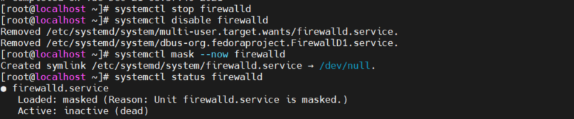
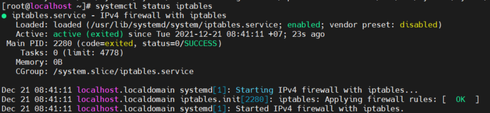
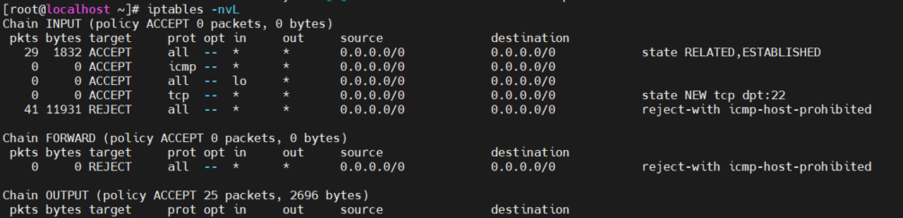
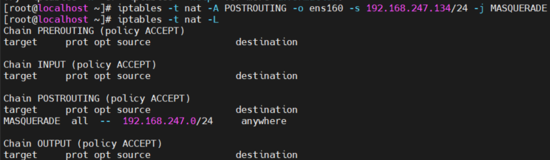

# Mục lục  
- [1. Giới thiệu về iptables](#1)


<a name ='1'></a>  
# 1. Giới thiệu về iptables

- Iptables là một hệ thống tường lửa (Firewall) tiêu chuẩn được cấu hình, tích hợp mặc định trong hầu hết các bản phân phối của hệ điều hành Linux (CentOS, Ubuntu…). 
- Iptables hoạt động dựa trên việc phân loại và thực thi các package ra/vào theo các quy tắc được thiết lập từ trước.
- `iptables` bao gồm 2 phần là `netfilter` nằm bên trong nhân Linux và `iptables` nằm ở vùng ngoài nhân. `iptables` chịu trách nhiệm giao tiếp với người dùng và sau đó đẩy rules của người dùng vào cho `netfilter` xử lý. `netfilter` thực hiện công việc lọc các gói tin ở mức IP. `netfilter` làm việc trực tiếp ở trong nhân của Linux nhanh và không làm giảm tốc độ của hệ thống.
- `iptables` cung cấp các tính năng sau:

    - Có khả năng phân tích gói tin hiệu quả.
    - Filtering gói tin dựa vào MAC và một số cờ hiệu (flags) trong TCP Header.
    - Cung cấp kỹ thuật NAT, chi tiết cho các tùy chọn để ghi nhận sự kiện hệ thống.
    - Có khả năng ngăn chặn một số cơ chế tấn công theo kiểu DoS.
    - Xây dựng một hệ thống tường lửa (firewall).
    - Cung cấp, xây dựng và quản lý các rule để xử lý các gói tin.


<a name ='2'></a>  
# 2. Các khái niệm 
## **chain**
- `chain` là một quy tắc xử lý các gói tin bao gồm nhiều rules có liên quan tới nhau.
- Mỗi `table` sẽ được tạo với một hoặc nhiều `chain`. `chain` cho phép lọc gói tin tại các điểm khác nhau. `iptable` có thể được thiết lập đối với các loại `chain` như sau:

  - chain `PREROUTING`: Các rule thuộc `chain` này sẽ được áp dụng ngay sau khi gói tin vừa đi vào đến dải mạng (Network Interface). `chain` này chỉ có thể có ở table NAT, RAW và MANGLE.

  - chain `INPUT`: Các rule thuộc `chain` này sẽ áp dụng cho các gói tin ngay trước khi gói tin đi vào hệ thống. `chain` này có trong table MANGLE và FILTER.

  - chain `OUTPUT`: Các rule thuộc `chain` này áp dụng ngay cho các gói tin đi ra từ hệ thống. `chain` có trong table MANGLE, RAW và FILTER.

  - chain `FORWARD`: Các rule thuộc `chain` này áp dụng các gói tin được chuyển tiếp qua hệ thống. `chain` có trong table MANGLE.

  - chain `POSTROUTING`: Các rule thuộc `chain` này áp dụng cho các gói tin tới dải mạng (Network Interface). `chain` này có trong table MANGLE và NAT.

## **rule** 
- rule là là một luật, hành động cụ thể xử lý gói tin ứng với mỗi trường hợp, tiêu chí mà ta đề ra.
## **filtering**
- Là quá trình chặn bắt gói tin theo một số tiêu chí mà ta đề ra.
- Giả sử: Khi một gói tin đi đến sẽ chứa các giá trị về địa chỉ IP nguồn (source address), địa chỉ IP đích (destination address) và các port tương ứng (port nguồn và port đích). Khi ta thực hiện filtering gói tin theo tiêu chí địa chỉ IP nguồn. Thì các gói tin có địa chỉ IP nguồn khớp với địa chỉ IP mà ta đề ra sẽ được giữ lại để chờ xử lý.
## **target** 
- Mỗi một chain là một danh sách các luật có thể được thiết lập cho các gói tin. Mỗi một luật sẽ cần phải khai báo những gì cần phải làm với gói tin được gọi là target
  - ACCEPT: chấp nhận gói tin, cho phép gói tin đi qua hay đi vào hệ thống.

  - DROP: loại bỏ gói tin, không phản hồi lại gói tin giống như việc gói tin đó được gửi đến một hệ thống không tồn tại.

  - RETURN: Dừng thực thi xử áp dụng rules tiếp theo trong chain hiện tại đối với gói tin. Việc kiểm soát sẽ được trả về đối với chain đang gọi.

  - REJECT: Thực hiện loại bỏ gói tin và gửi lại gói tin phản hồi thông báo lỗi. Ví dụ: 1 bản tin “connection reset” đối với gói TCP hoặc bản tin “destination host unreachable” đối với gói UDP và ICMP.

  - LOG: Chấp nhận gói tin và có ghi lại log.
## **NAT**
- NAT trong netfilter là việc thực hiện thay đổi địa chỉ đích và port theo một cách mong muốn.
## **mangle**
- Là quá trình bóc tách gói tin và chịu trách nhiệm thay đổi bits của QoS (Quality of Services) trong IP Header bởi vì mangle làm việc với các gói tin IP.

<a name ='3'></a>  
# 3. Table trong iptable


## **NAT Table**
- Cho phép route các gói tin đến các host khác nhau trong mạng bằng cách thay đổi IP nguồn và IP đích của gói tin. Table này quy định và cho phép các kết nối có thể truy cập tới các dịch vụ không được truy cập trực tiếp. Bao gồm 3 thành phần
  - PREROUTING chain – Thay đổi gói tin trước khi định tuyến, điều này có nghĩa là việc dịch gói tin sẽ xảy ra ngay lập tức sau khi gói tin đến hệ thống. Điều này thực hiện thay đổi địa chỉ IP đích thành một địa chỉ nào đó sao cho phù hợp với việc định tuyến trên máy chủ cục bộ - DNAT.

  - POSTROUTING chain – Thay đổi gói tin sau khi định tuyến, điều này có nghĩa là dịch gói tin khi gói tin ra khỏi hệ thống. Điều này thực hiện thay đổi địa chỉ IP nguồn của gói tin thành một địa chỉ nào đó phù hợp với việc định tuyến trên máy chủ đích - SNAT.

  - OUTPUT chain – thực hiện NAT cho các gói tin được thực hiện cục bộ trên firewall.
## **FILTER Table**
- Đây là table được sử dụng mặc định bởi iptables khi bạn tạo các chain mà không khai báo cho chain` đó thuộc vào table nào. Table hoạt động với việc quy định việc quyết định có cho phép gói tin được chuyển đến địa chỉ đích hay không. Bao gồm 3 thành phần:

  - INPUT chain: Các gói tin đến firewall. Áp dụng đối với các gói tin đến máy chủ cục bộ.

  - OUTPUT chain: Các gói tin đi ra khỏi firewall. Áp dụng với các gói tin được tạo ra cục bộ và đi ra khỏi máy chủ.

  - FORWARD chain: Áp dụng đối với các gói tin được định tuyến đi qua máy chủ.
## **MANGLE Table**
- Table này liên quan đến việc sửa header của gói tin, ví dụ chỉnh sửa giá trị các trường TTL, MTU, Type of Service.

- Bao gồm các thành phần sau:

  - PREROUTING chain

  - OUTPUT chain

  - FORWARD chain

  - INPUT chain

  - POSTROUTING chain
## **RAW Table**
- Bảng này được sử dụng chủ yếu dành cho việc cấu hình sử dụng chain có sẵn. Bao gồm:

  - PREROUTING chain

  - OUTPUT chain

## **Security Table**
- Đây là bảng được sử dụng cho Mandatory Access Control (MAC) - kiểm soát truy cập bắt buộc đối với các rule về network.

- MAC được triển khai bởi Linux Security Modules được biết đến như là SELinux. Gói tin được chuyển đến table này sau khi đi qua FILTER table và cho phép một vài Discretionary Access Control (DAC) - kiểm soát truy cập tùy ý trong FILTER table gây ảnh hưởng trước các MAC rule. Table này cung cấp các chain có sẵn là:

  - INPUT chain.

  - OUTPUT chain.

  - FORWARD chain.


<a name ='4'></a>  
# 4. Cài đặt và khởi động iptable
- Để sử dụng iptable, cần tắt firewalld-service 
 ```
systemctl stop firewalld
systemctl disable firewalld
systemctl mask --now firewalld
```


- Cài đặt iptables và khởi động dịch vụ  
```
yum install iptables-services -y
systemctl start iptables
systemctl enable iptables

```
- Kiểm tra trạng thái  iptables 
```
systemctl status iptables
```


- Các tham số lệnh iptables
 
 Tùy chọn đầy đủ |	Tùy chọn viết tắt|	Giá trị theo sau tùy chọn	| Ý nghĩa sử dụng tùy chọn
 ---|---|---|---
--append|	-A|	chain_name rule_spec|	Thêm một hoặc nhiều rules tới chain đã khai báo có tên là chain_name
--check|	-C|	chain_name rule_spec|	Kiểm tra xem rule_spec đã khai báo có tồn tại trong chain chain_name hay không
--delete	|-D	|chain_name rule_spec hoặc chain_name rulenum|	Xóa một hoặc nhiều rules từ chain chain_name
--insert|	-I	|chain_name [rulenum] rule_spec	|Thêm một hoặc nhiều rule vào trong chain chain_name. Mặc định rule sẽ được thêm vào vị trí đầu của chain hoặc khi rulenum có giá trị là 1.
--replace	|-R	|chain_name rulenum rule_spec	|Thay thế một rule trong chain chain_name. Nếu source hoặc destination của rule có chứa nhiều địa chỉ thì sẽ xảy ra lỗi. rulenum được bắt đầu từ giá trị 1.
--list|	-L|	[chain_name]	|Liệt kê tất cả các rule có trong chain chain_name. Nếu chain_name không được khai báo, câu lệnh sẽ liệt kê ra rule của tất cả các chain trong table. Mặc định, câu lệnh sẽ chỉ liệt kê rule có trong table `filter`. Muốn xem các rule có trong table khác, ta cần phải kết hợp với tham số `--table`
--list-rule	|-S	|[chain_name]|	In ra tất cả các rule có trong chain chain_name. Nếu không khai báochain_name, câu lệnh sẽ in ra tất cả các rule. Mục đích của câu lệnh là in ra rule_spec. Kết quả câu lệnh trả về tương tự như `iptables-save`
--flush	|-F	|[chain_name]	|Xóa tất cả các rule có trong chain_name hoặc xóa tất cả trong các chain_name
--zero	|-Z|	[chain_name] [rulenum]|	Đặt lại giá trị bộ đếm byte của packet trong tất cả các chains hoặc chỉ các rule có trong chain_name.
--new-chain	|-N	|chain_name	|Tạo mới một chain có tên là chain_name nếu nó chưa tồn tại
--delete-chain	|-X	|[chain_name]|	Xóa tất cả các tùy chọn trong chain_name được khai báo.
--policy|	-P	|chain_name target|	Thiết lập một chính sách cho chain có tên là chain_name ứng với target khai báo trong câu lệnh. Chỉ các chain_name không phải do người dùng tạo ra mới có thể nhận được target.
--rename-chain	|-E	|old_chain new_chain|	Đặt lại tên của chain người dùng tạo ra. Trong đó old_chain là tên hiện tại của chain, old_chain là tên mới của chain sẽ được đặt.


Tham số đầy đủ	|Tham số viết tắt|	Giá trị theo sau tham số|	Ý nghĩa sử dụng tham số
---|---|---|---
[!] --procol|	[!] -p|	protocol_name	|Khai báo protocol của packet mà rule sẽ kiểm tra
[!] --source, [!] --src	|[!] -s	| address[/mask][,...]| 	Khai báo địa chỉ IP nguồn của packet. address có thể là một địa chỉ IP, một hostname, một địa chỉ mạng hay một dải địa chỉ IP
[!] -destination, [!] --dst	|[!] -d	|address[/mask][,...]	|Khai báo địa chỉ IP đích của packet. address có thể là một địa chỉ IP, một hostname, một địa chỉ mạng hay một dải địa chỉ IP
--jump |	-j|	target	| Khai báo target của rule sẽ được tạo ra, những gì cần phải làm nếu packet khớp với rule. Có thể được kết hợp để sử dụng với tham số -g hay --goto
--goto	|-g	|chain | Khi sử dụng khai báo này, việc xử lý của rule sẽ được xử lý tại chain gọi tới.
[!] --in-interface |	[!] -i|	name|	Khai báo tên của interface nơi mà gói tin được nhận (chỉ có trong INPUT, FORWARD, PREROUTING chain). Tên của interface có thể khai báo theo dạng name[+]. Nghĩa là nếu có dấu + thì bất cứ interface nào bắt đầu với name sẽ khớp với rule. Nếu không có dấu + thì chỉ có tên interface giống y hệt mới khớp với rule. Ví dụ name+ sẽ khớp với nameinterface, namea, nameb.
[!] --out-interface	| [!] -o	|name	|Khai báo tên của interface nơi mà gói tin đi ra khỏi hệ thống (chỉ có trong OUTPUT, FORWARD, POSTROUTING chain). Tên của interface có thể khai báo theo dạng name[+]. Nghĩa là nếu có dấu + thì bất cứ interface nào bắt đầu với name sẽ khớp với rule. Nếu không có dấu + thì chỉ có tên interface giống y hệt mới khớp với rule. Ví dụ name+ sẽ khớp với nameinterface, namea, nameb.
[!] --fragment|	[!] -f	||	Rule sẽ chỉ nhắm đến các gói tin bị phân mảnh. Các gói tin mà không có đích đến hay nguồn đi.
--set-counters	|-c	|packets bytes	| Cho phép ta khởi tạo các bộ đếm gói tin và byte của một rule


Tùy chọn đầy đủ	 | Tùy chọn viết tắt |	Giá trị theo sau tùy chọn	 | Ý nghĩa sử dụng tùy chọn
---|---|---|---
--verbose | 	-v		|| Tùy chọn có tác dụng liệt kê ra kết quả của câu lệnh được thực hiện. Các bộ đếm gói tin và byte cũng được liệt kê theo hậu tố K, M, G với cấp nhân 1000, 1 000 000, 1 000 000 000.
--numeric| 	--numeric	||	Tùy chọn có tác dụng khiến kết quả trả về của câu lệnh sẽ cố gắng in ra địa chỉ IP với dạng số thay vì in ra theo hostname.
--exact	| -x	||	Hiển thị chính xác giá trị của bộ đếm gói tin và byte thay vì chỉ hiển thị số được làm tròn.
--line-numbers	|||		Khi liệt kê rule sẽ có số thứ tự kèm theo mỗi rule.
--modprobe=	||	command	|Khi thêm mới hoặc chèn một rule vào chain. Ta sẽ sử dụng command để thêm một module cần thiết cho rule.


- Kiểm tra rule hiện tại 
```
iptables -nvL (Mặc định xem Filering table, thêm option -t name-tab để xem table khác ) 
```



- Trong đó  
  - target: Thể hiện giá trị của target bao gồm các giá trị: ACCEPT, DROP, REJECT, RETURN, LOG ...
  - prot: Quy định protocol của rule được match với rule. chúng bao gồm các protocol có trong /etc/protocols.
  - opt: Ít khi được sử dụng, nó mô tả các tùy chọn có liên quan đến IP
  - source: Chỉ ra một địa chỉ IP, subnet là nơi xuất phát của traffic hoặc có thể bất cứ đâu (anywhere).
  - destination: Chỉ ra một địa chỉ IP, subnet là đích đến của traffic hoặc có thể bất cứ đâu (anywhere).
  - Mỗi một dòng sau `target prot opt source destination` được xem là một rule trong 1 `chain`, và `Chain INPUT (policy ACCEPT)` biểu thị chain có tên là `INPUT` và `policy` của `chain` là `ACCEPT` và `1 references` biểu thị số lượng chain có liên quan đến `chain` này. Điều này đúng cho thông tin của các chain.
- Một số lệnh thường dùng  
  - iptables -F: Xóa tất cả rule 
  - iptables -X: xóa các chain do người dùng khai báo  
  - Kích hoạt chế độ chuyển gói tin ở mức kernel (loading module). Tính năng này cần được kích hoạt để iptables có thể chuyển gói tin sang máy khác: 
    ```
    echo 1 > /proc/sys/net/ipv4/ip_forward
    ```
  - Thực hiện xóa các rule trong bảng NAT:
    ```
     iptables -t nat -F
    ```
  - Từ chối kết nối đi tới, các kết nối được chuyển hướng:
    ```
    iptables -P INPUT DROP
    iptables -P FORWARD DROP
    ```
  - Cho phép gói tin đi ra từ hệ thống:

    ```
    iptables -P OUTPUT ACCEPT
    ```
  - Chấp nhận gói tin được chuyển hướng:

    ```
    iptables -A FORWARD -i eth1 -o ens34 -s 10.10.10.0/24 -j ACCEPT
    ```
    Trong đó: 
    - -i eth1: Khai báo interface mà gói tin đi vào 
    - -o ens34: Khai báo interface mà gói tin đi ra 
    - -s 10.10.10.0/24: Khai báo dải mạng của nguồn gói tin gửi đến 
    - -j ACCEPT: Khai báo hành động xử lý gói tin. Ở đây là ACCEPT gói tin
  - Cho phép thiết lập các kết nối đi vào hệ thống:

        iptables -A FORWARD -m state --state ESTABLISHED,RELATED -j ACCEPT
        iptables -A INPUT -m state --state ESTABLISHED,RELATED -j ACCEPT
 
  - Chấp nhận các kết nối loopback:
        
        iptables -A INPUT -s 127.0.0.1 -d 127.0.0.1 -j ACCEPT

  - Chấp nhận kết nối SSH cho việc remote xuất phát từ mạng LAN:

        iptables -A INPUT -p tcp -m state -state NEW -m tcp -s 192.168.247.0/24 -d 192.168.247.134 --dport 22 -j ACCEPT
  - Cho phép các kết nối ping với giới hạn 5 lần 1 phút đối với các kết nối từ mạng cục bộ:

         iptables -A INPUT -p icmp --icmp-type echo-request -s 192.168.19.0/24 -d 192.168.19.72 -m limit --limim --limit-burst 5 -j ACCEPT  
  - Thực hiện NAT địa chỉ IP

        iptables -t nat -A POSTROUTING -o ens160 -s 192.168.247.134/24 -j MASQUERADE
    
  - Lưu lại cấu hình và khởi động lại iptables

        iptables-save
        systemctl restart iptables

<a name ='tm'></a>  
# Tham khảo  

https://www.linuxgurus.in/installing-iptables-centos-rhel/

https://github.com/hocchudong/thuctap012017/tree/master/TVBO/docs/Firewalls/iptables/docs
