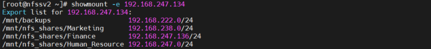
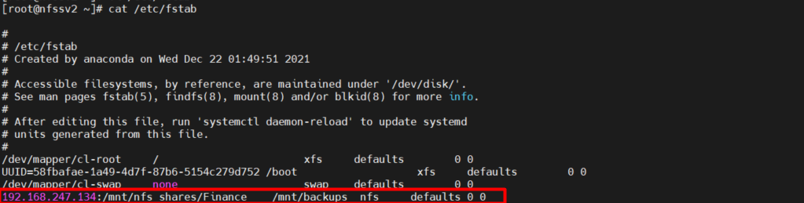

# Mục lục 
- [1. NFS Share](#1)
  - [1.1 File cấu hình](#11)
  - [1.2 Setup and Configure NFS Mounts](#12)
    - [1.2.1 Setting Up NFS Server](#121)
    - [1.2.2 Setting Up NFS Client](#122)
- [2. CIFS Share](#2)
- [3. Mounting Remote File Systems Through fstab](#3)
- [4. Using Automount to Mount Remote File Systems](#3)
- [Tham khảo](#tm)

---


<a name ='1'></a>
# 1. NFS share
- NFS - Network File System là một giao thức phân phối file system, nó cho phép bạn mount các thư mục từ xa có trên server.
- NFS được phát triển bởi SUN Microsystem, bắt đầu từ năm 1984 với phiên bản đầu tiên.
- Cho đến nay đã có tất cả 6 phiên bản:
  - version 1: phát hành năm 1984 với mục đích thí nghiệm
  - version 2: phát hành năm 1989, được đưa ra thị trường
  - version 3: phát hành năm 1995 với nhiều cải tiến
  - version 4 năm 2000, version 4.1 năm 2010 và version 4.2 năm 2016
- Cho phép bạn quản lý không gian lưu trữ ở một nơi khác và ghi vào không gian lưu trữ này từ nhiều clients.
- NFS cung cấp một cách tương đối nhanh chóng và dễ dàng để truy cập vào các hệ thống từ xa qua mạng và hoạt động tốt trong các tình huống mà các tài nguyên chia sẻ sẽ được truy cập thường xuyên.
- Dung lượng file mà NFS cho phép client truy cập lớn hơn 2GB, đòi hỏi hệ thống phải có phiên bản kernel lớn hơn hoặc bằng 2.4x và glibc từ 2.2.x trở lên
- Truyền thông giữa client và server thực hiện qua mạng Ethernet
- Client và Server sử dụng RPC (Remote Procedure Call) để giao tiếp với nhau.
- NFS sử dụng cổng 2049
- NFS hoạt động theo mô hình client/server. Một server đóng vai trò storage system, cho phép nhiều client kết nối tới để sử dụng dịch vụ.
- Các trường hợp dùng NFS

  - Ứng dụng hỗ trợ: VDI, Oracle, VMware ESXi, SAS Grid, SAP HANA, TIBCO, OpenStack, Docker, etc
  - Các khách hàng lớn.
  - Đơn giản, dễ quản lý.
  - Không cần client OS file system.
  - Dễ dàng mở rộng, thu hồi.
  - Dễ dàng di chuyển các storage.
  - Chạy trên Ethernet.
  - Hiệu suất lớn, độ trễ thấp. Hiệu suất tốt hơn iSCSl trong vài trường hợp


<a name ='11'></a>  
## 1.1 File cấu hình
- File cấu hình cho NFS server
  - /etc/nfs.conf – file cấu hình chính cho NFS deamon và tool 
  - /etc/nfsmount.conf – File cấu hình của mount NFS 
- Có 3 file cấu hình chính cần chỉnh sửa để thiết lập một NFS server */etc/exports, /etc/hosts.allow và /etc/hosts.deny*

**/etc/export**
- Cấu trúc

       dir host1(options) host2(options) hostN(options) 

  Trong đó 
    - dir là thư mục hoặc file system muốn chia sẻ 
    - host là một hoặc nhiều host được cho phép mount dir. Có thể được định nghĩa là một tên, một nhóm sử dụng ký tự , * hoặc một nhóm sử dụng 1 dải địa chỉ mạng/subnetmask...
    - option để định nghĩa 1 hoặc nhiều option khi mount 

  Các option
    - ro: thư mục được chia sẻ chỉ đọc được; client không thể ghi lên nó.
    - rw: client có thể đọc và ghi trên thư mục.
    - no_root_squash: Mặc định, bất kỳ file truy vấn được tạo bởi người dùng (root) máy trạm đều được xử lý tương tự nếu nó được tạo bởi user nobody. Nếu no_root_squash được chọn, user root trên client sẽ giống như root trên server.
    - no_subtree_check: Nếu chỉ 1 phần của ổ đĩa được chia sẻ, 1 đoạn chương trình gọi là “thẩm tra lại việc kiểm tra cây con” được yêu cầu từ phía client (nó là 1 file n m trong phân vùng được chia sẻ). Nếu toàn bộ ổ đĩa được chia sẻ, việc vô hiệu hóa sự kiểm tra này sẽ tăng tốc độ truyền tải.
    - sync: thông báo cho client biết 1 file đã được ghi xong- tức là nó đã được ghi để lưu trữ an toàn-khi mà NFS hoàn thành việc kiểm soát ghi lên các file hệ thống. cách xử lí này có thể là nguyên nhân làm sai lệch dữ liệu nếu server khởi động lại.
  
  Ví dụ 
  ```
  /usr/local *.123.vn(ro) 
  /home 192.168.1.0/255.255.255.0(rw) 
  /var/tmp 192.168.1.1(rw) 192.168.1.3(rw)
  ```
  Trong đó: 
  - Dòng 1: cho phép tất cả  các host với tên miền dạng ***.123.vn được mount tới thư mục /usr/local với quyền đọc
  - Dòng 2: Cho phép bất kỳ host nào có địa chỉ IP thuộc subnet 192.168.1.0/24 được mount thư mục /home với quyền đọc và ghi
  - Dòng ba : Cho phép 2 host được mount thư mục /var/tmp với quyền đọc và ghi
- Chạy lệnh **exportfs -ra** để các thay đổi trong /etc/exports có hiệu lực 
**File /etc/hosts.allow và /etc/hosts.deny**

- Hai tập tin đặc biệt này giúp xác định các máy tính trên mạng có thể sử dụng các dịch vụ trên máy. 
- Mỗi dòng trong nội dung file chứa duy nhất 1 danh sách gồm 1 dịch vụ và 1 nhóm các máy tính. Khi server nhận được yêu cầu từ client, các công việc sau sẽ được thực thi:

  - Kiểm tra file host.allow – nếu client phù hợp với 1 quy tắc được liệt kê tại đây thì nó có quyền truy cập.
  - Nếu client không phù hợp với 1 mục trong host.allow server chuyển sang kiểm tra trong host.deny để xem thử client có phù hợp với 1 quy tắc được liệt kê trong đó hay không (host.deny). Nếu phù hợp thì client bị từ chối truy cập.
  - Nếu client phù hợp với các quy tắc không được liệt kê trong cả 2 file thì nó sẽ được quyền truy cập.
  
    Ví dụ: Muốn chặn hoặc cho phép một host hoặc network thì thêm vào file deny hoặc allow.

        portmap: 10.10.10.5, 10.10.10.0/24

- Để sử dụng dịch vụ NFS, cần có các daemon (dịch vụ chạy ngầm trên hệ thống) sau:

  - **Portmap**: Quản lý các kết nối, dịch vụ chạy trên port 2049 và 111 ở cả server và client.
  - **NFS**: Khởi động các tiến trình RPC (Remote Procedure Call) khi được yêu cầu để phục vụ cho chia sẻ file, dịch vụ chỉ chạy trên server.
  - **NFS lock**: Sử dụng cho client khóa các file trên NFS server thông qua RPC.


<a name ='12'></a>
## 1.2 Setup and Configure NFS Mounts
- Chuẩn bị 2 server
  - NFS Server: nfssv1.example.com with IP-192.168.247.134
  - NFS Client : nfssv2.example.com with IP-192.168.247.136

<a name ='121'></a>
### 1.2.1 Setting Up NFS Server
- Cài đặt các gói liên quan và khởi động dịch vụ  

      yum -y install nfs-utils 
      systemctl start nfs-server.service
      systemctl enable nfs-server.service
      systemctl status nfs-server.service

  

- Tạo file để export hoặc share trên NFS server

      mkdir -p  /mnt/nfs_shares/{Human_Resource,Finance,Marketing}
      mkdir  -p /mnt/backups
      ls -l /mnt/nfs_shares/
  

- Thêm các file trên vào  file cấu hình /etc/exports 

      /mnt/nfs_shares/Human_Resource          192.168.247.0/24(rw,sync)
      /mnt/nfs_shares/Finance                 192.168.247.136/24(rw,sync)
      /mnt/nfs_shares/Marketing               192.168.238.0/24(rw,sync)
      /mnt/backups                            192.168.222.0/24(rw,sync,no_all_squash,root_squash)


  

- Nhập `exportfs -arv`
    
  - Trong đó
     
      -a để xuất hoặc không suất tất cả các thư mục
      
      -r để nhập lại các thư mục, đồng bộ  /var/lib/nfs/etab với /etc/exports  và  /etc/exports.d

      -v để hiển thị đầu ra chi tiết

  

- Cho phép dịch vụ đi qua firewall
  - Sử dụng firewalld 

        firewall-cmd --permanent --add-service=nfs
        firewall-cmd --permanent --add-service=rpc-bind
        firewall-cmd --permanent --add-service=mountd
        firewall-cmd --reload


<a name ='122'></a>
### 1.2.2 Setting Up NFS Client
- Cài các package cần thiết để truy cập NFS share 
    
      yum -y  install nfs-utils nfs4-acl-tools
      
- Chạy lệnh `showmount` để hiển thị thông tin mount cho NFS service 

      showmount -e 192.168.247.134
  
    
- Tiến hành mount 

      mount -t nfs   192.168.247.134:/mnt/nfs_shares/Finance /mnt/backups
  

- Xác định mount thành công 

      mount | grep 192.168.247.134

  

- Mount tự động qua /etc/fstab 

      echo "192.168.247.134:/mnt/nfs_shares/Finance    /mnt/backups  nfs     defaults 0 0">>/etc/fstab
  


<a name='2'></a>
# 2. Samba (smb)
- SAMBA là một dịch vụ chạy trên hệ thống Unix, nó cho phép Windows để chia sẻ file và máy in trên các máy chủ Unix, và nó cũng cho phép người sử dụng Unix để truy cập tài nguyên được chia sẻ bởi các hệ thống Windows.
- Microsoft sử dụng SMB cùng với giao thức xác thực NTLM để cung cấp dịch vụ gọi là chia sẻ file và máy in ở mức user. Khi một user đã đăng nhập thực hiện kết nối tới tài nguyên chia sẻ trên máy tính khác (\\server\share), Windows tự động gửi thông tin đăng nhập của user đó tới SMB server trước khi hỏi username hoặc password.
- Phiên bản SMB2 và SMB3 là phiên bản nâng cấp của CIFS
- Samba gồm 3 thành phần chính đó là smbd, nmbd và winbindd:

  - **smbd**: Quản lý việc chia sẻ file và dịch vụ in cho các client, đồng thời cũng chịu trách nhiệm chứng thực người dùng bằng cách sử dụng port 139 và 445 để lắng nghe các yêu cầu đến thư mục chia sẻ trên Linux. Khi một client kết nối, smbd sẽ tạo ra một tiến trình mới, phục vụ cho kết nối này.
  - **nmdb**: Lắng nghe trên port 137, chịu trách nhiệm cung cấp tên NetBIOS của samba server cho các request kết nối.
  - **winbindd**: Dùng khi Samba là 1 phần của domain, dùng để truy vấn server Windows thông tin nhóm và người dùng.

- Cài các gói liên quan và khởi động dịch vụ 

      yum -y install cifs-utils
      yum -y install samba samba-client
      yum -y install samba-client
      systemctl enable smb
      systemctl enable nmb
      systemctl start smb
      systemctl start nmb

- Cấu hình Samba Server
  - File cấu hình của samba nằm ở /etc/samba/smb.conf, ta cần chỉ sửa file cấu hình để share file.
  - Nên copy file để backup 

        mv /etc/samba/smb.conf /etc/samba/smb.conf.bkup

- Chỉnh sửa file cấu hình  /etc/samba/smb.conf

```
# See smb.conf.example for a more detailed config file or
# read the smb.conf manpage.
# Run 'testparm' to verify the config is correct after
# you modified it.

[global]
        workgroup = SAMBA
        security = user

        passdb backend = tdbsam

        printing = cups
        printcap name = cups
        load printers = yes
        cups options = raw

...

# Configs
[Share_One]
comment = Public Documents - Share_One
path = /samba/share1/data
valid users = root
guest ok = no
writable = yes
browsable = yes

[Share_Two]
comment = Public Documents - Share_Two
path = /samba/share2/data
valid users = root
guest ok = no
writable = yes
browsable = yes
```

- Tạo user và password
  - Samba sử dụng nhiều hình thức bảo mật khác nhau. Trong lab này, ta sử dụng phương thức mặc định (user level). Phương thức này, mỗi chia sẻ được gán truy cập với những user cụ thể. Khi user gửi yêu cầu kết nối để chia sẻ, Samba sẽ xác thực bằng username đã được khai báo trong file cấu hình và password trong database.
  - Samba sử dụng nhiều database backends để lưu trữ password người dùng. Cách đơn giản nhất là lưu trữ password trong file smbdpasswd giống như /etc/passwd. Thông thường, file này sẽ được lưu tại /var/lib/samba/private/ hoặc /usr/bin/smbpasswd.

  - Thêm User và set Password trong database
    ```
    [root@nfssv1 ~]# smbpasswd -a root
    New SMB password:
    Retype new SMB password:
    Added user root.
    ```

  - Hiển thị danh sách login trong database 
    ```
    [root@nfssv1 ~]# pdbedit --list
    root:0:root
    ```
- Cấu hình firewall để mở port

      firewall-cmd --permanent --zone=public --add-service=samba 
      firewall-cmd --reload

- Khởi động lại smb service 
    
      systemctl restart smb
- Trên window nhập tổ hợp windows+R nhập 


  

- Kết quả 
  
  
https://www.tecmint.com/install-nfs-server-on-centos-8/

https://github.com/hocchudong/ghichep-nfs/blob/master/NDChien_Baocao_NFS.md#1


