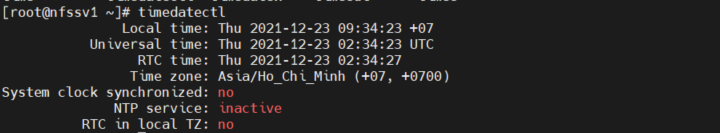
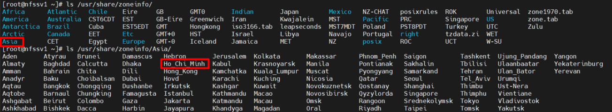

# Mục lục 
- [1. Local Time](#1)
- [2. Network Time Protocol](#1)


<a name ='1'></a>
# 1. Local Time
- Thời gian thực của linux server dựa vào hardware clock, được thiết lập theo định dạng UTC (Coordinated Universal Time)
- System time được duy trì bởi hệ điều hành. Khi hệ thống đã khởi động đồng hồ hệ thống hoàn toàn độc lâp với đồng hồ phần cứng 
- Thời gian hệ thống mới không tự động đồng bộ hóa với đồng hồ phần cứng.
- Các khái niệm vể linux time 

Concept|Explanation
---|---
Hardware clock| Đồng hồ phần cứng đặt trên main card của hệ thống máy tính  
Real-time clock|giiống như đồng hồ phần cứng 
System time| thời gian được duy trì bởi hệ điều hành 
Software clock| giống như system time 
Coordinated Universal Time (UTC)| thời gian tiêu chuẩn trên thế giới 
Daylight saving time| tính toán được thực hiện để tự động thay đổi thời gian khi DST (Daylight Saving Time) thay đổi 
Local time| Thời gian tương ứng với thời gian hiện tại của múi giờ

<a name ='2'></a>
# 2. Network Time Protocol  

- NTP (Network Time Protocol) là một giao thức chạy trên cổng 123 UDP tại Transport Layer nó giúp cho các máy tính trên hệ thống đồng bộ hóa thời gian qua mạng trong một thời gian chính xác.

- Quản lý thời gian trên RHEL

Command | Short Description
---|---
date | quản lý thời gian nội bộ 
hwclock | quản lý thời gian phần cứng
timedatectl | quản lý tất cả khía cạnh của thời gian trên RHEL 8 

**date**

- date: hiển thị thời gian hiện tại của hệ thống 
- date +%d-%m-%y: hiển thị ngyà tháng năm hiện tại của hệ thống 
- date -s 16:03: thiết lập thời gian hiện tại đến 16h03

**hwclock**

- hwclock --systohc: đồng bộ thời gian hệ thống hiện tại đến đồng hồ phần cứng 
- hwclock --hctosys: đồng bộ thời gian phần cứng hiện tại đến thời gian phần cứng 

**timedatectl**

  

- `timedatecl` option

Command | Explantion 
---|---
status | hiện thị thời ian hiện tại 
set-time TIME | thiết lập thời gian hiện tại
set-timezone ZONE | thiết lập zone time hiện tại
list-timezone | hiện thị danh sách tất cả zone time
set-local-rtc [0|1] | khiểm soát RTC trong local time 
set-ntp [0|1] | kiểm soát ntp kích hoạt 

- Quản lý thiết lập time zone 
  - 3 cách tiếp cận để thiết lập zone time local  
    - Thư mục  /usr/share/zoneinfo 

        Dùng lệnh `ln -sf  /usr/share/zoneinfo/Asia/Ho_Chi_Minh /etc/localtime ` để thiết lập time local 
  

    - Dùng `tzselect` 
  
    - Dùng `timedatectl`
        ```
         timedatectl list-timezones # lấy thông tin time zone 
         timedatectl set-timezone Europe/Amsterdam # thiết lập time zone  
        ```
- Cấu hình time service clients

  - chrony service được cấu hình để có thời gian thích hợp từ internet.
  - Mặc định file cấu hình chrony.conf chứa dòng *pool 2.centos.pool.ntp.org iburst*. Nếu thay dòng này bằng  *server 192.168.247.134 iburst* thì thời gian của server 192.168.247.134 được sử dụng thay thay vì server pool.ntp.org

- Lap cấu hình môt NTP time client 
  - 2 server được sử dụng trong bài lap 

  Server | HDH | ip | name 
  --- | --- | --- | ---
  NTP server| Centos 8 | 192.168.247.134 | nfssv1.exmple.com 
  NTP client | Centos 8 | 192.168.247.136 |nfssv2.exmple.com 

  - Cài đặt chrony và khởi động 
    
        yum install -y chrony
        systemctl enable --now chronyd
        systemctl status chronyd
  - Cấu hình firewall 

        firewall-cmd --add-service ntp --permanent
        firewall-cmd --reload       

  - Trên NTP server, thêm dòng *allow 192.168.0.0/24* cho phép truy cập từ tất cả client sử dụng ip bắt đầu bằng 192.168. 
  - Thêm dòng *stratum 10* để chắc local time server được sử dụng cho client. Lưu file cấu hình 
  - Khởi động lại chrony 

        systemctl restart chronyd
  
  - Trên NTP client, mở file /etc/chrony.conf và disable dòng *pool 2.rhel.pool.ntp.org*
  - Thêm dòng *server nfssv1.example.com* hoặc địa chỉ ip của server1 192.168.247.134 vào file cấu hình.
  - Khởi động lại chrony  
    
        systemctl restart chronyd
  - Nhập `chronyc sources` để kiểm tra kết nối đồng bộ
  


