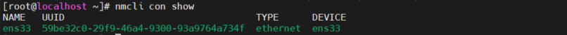
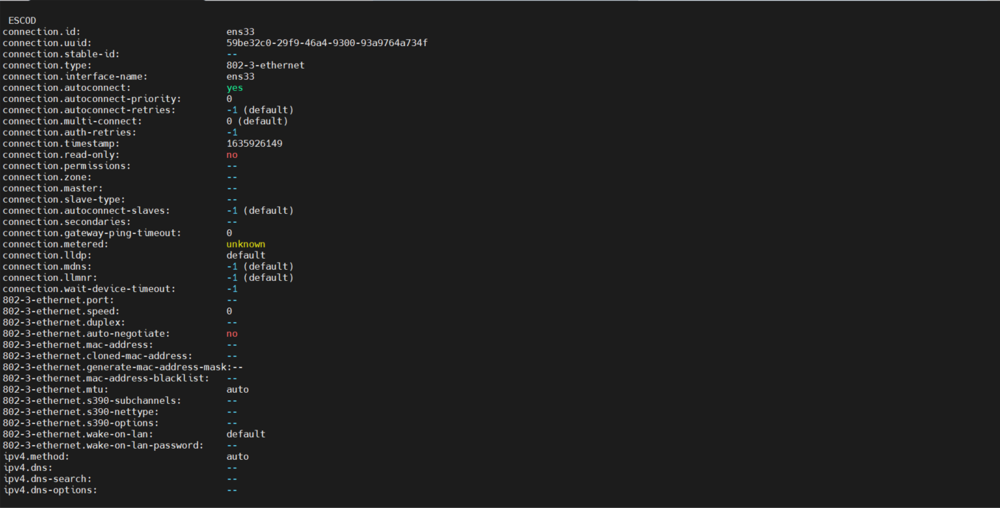
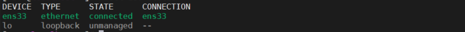
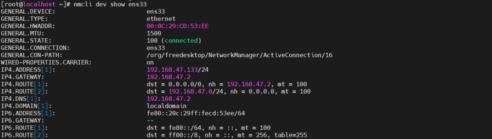
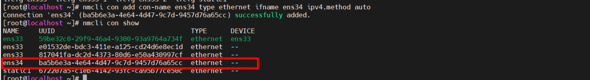
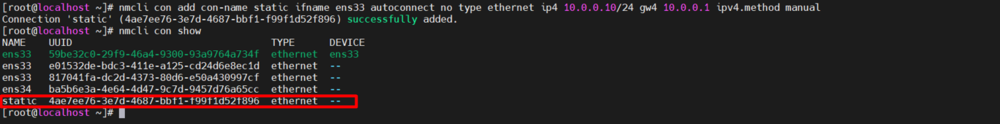

# 1. Các nguyên tăc cơ bản
- Có 2 loại địa chỉ IP (Internet Protocol) :
  - IPv4: là địa chỉ cơ sở có 32 bit gồm 4 nhóm hệ thập phân, được phân tách nhau bởi dấu chấm. Vd 192.168.47.133
  - IPv6: là địa chỉ cơ sở có 128 bit biểu diễn bởi 8 nhóm hệ hecxa được phân tách nhau bởi dấu ":". Vd: fe80:badb:abe01:45bc:34ad:1313:6723:8798

- Địa chỉ IP cần để các thiết bị kết nối với mạng internet
- Để truy cập internet, mọi máy tính cần có 1 địa chỉ IP duy nhất.
- **Địa chỉ mạng riêng**
  - Là địa chỉ sử dụng cho mạng nội bộ
  - Một vài địa chỉ IP được chia ra theo mục địch:  
      - A Class A network: 10.0.0.0/8
      - 16 Class B network: 172.16.0.0/12
      - 256 Class C network: 192.168.0.0/16

- **NAT**
  -  NAT (Net Work Address Translation) thông thường được sử dụng cho router 
  - Trong NAT các nodes sử dụng địa chỉ IP riêng nhưng khi sử dụng mạng, địa chỉ Ip riêng này sẽ đợc thay thế bằng địa chỉ IP của NAT router. 
  - NAT router cho phép theo dõi tất cả các kết nối tồn tại cho phần máy chủ trong mạng.

- **Network Masks**
  - *Subnet mask* xác định trong địa chỉ ip phần nào là mạng, phần nào là nút
  - Vd: 192.168.10.100/24 với 3 bit đầu 192.168.10 là phần mạng và bit cuối 100 chỉ máy chủ trên mạng
  - Trong địa chỉ quảng bá tất cả bit node được thiết lâp bằng 1, làm cho 255 số thập phân nếu tất cả bit được tham chiếu.
  - Vd: Địa chỉ 192.168.10.100/24 có địa chỉ quảng bá là 192.168.10.255
- **Binary Notation(ký hiệu nhị phân)**
  - Do Ipv4 bị giới hạn về số lượng, các mạng IPv4 hiện tại network mask có độ dài thay đổi được sử dụng.
  - Trong subnet mask thay đổi giá trị, chỉ một phần byte được sử dụng để địa chỉ các nút, các phần còn lại được sử dụng cho địa chỉ mạng.
  - Trong subnet mask /, 3 bit đầu sử dụng cho địa chỉ mạng, 5 bit cuối sử dụng cho địa chỉ các nút.
  Network mask: 212.209.113.33/27
  
  - Chuyển đổi hệ nhịn phân - thập phân

Giá trị nhị phân| Giá trị thập phân
---|---
00000000 |0
00100000 |32
01000000 |64
01100000 |96
10000000 |128
10100000 |160
11000000 |192
11100000 |224

  - Xét địa chỉ IP 212.209.113.33/27, địa chỉ IP này thuộc về mạng  212.209.113.32/27 và trong địa chỉ quảng bá là 212.2.9.113.63. Với subnet mask /27  30 nút mạng có thể được đánh địa chỉ trên mỗi mạng.
  - Sẽ có 32 địa chỉ để sử dụng, 2 trong số chúng là đia chỉ mạng và địa chỉ quảng bá không thể sử dụng như một địa chỉ IP máy chủ  

**Địa chỉ MAC**
- Địa chỉ MAC dùng để xác định một giao diện mạng duy nhất trong một thiết bị
- Mỗi card mạng sẽ có 12 byte địa chỉ MAC
- Địa chỉ MAC được sử  dụng cho mạng nội bộ(mạng vật lý cuc bộ hoặc mạng WLAN)
- Địa chỉ MAC giúp máy tính tìm được card mạng cụ thể  địa chỉ IP thuộc về
- Vd địa chỉ MAc  00:0c:29:7d:9b:17 với 6 byte đầu chứa ID nhà cung cấp và 6 byte chỉ sự duy nhất của node ID
**Protcol and Port**
- Ở trong note, ta xác định được các dịch vụ đang chạy ví dụ như một web server hoặc FTP server
- Địa chỉ port được sử dụng để xác định dịch vụ.
- VD port 80 dùng cho HTTP (Hypertext Transfer Protocol), port 22 dùng cho SSH, trong giao tiếp mạng người gửi và người nhận sử dụng địa chỉ port
- Vì vậy địa chỉ mạng đích và địa chỉ mạng nguồn liên quan đến giao tiếp mạng.
- Bởi không phải tất cả các dịch vụ được đánh địa chỉ một cách giống nhau nên một Protocal (giao thức) riêng được sử dụng giữa địa chỉ IP và địa chỉ port. VD Transfer Control Protocol (TCP), User Datagram Protocol (UDP), or Internet Control Message Protocol (ICMP).

# 2. Quản lý giao diện và địa chỉ mạng
- Địa chỉ mạng có thể được chỉ định theo 2 cách:
  - Fixed IP addresses: hữu ích cho server, luôn luôn cần cho các địa chỉ IP giống nhau.
  - Dynamycally assigned IP addresses: hữu ích cho thiết bị người dùng cuối cùng và cho một phiên bản trong một môi trường  cloud.
- Tên mặc định của card mạng trong linux là eth0, eth1 và  eth2 và hệ thống sẽ dò card mạng bắt đầu từ eth0.
- Trong RHEL 8, tên của card mạng được dựa trên firmware, device topology và device type.
  - Giao diện ethernet bắt đầu bằng *en* , giao diện WLAN bắt đầu bằng *wl* và giao diện WWAN bắt đầu bằng *ww*
  - Tiếp theo là loại adapter. *o* sử dụng cho onboand, *s* sử dụng cho hotplug slot và *p* sử dụng cho PCI location.
  tiếp theo là một số dùng để chỉ định cho index, IP hoặc port
  - Nếu không thể sửa tên thì tên truyền thống sẽ được sử dụng 

- Card mạng có thể được đặt tên dựa vào tên thiết bị BIOS. Để là được điều này, biosdevname package phải được cài đặt.
# 3. Xác thực cấu hình mạng
## 1.Xác định cấu hình địa chỉ mạng
- Dùng lệnh ip để xác định cấu hình của địa chỉ mạng. 
  - ip addr để cấu hình và giám sát địa chỉ mạng.
  - ip route dùng để cấu hình và giám sát thông tin định tuyến.
  - ip link dùng để cấu hình mà giám sát trạng  thái liên kết mạng.
- Lệnh `ip addr show` để hiển thị cấu hình mạng hiện tại, lệnh `ip a` và `ip a s` có cùng chức năng.

  - **Current state**: hiển thị thông tin trạng thái hiện tại là đang hoạt động hay có sẵn.

  - **MAC address configuration**: hiển thị   địa chỉ MAC duy nhất trong mọi card mạng (00:0c:29:cd:53:ee) tương ưng với địa chỉ quảng bá (ff:ff:ff:ff:ff:ff)

  - **IPv4 configuration**: là dòng hiển thị địa chỉ IP hiện sử dụng(và địa chỉ quảng bá tương ứng) cũng như subnet mask được sử dụng.
  -**IPv6 configuration**: là dong hiển thị địa chỉ IPv6  và cấu hình của nó. Địa chỉ IPv6 được mọi giao diện tự động nhận dạng ngay cả khi chưa được cấu hình, nó được sử dụng cho giao tiếp chỉ trong mạng nội bộ.

- Lệnh `ip link show` chỉ hiển thị trạng thái liên kết của giao diện mạng. Thêm tùy chọn -s để hiển thị thống kê số liệu hiện tại.

## 2.Xác thực định tuyến
- Lệnh `ip route show` để xem bộ định tuyến nào được sử dụng, mỗi mạng đều có một bọ định tuyến mặc định được đặt.

- Dòng `default via 192.168.47.2 dev ens33 proto dhcp metric 100` là phần quan trọng , hiển thị đường định tuyến mặc định đu qua địa chỉ ip 192.168.47.2 và giao diện mạng ens33 cho địa chỉ IP. Nó hiển thị định tuyến mặc định được chỉ thi bởi server DHCP
- Dòng `192.168.47.0/24 dev ens33 proto kernel scope link src 192.168.47.133 metric 100` nhận định nội bộ được kết nối. Ở đây ứng dụng cho mạng 192.168.47.0. Định tuyến này được làm tự động và không cần quản lý.
## 3. Xác thực khả dụng của port và server
- Lệnh `netstat` hoặc `ss` để xác định tính khả dụng của port trong server 
- Sử dụng `ss -lt` để hiển thị các TCP port đang sử dụng.

 - Sử dụng lệnh `ip addr add IP-address dev <devicename>`

 - Thêm địa chỉ up IP tạp thời  10.0.0.10/26 `ip addr add 10.0.0.10/26 dev ens33` 

 

- Lệnh `ss -tul` để hiện thị danh sách port ủa UDP và TCP đang listen trong server

# 4. Cấu hình mạng với lệnh nmtui và nmcli
- Sử dụng lệnh `systemctl status NetworkManager` để xác đinh trạng thái iệu tại, nó đọc các tập lệnh của cấu hình card mạng ở trong /et/sigconfig/network-scripts và có tên bắt đầu với ifcfg và nối tiếp bởi tên của card mạng 

- Sự khác nhau giữa một thiết bị và một kết nối:
  - Một thiết bị là một card giao diện mạng.
  - Một kết nối là sự cấu hình được sự dụng cho một thiết bị.
- Lệnh nmtui và mncli dùng để quản lý kết nối mạng mà ta muốn chỉ định đến thiết bị.

## 1. Quyền yêu cầu thay đổi cấu hình mạng
- Người dùng root có thể sử đổi mạng hiện tại.
- Nếu người dùng bình thường được đăng nhập vào bảng điều kiển nội bộ người dùng đó có thể thay đổi cả cấu hình mạng.
- Lệnh `nmcli gen permissions` để kiểm tra các quyền hiện tại

## 2. Cấu hình mạng với nmcli

- Hiển thị trạng thái kết nối:

- Lệnh `nmcli con show` để hiểu thị thuộc tính của kết nối 

`nmcli con show ens33` 

- Lệnh `nmcli dev status` để hiển thị danh sách trạng thái thiết bị 

- Lệnh `nmcli dev show <devicename>` để xem cài đặt riêng của từng thiết bị 

- VD 
  - Tạo một kết nối mạng mới `nmcli con add con-name ens34 type ethernet ifname ens34 ipv4.method auto`

 

  - Tạo một kết nối với tên *staic* để định nghĩa một địa chỉ IP tĩnh và gateway: `nmcli con add con-name static ifname ens33 autoconnect no type ethernet ip4 10.0.0.10/24 gw4 10.0.0.1 ipv4.method manual`

  

  - Dùng `nmccli con show` để hiện thị kết nối
  - Dùng `nmcli con up static` để hoạt động kết nối tĩnh 

