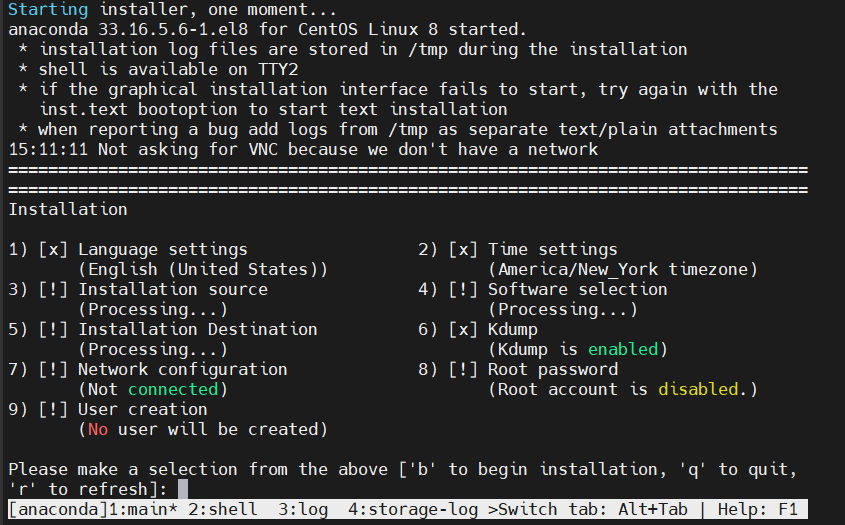
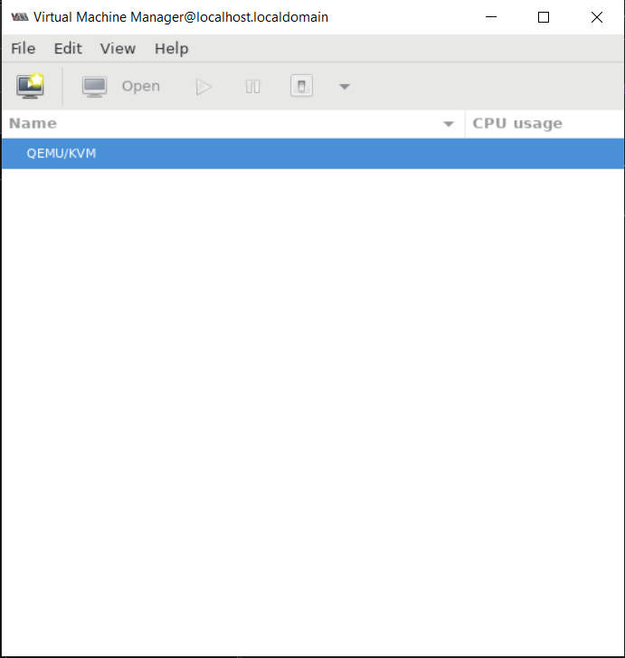
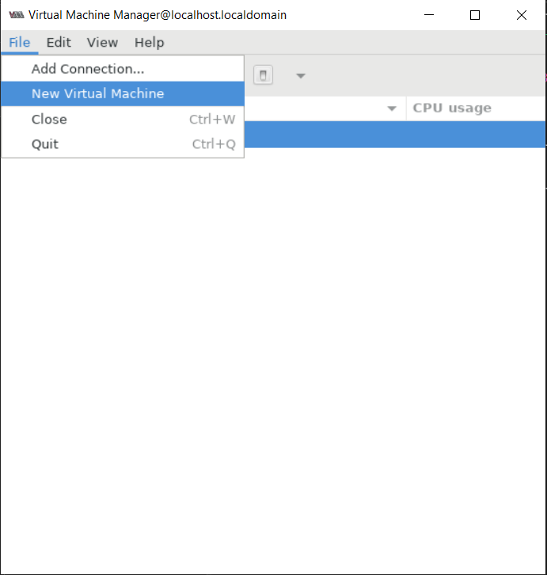
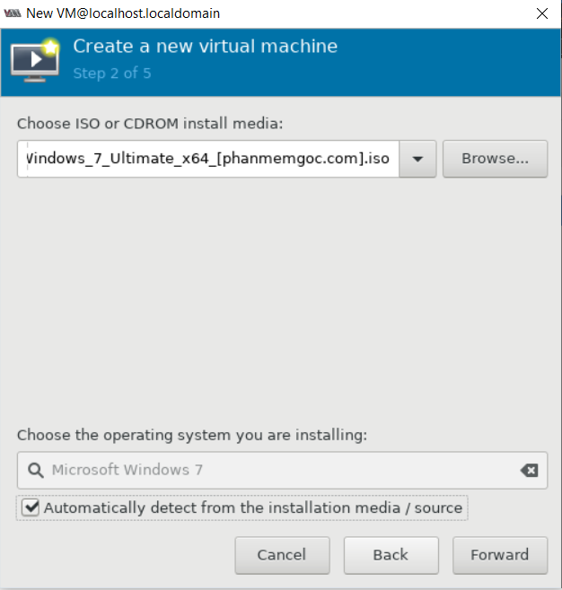
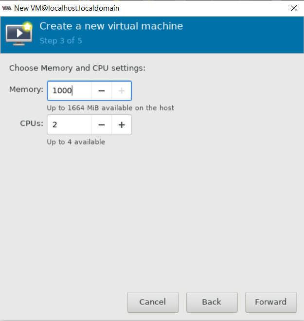
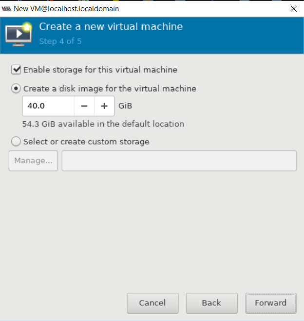
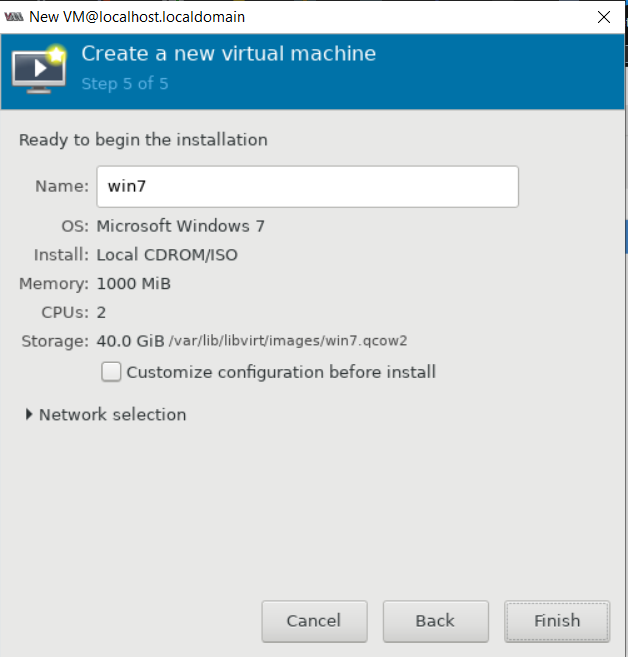

# Chuẩn bị
- Cài đặt các package liên quan đến kvm
  - `yum install qemu-kvm qemu-img libvirt virt-install virt-manager -y`
  - Trong đó:
    - qemu-kvm: Phần phụ trợ cho KVM.
    - libvirt: cung cấp libvirt mà bạn cần quản lý qemu và KVM bằng libvirt.
    - bridge-utils: chứa một tiện ích cần thiết để tạo và quản lý các thiết bị bridge.
    - virt-manager: cung cấp giao diện đồ họa để quản lý máy ảo.
    - virt-install: Cung cấp lệnh để cài đặt máy ảo
- Kiểm tra xem KVM đã được cài đặt hay chưa. 
  - `lsmod | grep kvm`
- Đối với bản Minimal để dùng được công cụ đồ họa virt-manager người dùng phải cài đặt gói x-window bằng câu lệnh
  - `dnf install  xorg-x11-xauth xorg-x11-fonts-* xorg-x11-utils -y`
- Start dịch vụ libvirt và cho dịch vụ chạy cùng hệ thống
  - `systemctl start libvirtd`
  - `systemctl enable libvirtd`
- Reboot lại hệ thống

- Thao tác với KVM qua comand
  - Các lệnh cơ bản với virsh
    - Show tất cả các máy ảo đã được cài đặt :
`virsh list --all`
    - Hiển thị các máy ảo đang hoạt động :
`virsh list`
    - Khởi động máy ảo (ví dụ với máy ảo có tên “centos8”) :
`virsh start centos8`
    - Tắt máy ảo :
`virsh shutdown centos8`
    - Khởi động lại máy ảo :
`virsh reboot centos8`
    - Suspend máy ảo :
`virsh suspend centos8`
    - Resume lại máy ảo sau khi suspend :
`virsh resume centos8`
    - Chỉnh sửa thông số máy ảo :
`virsh edit centos8`
    - Sau khi chỉnh sửa , cập nhật lại cấu hình :
`virsh define /etc/libvirt/qemu/centos8.xml`
    - Xóa máy ảo :
`virsh destroy centos8 virsh undefine /etc/libvirt/qemu/centos8.xml`
    - Sau khi xóa máy ảo, ta có thể tùy chọn có xóa image không . Nếu xóa image : `rm -rf /var/lib/libvirt/images/centos8.qcow2`

  -  Các lệnh kiểm tra thông tin
     - Xem file .xml của máy ảo :
`virsh dumpxml centos8`
     - Xem thông tin máy ảo :
`virsh dominfo centos8`
     - Kiểm tra các cổng của máy ảo :
`virsh domiflist centos8`
  - Các thao tác Clone (Trước khi clone cần SHUTDOWN máy ảo trước)
    - Clone tự động :
`virt-clone --original=centos8 --auto-clone`
    - Clone custom tên máy clone :
`virt-clone --original=centos8 --name=CentOS7-03 --auto-clone`
    - Clone custom tên máy clone và disk image :
`virt-clone --original=centos8 --name=centos8 --file=/var/lib/libvirt/images/centos8.qcow2`
  - Các thao tác Snapshot
    - Tạo snapshot :
`virsh snapshot-create-as --domain centos8 --name "Begin" --description "ban khoi tao"`
    - Show các bản snapshot đã tạo :
`virsh snapshot-list centos8`
    - Xem thông tin chi tiết bản snapshot đã tạo :
`virsh snapshot-info centos8 --snapshotname "Begin"`
    - Reverse lại 1 bản snapshot đã tạo :
`virsh snapshot-revert centos8 --snapshotname "Begin"`
    - Xóa một bản snapshot đã tạo :
`virsh snapshot-delete centos8 --snapshotname "Begin"`
  - Console máy ảo
    - B1 : Khởi động dịch vụ TRÊN CÁC MÁY ẢO để cho phép máy chủ KVM console không cần mật khẩu :
`systemctl start serial-getty@ttyS0.service systemctl enable serial-getty@ttyS0.service`
    - B2 : Trên host KVM, thực hiện lệnh :
`virsh console CentOS7-01`

    - Gõ Ctrl + ] để thoát phiên console .

    - Từ phiên console thứ 2 sẽ không cần phải đăng nhập user và password nữa


# Cài VM bằng virt-install
- Nhập lệhh để cài Virtual Machine qua KVM
```sh
virt-install --name centos8.5 --ram 1000 --disk path=/var/kvm/images/centos8.5.img,size=10 --vcpus 2 --os-type linux --os-variant rhl8.0 --network bridge=virbr0 --graphics none  --console pty,target_type=serial  --location '/root/CentOS-8.5.2111-x86_64-dvd1.iso' --extra-args 'console=ttyS0,115200n8 serial'
```
Trong đó:
```sh
--name: Tên của Virtual Machine
--ram: RAM của Virtual Machine
--disk path=xxx ,size=xxx
'path=' ⇒ chỉ định nơi đặt Virtual Machine
'size=' ⇒ chỉ địng kích thước của ổ đĩa cho  Virtual Machine
--vcpus: Chỉ định số CPUs ảo
--os-type: chỉ định loại  GuestOS
--os-variant: specify the kind of GuestOS - possible to confirm the list with the command below
# osinfo-query os
--network: Chỉ định loại mạng cho Virtual Machine
--graphics: Chỉ định đồ họa sử dụng. 'none' là  nographics.
--console: chỉ định loại console 
--location: Chỉ định địa điểm của file cài đặt 
--extra-args: chỉ định các tham số được đặt trong kernel
```
  

# Cài VM qua giao diện KVM

- Mở giao diện KVM bằng cách nhập virt-manager 

  

- Chọn New Virtual Machine để tạo một vm với

  

- Cài đặt qua một file iso

  

- Thiết lập ram và cpus

  

- Thiết lập bộ nhớ

  

- Chọn Finish để cài đặt 

  


# tham khảo 

https://onet.vn/kvmcentos8-huong-dan-cai-dat-kvm-tren-centos-8.html

https://onet.vn/su-dung-lenh-virsh-voi-kvm.html
