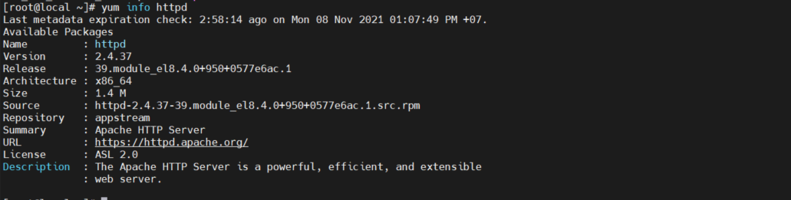
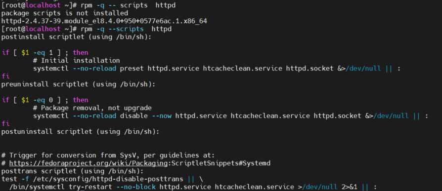

# Mục lục
- [1. Quản lý  các gói phần mềm với yum](#1)
- [2. Lệnh yum](#2)
- [3. Quản lý Package Module Streams](#3)

#1. Quản lý  các gói phần mềm với yum
- Hiểu về Repository
  - Phần mền trong Red Hat Enterprise Linux được cung cấp trong định dạng RPM(Red Hat Package Manager). Một định dạng cụ thể được sử dụng để lưu trữ và cung cấp các package.

  - Repository có vai trò quan trọng, việc sử dụng Repository dễ dàng hơn server hiện hành. Người bảo trì của Repository cho ra các bản cập nhập package trong kho lưu trữ.
  - Khi sử dụng lệnh `yum` để cài đặt phần mền, bản cập nhâpj mới nhất sẽ được tự động cài đặt.
  - Red Hat Customer Portal là nơi lưu trữ các kho cung cấp khác biệt.
- Đăng ký Red Hat Enterprise Linux Support
  - Để đăng ký RHEL, ta cần quyền hợp lệ, các quyền có liên quan tới tài khoản trong Red Had Customer Portal, có thể mua hoặc tham gia Red Hat Developer program. Đăng ký tại  https://developers.redhat.com
- Một quyền liên quan tới 4 nhiệm vụ cơ bản:
  - **Register**: khi đăng ký, kết nối tài khoản tới tài khoản Red Hat hiện tại. Công cụ `subscription-manager` có thể kiểm kê hệ thống
  - **Subscribe**: đăng ký hệ thống để tài khoản có quyền truy cập và các bản cập nhập của RedHat
  - **Enable repositories**: sau khi đăng ký ta sẽ được cấp một Repository mặc định. Một vài Repository bị vô hiệu khóa sẽ được kích hoạt lại sau khi đăng ký hệ thống 
  - **Review and Track**: Có thể xem và theo dõi các đăng ký hiện tại dang sử dụng 
- Quản lý các đăng ký 
  - Có thể quản lý bằng giao diện GNOME hoặc chế độ dòng lệnh
  - Dùng công cụ  `subscription-manager` để quản lý từ dòng lệnh.
    - **Register a system**: Chọn `subscription-manager register` để đăng ký
    - **List available subscriptions**: Chọn `subscription-manager list --available` để xem các tài khoản được cấp quyền
    - **Automatically attach a subscription**: Đăng ký server là  khồng đủ quyền để truy cập vào vào kho lưu trữ. Dùng `subscription-manager attach --auto ` để gắn tự động cho đăng ký để kho dữ liệu là có sẵn.
    - **Get an overview**: Chọn `subscription-manager --consumed` để xem các đăng ký hiện tại đang sử dụng
    - **Unregister**: Chọn `subscriptionmanager unregister` để hủy cấp phép đăng ký.
  - Sau khi đăng ký một subscription, chứ nhận quyền được viết trong file /etc/pki/diretoty
  - /etc/pki/product lưu chữ chính chỉ biểu bị cho Red Hat Product được cài đặt trên hệ thông
  - /etc/pki/consumer Lưu trữ chứng chỉ nhận định các tài khoản Red Hat được đăng ký trong hệ thống
  - /etc/pki/entitlement chứa nội dung thông tin về các subscriptions được theo dõi trong hệ thống
- Chỉ định Repository để sử dụng 
  - Để máy chủ biết repository nào để sử dụng, tạo một file với tên kết thúc bằn .repo trong thư mục /etc/yum.repds.d
  Trong file .repo cần có: 
    - **[label]** file .repo cần có nội dung khác với kho lưu trữ, mỗi phần bắt đầu với  label để xác định các kho chỉ định 
    - **name=** sử dụng tên riêng cho kho lưu trữ
    - **baseurl** Chứa URl chỉ đển địa chỉ repository riêng
  - Hiển thị tập tin repository mặc định được cài đặt trong CentOS 8 
  
  - Khi tạo Repository, tham số baseurl là quan trong nhất vì đó là nơi máy chủ sẽ tìm file để cài đặt. HTTP và FTP là 2 URL thường được sử dụng.
  - Khi dùng URl có 2 thành phần được sử dụng. 
    - URL xác địng gia thức được sử dụng và định dạng giao thức :// như htttp:// , ftp:// hoặc file://
    - Sau URL là vị trí chính xác trên URL đó.  

- Repository security
  - Sử dụng repository rất thuận tiên nhưng cũng tồn tại rủi ro bảo mật.
  - Khi cài đặt một gói cài đặt và  trong gói đó các tập lệnh đều dược thực thi với quyền root, nên ta cần chắc chắn về các package software mà ta đang cố cài đặt.
  - Để bảo mật các gói trong kho lưu trữ, các gói thường được ký bằng khóa GPG. Khóa GPG được đăng kí cho package software thường được cung cấp thông qua kho dữ liệu 
  - Lệnh `yum` sẽ phản ảnh khi khi ta cài một gói phần mềm không trùng khóa GPG, gói phần mềm đó đã bị tấn công 
  - Khi sử dụng một Repository có khóa GPG, lệnh `rpm` sẽ đề xuất tải cả khóa GPG để sử dụng ký gói. Các khóa GPG được sử dụng để ký gói được cài đặt đến thư mục /etc/pki/rpm-gpg theo mặc định
  - Kết nối với một kho lưu trữn khóa GPG được tải xuống.
  
- Tạo Local Repository
  - Thiết lập Repository riêng cho phép ta đặt các gói RPM của riêng mình vào thư mục và xuất bản thư mục đó như một kho lưu trữ
  - VD: tạo một Repository riêng 
    - Cần có quyền truy cập vào đĩa hoặc file ISO
    - 1. Chèn đĩa cài đặt vào trong máy  và chắc chắn nó đã được đính kèm và có sẵn
    - 2. Tạo thư mục /repo là nơi gắn kết tệp, nơi có thể gắn tệp
    - 3. Thêm vào dòng cuôi cùng file cấu hình /etc/fstab: `/dev/sr /repo iso9660 defaults 0 0`
    - 4. Gõ `mount -a` , `mount | grep sr0`  thiết bị quang sẽ gắn trên thư mục /repo, thư mục /repo được sử dụng như một repository
    - 5. Hai Repository có sẵn sẽ thông qua tư mục /repo. Repository BaseOS cung cấp truy cập đến base package và repo Application Stream (AppStream) cung cấp truy cập đến ứng dụng streams. Để cho chúng có thể truy cập cần thêm 2 file và0 thư mục /etc/yum.repos.d
      - BaseOS.repo: 

        name=BaseOS 

        baseurl=file:///repo/BaseOS 
      
        gpgcheck=0
      - AppStream.repo: 

        name=AppStream

        baseurl=file:///repo/AppStream

         gpgcheck=0
    - 6. Lệnh `yum repolist` để xác minh tính khả dụng của Repository mới được tạo. 

# 2. Lệnh yum
- Để sử dụng Repository cần sử dụng lệnh `yum`
- Hiển thị danh sách repo `yum repolist` 
- Để cài đặt các package từ các repo disable dùng lệnh `yum --enablerepo=epel install`
- Để enable repo vĩnh viễn chỉnh sửa dòng `enabled=1` để enable cho repo 

task | Mô tả 
---|---
search | tìm các package theo tên  
[what]provides */name | tìm kiếm sâu trong gói để tìm tệp cụ thể
info | cung cấp nhiều thông tin hơn về package
install | cài đặt package
remove | xóa package
list all | hiển thi danh sách tất cả package
list installed|các package được cài đặt
group list | danh sách nhóm package 
group install | cài đặt tất cả package trong nhóm 
update | cập nhập 
clean all| xóa tất cả dữ liệu lưu trữ

- Làm việc với package 
  - Dùng yum để tìm kiếm phần mềm  `yum search`
    
  - Tìm kiếm nhiều thông tin hơn với `yum info`

  - Cài đặt package `yum install`

  - Xóa package `yum remove`

  - Hiển thị danh sách package `yum list`

  - Cập nhập package `yum update`

  - Danh sách package đã cài đặt `yum list installled`
  

- Làm việc với Group package  `yum group`

  - Hiển thị danh sách group `yum group list 
  
  - Hiển thị thông tin group package `yum group info`
    
  - Cài đặt group package `yum groupinstall`
    
- Hiển thị lịch sử lệnh yum `yum history`
    

    
# 3.Quản lý Package Module Streams
- Modules
  - Trong Application Stream repository, nội dung các vòng đười được cung cấp
  - Nội dung được cung cấp dưới dạng gói RPM
  - Một modules mô tả một tập hợp của các gói RPM và chúng thuộc về nhau. 
  - Một module có thể có một hoặc nhiều application streams
  - Một streams bao gồm một phiên bản cụ thể và bản cập nhập được cung cấp cho một stream cụ thể. Khi module làm việc với nhiều stream khác thì chỉ có một stream có khả năng bật cùng lúc
  - Modules có thể có một hoặc nhiều profiles. Profile là danh sách của package được cài đặt cùng nhau cho một trường hợp sử dụng cụ thể 

iteam | mô tả
---|---
 RPM| package định dạng mặc định. Nội dung file, như các matadata mô tả quá trình cài đặt. 
 module |  Cơ chế phân phối cài đặt packages RPM. Trong các phiên bản module khác nhau và profiles có thể được cung cấp
 application stream | một phiên bản chỉ định của module
 profile | tập hợp các gọi được cài đặt cùng nhau cho một trường hợp sử dụng cụ thể

- Quản lý module 
  - `yum module list`để hiển thị danh sách module
  - `yum module info`Hiển thị thông tin module và thông tin phiên bản 

    `yum module info ghc:8.2`
    
  - `yum module install` để cài đặt module
  - `yum module enanble` để cho phép module hoạt động

# 4. Quản lý software package với rpm
- Filenames RPM
  - Tên của một file rpm là `autofs-5.0.7-40.el7.x86_64.rpm`

  Thành phần | Mô tả
  --- |--- 
  aotufs | tên của package
  5.0.7 | version của package
  -40| subversion của package
  el7| phiên bản Red Had mà package được tạo
  x86-64| nền tảng (32-64 bit) package được tạo

- Truy vấn RPM packge

  - Cấu trúc lệnh truy vấn
  `rpm -q [select-options] [query-option]`

  - Hiển thị thông tin chung về các gói đã cài đặt

 -  `rpm -qa`  danh sách package đã cài đặt
    

-   `rpm -q`  cho biết phien bản của package
    

-   `rpm -qf`  tìm hiểu gói nào cung cấp FILENAME
    

-   `rpm -ql ` danh sách file được cài đặt bởi gói  
    

-   `rpm -qi ` thông tin chi tiết về gói  
  
-   `rpm -qd`  danh sách file tài liệu được cài đặt bởi package
  
-   `rpm -qc ` danh sách file cấu hình được cài đặt bởi package
  
-   `rpm -q --scripts ` danh sách tập lệnh chạy trước hoặc sau khi package được cài đặt hoặc xóa 
  
-   `rpm -qp <<pkg>pkg>` option -p được sử dụng với tất cả các option được liệt kê trước đó để truy vấn các tệp gói RPM riêng lẻ thay vì cơ sở dữ liệu gói RPM. Sử dụng tùy chọn này trước khi cài đặt giúp bạn tìm ra thực sự trong gói trước khi nó được cài đặt

-   `rpm -qR ` hiển thị các phụ thuộc cho package cụ thể

-   `rpm -V` hiện thì phần package nào đã bị thay đổi từ khi  cài đăt

-   `rpm -Va` xác minh các gói cài đặt và hiển thị phần bị thay đổi của package từ khi cài đặt 

- Cài đặt một RPM package
  - Cần có file RPM trước khi cài đặt thông qua lệnh rpm
  - Cấu trúc `rpm -ivh packname`

- Sử dụng repoquery
  - Dùng để truy vấn package từ repositories trước khi cài đặt.

